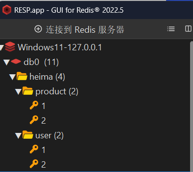
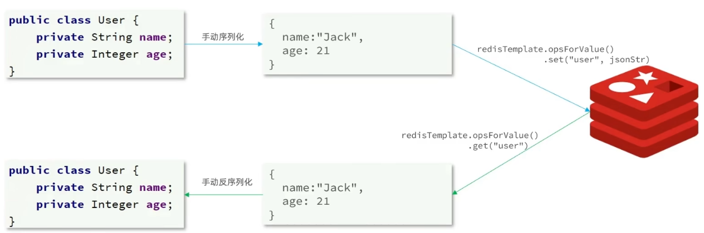
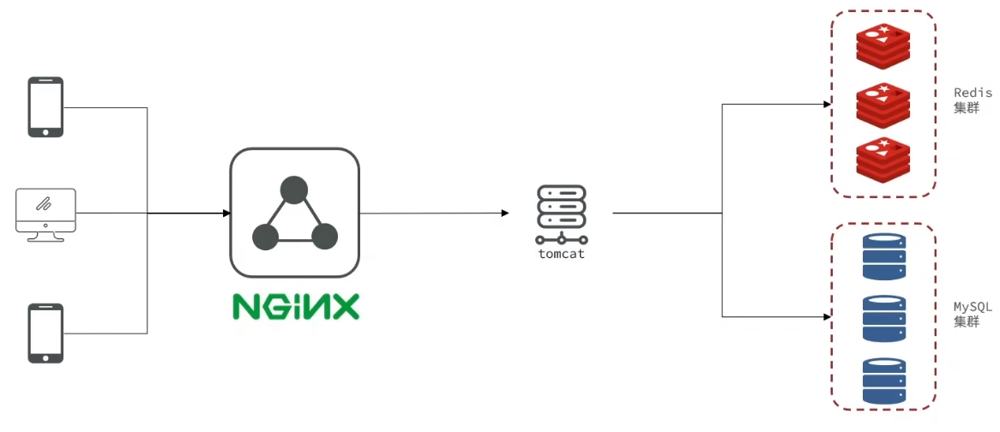
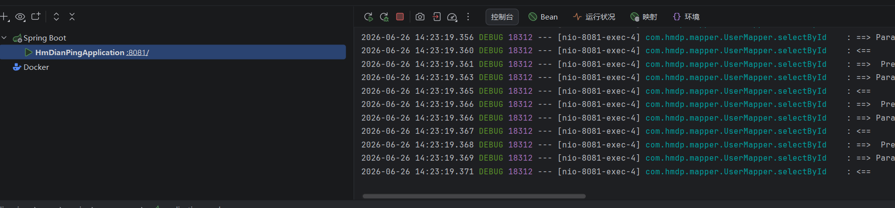
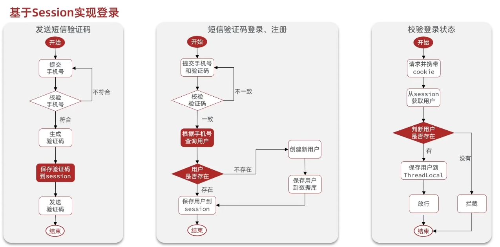
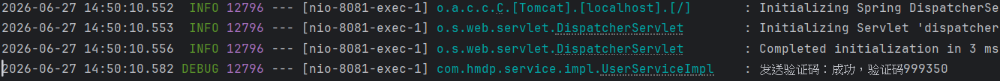
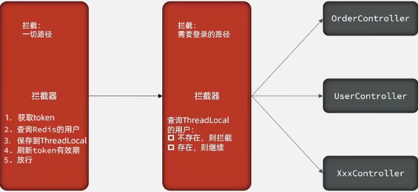
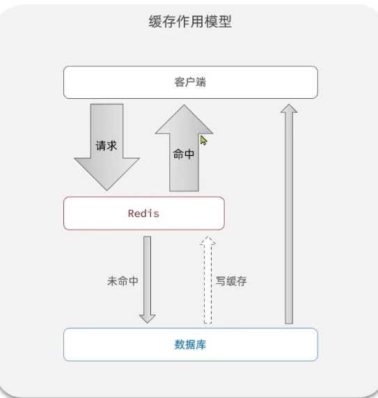

# 基础篇

## 一、初识Redis

### 1、认识NoSQL

|   差别   |                             SQL                              |                            NoSQL                             |
| :------: | :----------------------------------------------------------: | :----------------------------------------------------------: |
| 数据结构 |                     结构化（Structured）                     |                           非结构化                           |
| 数据关联 |                     关联的（Relational）                     |                           无关联的                           |
| 查询方式 |                           SQL查询                            |                            非SQL                             |
| 事务特性 |                             ACID                             |                             BASE                             |
| 存储方式 |                             磁盘                             |                             内存                             |
|  扩展性  |                             垂直                             |                             水平                             |
| 使用场景 | （1）数据结构稳定<br>（2）相关业务对数据安全性、一致性要求较高 | （1）数据结构不固定<br/>（2）对一致性、安全性要求不高<br/>（3）对性能要求 |

- **ACID vs BASE**

ACID（强一致性，关系型数据库）

**全称**：原子性 (Atomicity)、一致性 (Consistency)、隔离性 (Isolation)、持久性 (Durability)

**核心**：宁可慢，不能错 ✅

| 特性       | 通俗解释                                                     |
| ---------- | ------------------------------------------------------------ |
| 原子性 (A) | 事务要么全部成功，要么全部失败（转账：扣钱 + 加钱必须同生共死） |
| 一致性 (C) | 事务前后数据状态合法（转账前后总金额不变）                   |
| 隔离性 (I) | 多个事务并发时，互相看不见中间状态（避免脏读 / 幻读）        |
| 持久性 (D) | 事务提交后，数据永久保存，断电也不丢                         |

BASE（最终一致性，分布式 / NoSQL）

**全称**：基本可用 (Basically Available)、软状态 (Soft state)、最终一致性 (Eventually consistent)

**核心**：先跑起来，账慢慢对 ⚡

| 特性           | 通俗解释                                                   |
| -------------- | ---------------------------------------------------------- |
| 基本可用 (BA)  | 系统部分故障时，仍能提供核心服务（不整体宕机）             |
| 软状态 (S)     | 允许数据存在中间过渡状态（暂时不一致）                     |
| 最终一致性 (E) | 经过一段时间后，数据会自动同步到一致状态（不要求实时一致） |

### 2、认识Redis

Redis诞生于2009年，全称是Remote Dictionary Server，远程词典服务器，是一个基于内存的键值型NoSQL数据库。

**特征：**

- 键值（Key-value）型，value支持多种不同的数据结构，功能丰富
- 单线程，每个命令具备原子性
- 低延迟，速度快（基于内存、IO多路复用、良好的编码）
- 支持数据持久化
- 支持主从集群、分片集群
- 支持多语言客户端

### 3、Windows版Redis安装

Redis 官方不提供 Windows 安装包，但 Microsoft 维护了 Windows 移植版，也可使用 Memurai 或 WSL2 方案。

**方式一：Microsoft 移植版（推荐，简单）**

1. 访问 GitHub Release 页面：`https://github.com/microsoftarchive/redis/releases`
2. 下载最新 `.msi` 安装包（如 `Redis-x64-3.0.504.msi`）
3. 双击安装，勾选"添加环境变量"，一路 Next 即可
4. 安装后 Redis 默认作为 Windows 服务开机自启

**方式二：Memurai（更活跃的维护版）**

1. 官网 `https://www.memurai.com/` 下载安装包
2. 免费开发版功能与 Redis 5.x 兼容，安装步骤与方式一相同

**方式三：WSL2（最接近生产环境）**

1. 启用 WSL2 并安装 Linux 发行版（如 Ubuntu）

2. 在 WSL 终端中执行：

   ```bash
   sudo apt update && sudo apt install redis-server -y
   sudo service redis-server start
   ```

**验证安装**

```bash
redis-cli ping
# 返回 PONG 即表示安装成功
```

**常用命令**

| 命令                        | 说明              |
| --------------------------- | ----------------- |
| `redis-server`              | 前台启动 Redis    |
| `redis-cli`                 | 进入 Redis 命令行 |
| `redis-cli shutdown`        | 停止 Redis 服务   |
| `redis-cli -h 主机 -p 端口` | 连接远程 Redis    |

> ⚠ **注意**：Microsoft 移植版停留在 3.0 版本，较旧，部分新特性不支持。学习和本地开发够用，生产环境建议用 Linux。


### 4、Redis命令行客户端

基础命令

```shell
PS C:\Users\BangeLu> redis-cli -h 127.0.0.1 -p 6379
127.0.0.1:6379> ping
PONG#测试成功
127.0.0.1:6379> set key value [expiration EX seconds|PX milliseconds] [NX|XX]
PS C:\Users\BangeLu> redis-cli -h 127.0.0.1 -p 6379#连接本地Redis，指定端口为默认端口6379
127.0.0.1:6379> set name ikun
OK
127.0.0.1:6379> set age 22
OK
127.0.0.1:6379> get name
"ikun"
127.0.0.1:6379> get age
"22"
```


### 5、图形化桌面客户端

**Redis Desktop Manager（Windows 版）**

GitHub 地址：`https://github.com/lework/RedisDesktopManager-Windows`

1. 访问上述 GitHub 仓库，在 Releases 页面下载最新 `.exe` 安装包
2. 双击安装，一路 Next 即可
3. 启动后，点击「连接到 Redis 服务器」：
   - 地址：`127.0.0.1`（本机）
   - 端口：`6379`（默认）
   - 名称：自定义（如"本地"）
4. 连接成功后，左侧即可浏览所有 Key，支持查看/编辑/删除等操作

> 💡 **说明**：官方 Redis Desktop Manager 从 2019 年起开始收费，lework 维护的这个是免费的社区 Windows 编译版，功能和官方版基本一致。


## 二、Redis常见命令

### 1、Redis数据结构介绍

Redis是一个key-value的数据库，key一般是String类型，不过value的类型多种多样：

|    类型     |           例子            |
| :---------: | :-----------------------: |
|  `String`   |       `hello world`       |
|   `Hash`    | `{name: "Jack", age: 21}` |
|   `List`    |   `[A -> B -> C -> C]`    |
|    `Set`    |        `{A, B, C}`        |
| `SortedSet` |   `{A: 1, B: 2, C: 3}`    |
|    `GEO`    |   `{A: (120.3, 30.5)}`    |
|  `BitMap`   |   `0110110101110101011`   |
| `HyperLog`  |   `0110110101110101011`   |

其中，String、Hash、List、Set、SortedSet基本类型

### 2、Redis通用命令

通用指令是部分数据类型的，都可以使用的指令，常见的有：

- KEYS：查看符合模板的左右key，不建议在生产环境设备上使用
- DEL：删除一个指定的key
- EXISTS：判断key是否存在
- EXPIRE：给一个key设置有效期，有效期到期时该key会被自动删除
- TTL：查看一个key的剩余有效期（-1永久有效，）

### 3、String类型

String类型，也就是字符串类型，是Redis中最简单的类型。

其value是字符串，不过根据字符串的格式不同，又可以分为三类：

- string：普通字符串
- int：整数类型，可以做自增、自减操作
- float：浮点类型，可以做自增、自减操作

不管是哪种形式，底层都是字节数组形式存储，只不过是编码方式不同，字符串类型的最大空间不能超过**512m**。


**String类型的常见命令**：

- SET：添加或者修改已经存在的一个String类型的键值对
- GET： 根据key获取String类型的value
- MSET：批量添加多个String类型的键值对
- MGET：根据多个key获取多个String类型的value
- INCR：让一个整型的key自增1
- INCRBY：让一个整型的key自增并指定步长，例如：`incrby num 2`，让num值自增2
- INCRBYFLOAT：让一个浮点类型的数字自增并指定步长
- SETNX：添加一个String类型的键值对，前提是这个key不存在，否则不执行
- SETEX：添加一个String类型的键值对，并且制定有效期


### 4、key的层级格式

**key的结构**

Redis的key允许有多个单词形成层级结构，多个单词之间用' : '隔开，格式如下：

​												`项目名：业务名：类型：id`

这个格式并不是固定的，也可以根据实际需求来删除或者添加词条。

例如我学的这个项目就叫做heima，有user和product两种不同类型的数据，我就可以这样来定义key：

- user相关的key：`heima:user:1`

- product相关的key：`heima:product:1`

如果Value是一个Java对象，例如一个User独享，则可以将对象序列化为JSON字符串后存储：

|       KEY       |                      VALUE                      |
| :-------------: | :---------------------------------------------: |
|  heima:user:1   |      {"id": 1, "name": "Jack", "age": 21}       |
| heima:product:1 | {"id": 1, "name": "VivoX100pro", "price": 5699} |

在终端连接Redis，输入以下命令：

```shell
127.0.0.1:6379> set heima:user:1 '{"id":1, "name":"Jack", "age": 21}'
OK
127.0.0.1:6379> set heima:user:2 '{"id":2, "name":"Rose", "age": 18}'
OK
127.0.0.1:6379> set heima:product:1 '{"id":1, "name":VivoX100pro", "price": 5699}'
OK
127.0.0.1:6379> set heima:product:2 '{"id":2, "name":"Honor6", "price": 2999}'
OK
```

然后打开RESP，刷新数据库，会发现会多出一个文件夹“heima”：



在可视化界面，分层结构就非常直观了。


### 5、Hash类型

Hash类型，也叫散列，其value是一个无序字典，类似于Java中的HashMap结构。

String结构是将对象序列化为JSON字符串后存储，当需要修改对象某个字段时很不方便：

|       KEY       |                      VALUE                      |
| :-------------: | :---------------------------------------------: |
|  heima:user:1   |      {"id": 1, "name": "Jack", "age": 21}       |
| heima:product:1 | {"id": 1, "name": "VivoX100pro", "price": 5699} |

修改要么覆盖，要么字符串删除重新写。

Hash结构可以将对象中的每个字段独立存储，可以针对单个字段做CRUD：

| key       | field  | value    | 可单独操作          |
| --------- | ------ | -------- | ------------------- |
| user:1001 | id     | 1001     | 查 / 改 / 删 id     |
| user:1001 | name   | ZhangSan | 查 / 改 / 删 name   |
| user:1001 | age    | 22       | 查 / 改 / 删 age    |
| user:1001 | gender | male     | 查 / 改 / 删 gender |

**Hash类型常见的命令：**

- HSET key field value：设置哈希的单个字段
- HGET key field：获取单个字段的值
- HMSET key field1 value1 field2 value2…：批量设置多个字段
- HMGET key field1 field2…：批量获取多个字段
- HGETALL key：获取哈希所有字段和值
- HEXISTS key field：判断字段是否存在
- HDEL key field：删除指定字段
- HLEN key：获取哈希字段数量
- HKEYS key：获取所有字段名
- HVALS key：获取所有字段值
- HINCRBY key field increment：字段整数值自增
- HINCRBYFLOAT key field increment：字段浮点数值自增

- HSETNX key field value： 仅当 field 不存在 时，才设置该字段的值；  如果字段已存在，则不执行任何操作，返回 0


### 6、List类型

Redis中的List类型与Java中的LinkedList类似，可以看做是一个双向链表结构。既可以支持正向检索也可以支持反向检索。

特征也与LinkedList类似：

- 有序
- 元素可以重复
- 插入和删除快
- 查询速度一般

常用来存储一个有序数据，例如：朋友圈点赞列表，评论列表等。

**List类型的常见命令：**

- LPUSH key element ...：想列表左侧插入一个或多个元素
- LPOP key：移除并返回列表左侧的第一个元素，没有则返回nil
- RPUSH key element ... ：向列表右侧插入一个或多个元素
- RPOP key：移除并返回列表右侧的第一个元素
- LRANGE key star end：返回一段角标范围内的所有元素
- BLPOP和BRPOP：与LPOP和RPOP类似，只不过在没有元素使等待指定时间，而不是直接返回nil


### 7、Set类型

Redis的Set结构与Java中的HashSet类似，可以看做是一个value为null的HashMap。因为也是一个hash表，因此具备与HashSet类似的特征：

- 无序
- 元素不可重复
- 查找快
- 支持交集、并集、差集等功能
- Set类型的常见

**Set类型的常见命令：**

- SADD key member ... ：向set中添加一个或多个元素
- SREM key member ... ：移除set中的指定元素
- SCARD key：返回set中的元素的个数
- SISMEMBER：key member：判断一个元素是否存在于set中
- SMEMBERS：获取set中的所有元素
- SINTER key1 key2 ... ：求key1与key2 的交集
- SDIFF key1 key2 ... ：求key1与key2的差集
- SUNION key1 key2 ... :求key1和key2的并集


### 8、SortedSet类型

Redis的SortedSet是一个可排序的set集合，与Java中的TreeSet有些类似，但底层数据结构却差别很大。SortedSet中的每个元素都带有一个score属性，可以基于score属性对元素排序，底层的视线是一个跳表）（SkipList）加hash表。SortedSet具备下列特性：

- 可排序
- 元素不重复
- 查询速度快

因为SortedSet的可排序特性，经常被用来实现排行榜这样的功能。

**SortedSet类型的常见命令：**

- ZADD key score member：添加一个或多个元素到sorted set，如果已经存在则更新其score值
- ZREM key member：删除sorted set中的一个指定元素
- ZSCORE key member：获取sorted set中的指定元素的score值
- ZRANK key member：获取sorted set中的指定元素的排名（默认排名从0开始）
- ZCARD key：获取sorted set中的元素个数
- ZCOUNT key min max：统计score值在给定范围内的所有元素个数
- ZINCRBY key increment member：让sorted set中的指定元素自增，步长为指定的increment值、
- ZRANGE key min max：按照score排序后，获取指定排名范围内的元素
- ZRANGEBYSCORE key min max：按照score排序后，获取指定score范围内的元素
- ZDIFF、ZINTER、ZUNION：求差集、交集、并集

注意：所有的排名默认都是升序，如果要降序则在命令的Z后面添加REV即可

**案例：SortedSet 命令练习**

将班级的下列学生得分存入 Redis 的 SortedSet 中：

**并实现下列功能：**

1. 删除 Tom 同学
2. 获取 Amy 同学的分数
3. 获取 Rose 同学的排名
4. 查询 80 分以下有几个学生
5. 给 Amy 同学加 2 分
6. 查出成绩前 3 名的同学
7. 查出成绩 80 分以下的所有同学

```bash
127.0.0.1:6379> zadd stus 85 Jack 89 Lucy 82 Rose 95 Tom 78 Jerry 92 Amy 76 Miles
(integer) 7
127.0.0.1:6379> zrem stus Tom
(integer) 1
127.0.0.1:6379> zscore stus Amy
"92"
127.0.0.1:6379> zrank stus Rose
(integer) 2
127.0.0.1:6379> zrank stus Rose
(integer) 2
127.0.0.1:6379> zrevrank stus Rose
(integer) 3
127.0.0.1:6379> zcount stus 0 80
(integer) 2
127.0.0.1:6379> zincrby stus 2 Amy
"94"
127.0.0.1:6379> zrevrange stus 0 2
1) "Amy"
2) "Lucy"
3) "Jack"
127.0.0.1:6379> zrangebyscore stus 0 80
1) "Miles"
2) "Jerry"
```


## 三、Redis的Java客户端

### 1、客户端对比

#### （1）Jedis

Jedis 是 Redis 官方推荐的 Java 客户端，API 与 Redis 原生命令高度一致。

**引入依赖**：

```xml
<dependency>
    <groupId>redis.clients</groupId>
    <artifactId>jedis</artifactId>
    <version>4.3.0</version>
</dependency>
```

**基本使用**：

```java
// 1. 创建连接
Jedis jedis = new Jedis("127.0.0.1", 6379);

// 2. 执行命令（方法与 Redis 命令一一对应）
jedis.set("name", "ikun");
String name = jedis.get("name");
jedis.hset("user:1", "age", "22");
jedis.close();
```

**连接池**（线程安全，复用连接）：

```java
JedisPool pool = new JedisPool("127.0.0.1", 6379);
try (Jedis jedis = pool.getResource()) {
    jedis.set("key", "value");
}
```

#### （2）Spring Data Redis

Spring 生态下的 Redis 客户端，底层可切换 Jedis 或 Lettuce，提供 RedisTemplate 封装。

**引入依赖**：

```xml
<dependency>
    <groupId>org.springframework.boot</groupId>
    <artifactId>spring-boot-starter-data-redis</artifactId>
</dependency>
```

**配置**（application.yml）：

```yaml
spring:
  data:
    redis:
      host: 127.0.0.1
      port: 6379
```

**RedisTemplate**：

```java
@Autowired
private RedisTemplate<String, Object> redisTemplate;

// 操作各种类型
redisTemplate.opsForValue().set("name", "ikun");          // String
redisTemplate.opsForHash().put("user:1", "age", 22);     // Hash
redisTemplate.opsForList().leftPush("list", "a");         // List
redisTemplate.opsForSet().add("set", "a", "b");           // Set
redisTemplate.opsForZSet().add("rank", "Amy", 92);       // SortedSet
```

**序列化**：默认使用 JDK 序列化（可读性差），建议改为 JSON 序列化：

```java
// 用 Spring 提供的 StringRedisTemplate（key 和 value 都是 String）
@Autowired
private StringRedisTemplate stringRedisTemplate;

// 或自定义序列化器
redisTemplate.setKeySerializer(new StringRedisSerializer());
redisTemplate.setValueSerializer(new GenericJackson2JsonRedisSerializer());
```

#### （3）Jedis vs Lettuce vs Redisson

| 客户端       | 特点                                                         | 适合场景           |
| ------------ | ------------------------------------------------------------ | ------------------ |
| **Jedis**    | 同步阻塞，API 简单直白，与 Redis 命令一一对应                | 简单项目、入门学习 |
| **Lettuce**  | 基于 Netty，异步非阻塞，线程安全，Spring Boot 2.x 默认       | 高并发项目         |
| **Redisson** | 分布式锁、分布式集合等高级封装，基于 Netty                   | 分布式场景         |

> 💡 Spring Boot 2.x 起默认使用 Lettuce，无需额外引入依赖，直接用 spring-boot-starter-data-redis 即可。


### 2、Jedis快速入门

Jedis的官网地址：[redis/jedis: Redis Java client](https://github.com/redis/jedis)

如何使用呢？

#### （1）引入依赖

```xml
<dependency>
    <groupId>redis.clients</groupId>
    <artifactId>jedis</artifactId>
    <version>7.1.0</version>
</dependency>
```

最终Maven的xml配置文件应该是：

```xml
<?xml version="1.0" encoding="UTF-8"?>
<project xmlns="http://maven.apache.org/POM/4.0.0"
         xmlns:xsi="http://www.w3.org/2001/XMLSchema-instance"
         xsi:schemaLocation="http://maven.apache.org/POM/4.0.0 http://maven.apache.org/xsd/maven-4.0.0.xsd">
    <modelVersion>4.0.0</modelVersion>

    <groupId>com.heima</groupId>
    <artifactId>jedis-demo</artifactId>
    <version>1.0-SNAPSHOT</version>

    <properties>
        <maven.compiler.source>8</maven.compiler.source>
        <maven.compiler.target>8</maven.compiler.target>
        <project.build.sourceEncoding>UTF-8</project.build.sourceEncoding>
    </properties>
    <dependencies>
        <!--jedis-->
        <dependency>
            <groupId>redis.clients</groupId>
            <artifactId>jedis</artifactId>
            <version>7.1.0</version>
        </dependency>
        <!--单元测试-->
        <dependency>
            <groupId>org.junit.jupiter</groupId>
            <artifactId>junit-jupiter</artifactId>
            <version>5.5.2</version>
            <scope>test</scope>
        </dependency>
    </dependencies>
</project>
```

#### （2）建立连接

```java
private Jedis jedis;

    @BeforeEach
    void setUp(){
        //1.建立连接
        jedis = new Jedis("127.0.0.1",6379);
        //设置密码
        //jedis.auth();我的本地Redis没密码
        //选择库
        jedis.select(0);//切换到 0 号库
    }
```

#### （3）测试string

```java
 @Test
    void testString(){
        //存入数据
        String result = jedis.set("name", "虎哥");
        System.out.println("result = " + result);
        //获取数据
        String name = jedis.get("name");
        System.out.println("name = " + name);
    }
```

#### （4）释放资源

```java
@AfterEach
    void tearDown(){
        //关闭连接
        if (jedis != null)
            jedis.close();
    }
```

可以发现，Jedis的用法就是将Redis命令直接移植过来，简单易学。


### 3、Jedis的连接池

Jedis本身是线程不安全的，因为不能在多线程里共同用一个Jedis对象，不然会出现数据错乱、命令乱序、连接卡死、直接报错。并且频繁的创建和连接会有性能损耗，因此更推荐使用Jedis连接池代替Jedis的直连方式。

首先先创建文件`src/main/java/com/heima/jedis/util/JedisConnectionFactory.java`：

```java
package com.heima.jedis.util;

import redis.clients.jedis.JedisPool;
import redis.clients.jedis.JedisPoolConfig;
import redis.clients.jedis.Jedis;

public class JedisConnectionFactory {
    private static final JedisPool jedisPool;//声明一个静态的全局唯一的JedisPool连接池对象，在类加载时通过静态代码块初始化，之后所有线程都共享这个连接池来获取 Redis 连接。

    static{
        //配置连接池
        JedisPoolConfig poolConfig = new JedisPoolConfig();//创建连接池参数配置对象
        poolConfig.setMaxTotal(8);//设置最大连接数
        poolConfig.setMaxIdle(8);//设置最大空闲连接数
        poolConfig.setMinIdle(0);//设置最小空闲连接数
        poolConfig.setMaxWaitMillis(1000);//设置最大等待时间
        //创建连接池对象
        jedisPool = new JedisPool(poolConfig, "127.0.0.1", 6379, 1000, null);
    }//参数分别是 连接池参数配置对象，ip，端口，超时时间，密码
    /*
    tatic 代码块的作用：
	在类第一次被加载时执行，且只执行一次
	用于初始化静态变量
	确保全局只有一个连接池实例
	*/
    public static  Jedis getJedis(){
        return jedisPool.getResource();//外部调用时，会分配一个连接
    }
}

```

在连接池配置完成后，再来到测试类，修改方法`setUp()`：

```java
@BeforeEach
    void setUp(){
        //1.建立连接
        //jedis = new Jedis("127.0.0.1",6379);//直连方式
        jedis = JedisConnectionFactory.getJedis();//从连接池获取连接
        //设置密码
        //jedis.auth();我的本地Redis没密码
        //选择库
        jedis.select(0);//切换到 0 号库
    }
```

可以看到，在配置连接池之后，我们不用直连的方式了。而是调用连接池，从连接池获取连接。

| 对比项            | 直接连接 `new Jedis(...)`  | 连接池 `jedisPool.getResource()` |
| ----------------- | -------------------------- | -------------------------------- |
| **连接方式**      | 每次新建 TCP 连接          | 预先创建一批连接，反复复用       |
| **close () 含义** | 真正**断开连接**           | 只是**归还到连接池**，不断开     |
| **性能**          | 差，频繁创建 / 销毁开销大  | 高，几乎无连接开销               |
| **线程安全**      | 不安全，不能多线程共用     | 安全，线程各拿各的               |
| **连接数量**      | 不可控，高并发会打崩 Redis | 可控制最大连接数，保护服务器     |
| **适用场景**      | 测试、小脚本、简单 demo    | **生产项目、高并发、Web 系统**   |
| **资源消耗**      | 高                         | 低                               |
| **代码复杂度**    | 简单                       | 稍复杂（需配置池）               |


### 4、认识SpringDataRedis

SpringData是Spring中数据操作的模块，包含对各种数据库的集成，其中对Redis的集成模块就叫做SpringDataRedis，官网地址[Spring Data Redis](https://spring.io/projects/spring-data-redis)。

- 提供了对不同Redis客户端的整合（Lettuce和Jedis）
- 提供了RedisTemplate统一API来操作Redis
- 支持Redis的发布订阅模型
- 支持Redis哨兵和Redis集群
- 支持基于Lettuce的响应式编程
- 支持基于JDK，JSON，字符串，Spring对象的数据序列化及反序列化
- 支持基于Redis的JDKCollection实现


SpringDataRedis中提供了RedisTemplate工具类，其中封装了各种对Redis的操作。并且将不同数据类型的操作API封装到了不同的类型中：

| API                                        | 返回值类型              | 说明                               |
| ------------------------------------------ | ----------------------- | ---------------------------------- |
| `redisTemplate.opsForValue()`              | `ValueOperations`       | 操作 **String 类型**               |
| `redisTemplate.opsForHash()`               | `HashOperations`        | 操作 **Hash 类型**                 |
| `redisTemplate.opsForList()`               | `ListOperations`        | 操作 **List 类型**                 |
| `redisTemplate.opsForSet()`                | `SetOperations`         | 操作 **Set 类型**                  |
| `redisTemplate.opsForZSet()`               | `ZSetOperations`        | 操作 **SortedSet（ZSet）有序集合** |
| `redisTemplate.opsForGeo()`                | `GeoOperations`         | 操作 **GEO 地理位置**              |
| `redisTemplate.opsForHyperLogLog()`        | `HyperLogLogOperations` | 操作 **HyperLogLog 基数统计**      |
| `redisTemplate.delete(key)`                | `Boolean`               | 删除指定 key                       |
| `redisTemplate.hasKey(key)`                | `Boolean`               | 判断 key 是否存在                  |
| `redisTemplate.expire(key, timeout, unit)` | `Boolean`               | 设置 key 过期时间                  |
| `redisTemplate.getExpire(key)`             | `Long`                  | 获取 key 剩余过期时间              |
| `redisTemplate`                            |                         | 通用的命令                         |


### 5、SpringDataRedis快速入门

SpringBoot已经提供了对SpringDataRedis的支持，使用非常简单：

#### **（1）引入依赖**

```xml
<!--redis依赖 -->
<dependency>
	<groupId>org.springframework.boot</groupId>
	<artifactId>spring-boot-starter-data-redis</artifactId>
</dependency>
<!--连接池依赖-->
<dependency>
	<groupId>org.apache.commons</groupId>
	<artifactId>commons-pool2</artifactId>
</dependency>
```

创建一个SpringBoot项目，名称为redis-demo，类型为Maven，这里采用的是JDK1.8，Java8版本。

#### （2）配置文件

删除项目中的`application.yaml`原有的代码，添加以下代码：

```yaml
spring:
  redis:
    host: 127.0.0.1
    port: 6379
    lettuce:
      pool:
        max-active: 8
        max-idle: 8
        max-wait: 100ms
        min-idle: 0
```

#### （3）注入`RedisTemplate`，并编写测试

修改`RedisDemoApplicationTests.java`：

```java
package com.heima.redisdemo;

import org.junit.jupiter.api.Test;
import org.springframework.beans.factory.annotation.Autowired;
import org.springframework.boot.test.context.SpringBootTest;
import org.springframework.data.redis.core.RedisTemplate;

@SpringBootTest
class RedisDemoApplicationTests {
    @Autowired//是 Spring 的依赖注入注解。作用: 自动将 Spring 容器中管理的 Bean 对象注入到当前字段中,无需手动创建实例
    private RedisTemplate redisTemplate;
    @Test
    void testString() {
        //写入一条String数据
        redisTemplate.opsForValue().set("name","李娜是头猪");
        //获取一条String数据
        Object name = redisTemplate.opsForValue().get("name");
        System.out.println("name = " + name);
    }
}

```

#### （4）**常见问题**

（1）JDK是1.8但创建项目时Java选不了8。

直接选高版本的Java会无法创建项目，这里可以先将JDK选较高版本，然后项目创建成功后，打开项目根目录的 `pom.xml`，找到 `<properties>` 节点，改成下面这样：

```xml
<properties>
    <java.version>1.8</java.version>
    <maven.compiler.source>1.8</maven.compiler.source>
    <maven.compiler.target>1.8</maven.compiler.target>
</properties>
```

再打开 `文件 → 项目结构 →项目 `，把「SDK」改成你下载好的 JDK 1.8，把「语言级别」改成 8 - Lambdas, 类型注解等，点击 `应用 → 确定`。

最后在IDEA右边的MAVEN刷新一下就可以。

（2）SpringBoot的版本比较新但是`pom.xml`配置文件里是 Java 1.8，在写`application.yaml`配置文件（第二步操作）的时候会爆红。

因为Spring Boot 3.x 需要 Java 17+,但你的 pom.xml 配置的是 Java 1.8。这会导致 YAML 解析失败。

这里我们采取降级的方法，修改 pom.xml 中的 Spring Boot 版本即可降级:

```xml
    <parent>
        <groupId>org.springframework.boot</groupId>
        <artifactId>spring-boot-starter-parent</artifactId>
        <version>2.7.18</version>
        <relativePath/> <!-- lookup parent from repository -->
    </parent>
```

而且需要注意的是，Spring Boot 2.7.18 的 Redis 配置中 lettuce 连接池需要额外添加依赖 commons-pool2,在 dependencies 中添加:

```xml
        <!--common-pool-->
        <dependency>
            <groupId>org.apache.commons</groupId>
            <artifactId>commons-pool2</artifactId>
        </dependency>
        <dependency>
            <groupId>org.projectlombok</groupId>
            <artifactId>lombok</artifactId>
            <optional>true</optional>
        </dependency>
```

修改后刷新 Maven 依赖即可。


### 6、RedisTemplate的RedisSerializer

#### （1）SpringDataRedis的序列化方式

RedisTemplate可以接受任意Object作为值写入Redis，只不过写入之前会把Object序列化为字节形式，默认是采用JDK序列化。

比如我们在测试类中编写测试方法：

```java
@Test
    void testString() {
        //写入一条String数据
        redisTemplate.opsForValue().set("name","李娜是头猪");
        //获取一条String数据
        Object name = redisTemplate.opsForValue().get("name");
        System.out.println("name = " + name);
    }
```

运行此测试方法，我们会发现下面输出为一串十六进制转义字符，我们的目的是想修改数据库中key为`name`的值为"`李娜是头猪"`，但是进入RESP发现，`name`的值并没有变，范围数据库出现了一个key为十六进制代码，且值也为十六进制代码的键值对：


这样有很明显的缺点，

第一个就是**可读性差**，身为开发者我们根本不知道这段东西到底代表什么，对于后期维护就很难。

第二个就是**内存占用比较大**，JDK 序（`JdkSerializationRedisSerializer`）会把对象本身 + 类型元数据 + 结构信息全部打包成二进制，相比 JSON/String 等轻量级格式，冗余信息非常多。

**RedisTemplate常用序列化方式有以下几种：**

| 序列化方式                             | 底层实现                       | 优点                                       | 缺点                                 | 适用场景（推荐度）        |
| -------------------------------------- | ------------------------------ | ------------------------------------------ | ------------------------------------ | ------------------------- |
| **JdkSerializationRedisSerializer**    | Java 原生序列化                | 兼容所有实现 Serializable 的对象，开箱即用 | 体积大、乱码、跨语言不兼容、性能一般 | **不推荐生产**，仅测试用  |
| **StringRedisSerializer**              | String ↔ byte[]（UTF-8）       | 极快、体积最小、Redis 可读、跨语言兼容     | 只能存字符串，不能直接存对象         | **key /hashKey 必用**     |
| **RedisSerializer.string()**           | 同 StringRedisSerializer.UTF_8 | 写法简洁，全局单例，UTF-8 固定             | 不可自定义编码                       | **日常优先用这个**        |
| **GenericJackson2JsonRedisSerializer** | Jackson JSON                   | 可读、体积小、跨语言、支持任意对象         | 需依赖 Jackson，带类型标识           | **value /hashValue 首选** |
| **Jackson2JsonRedisSerializer<T>**     | Jackson JSON                   | 性能高、无冗余类型信息                     | 需要指定具体类型，不够通用           | 明确存储单一类型对象时    |
| **OxmSerializer**                      | XML 格式                       | 结构化清晰                                 | 体积大、慢、几乎不用                 | 极少场景                  |
| **ByteArrayRedisSerializer**           | 直接操作 byte []               | 性能最高、零开销                           | 纯字节、不可读、需自己处理           | 底层二进制传输            |


那么其实SpringDataRedis是允许**自定义序列化方式**的，在实例开发中，Redis数据库里面的value数据类型会有很多种，如果只用默认的序列化方式肯定不够用。

自定义RedisTemplate的序列化文件`com/heima/redis/config/RedisConfig.java`，代码如下：

```java
package com.heima.redis.config;

import org.springframework.context.annotation.Bean;
import org.springframework.context.annotation.Configuration;
import org.springframework.data.redis.connection.RedisConnectionFactory;
import org.springframework.data.redis.core.RedisTemplate;
import org.springframework.data.redis.serializer.GenericJackson2JsonRedisSerializer;
import org.springframework.data.redis.serializer.RedisSerializer;

@Configuration
public class RedisConfig {

    @Bean
    public RedisTemplate<String, Object> redisTemplate(RedisConnectionFactory connectionFactory){
        // 创建RedisTemplate对象
        RedisTemplate<String, Object> template = new RedisTemplate<>();
        // 设置连接工厂
        template.setConnectionFactory(connectionFactory);
        //创建JSON序列化工具
        GenericJackson2JsonRedisSerializer jsonRedisSerializer = new GenericJackson2JsonRedisSerializer();
        //设置Key的序列化
        template.setKeySerializer(RedisSerializer.string());
        template.setHashKeySerializer(RedisSerializer.string());
        //设置Value的序列化
        template.setValueSerializer(jsonRedisSerializer);
        template.setHashValueSerializer(jsonRedisSerializer);
        //返回RedisTemplate对象
        return template;
    }
}

```

首先是**先创建RedisTemplate对象**，设置连接工厂。

这里我们对key和hashkey使用RedisSerializer.string()，直接序列化为字符串，因为key一般防止的都是名字或者层级结构，明文存放较为方便。

对于value和hashvalue我们就要优先考虑采用JSON序列化，因为value不同于key，历年很可能会存放Java对象等具有更复杂数据类型的数据，所以这里我们采用GenericJackson2JsonRedisSerializer生成JSON序列化工具，再对value和hashvalue进行序列化操作。

配置完成后，我们再运行测试代码，会发现可以成功看到name字段被修改了。


那么我们可以试着把**value值设置成对象**试试并且把key设置成具有层级结构。

首先创建User类`com/heima/redis/pojo/User.java`：

```java
package com.heima.redis.pojo;

import lombok.AllArgsConstructor;
import lombok.Data;
import lombok.NoArgsConstructor;

@Data
@NoArgsConstructor
@AllArgsConstructor
public class User {
    private String name;
    private Integer age;
}
```

这里@Data、@NoArgsConstructor和@AllArgsConstructor这三个注解都是 **Lombok 提供的代码生成注解**，目的是帮你**自动生成 Java 样板代码**，不用手写 getter/setter/ 构造器等重复代码。

`@Data`作用：自动生成以下代码：

- 所有字段的 `getter` 和 `setter`
- `toString()` 方法
- `equals()` 和 `hashCode()` 方法

`@NoArgsConstructor`作用：

```java
public User() {}
```

自动生成**无参构造方法**

`@AllArgsConstructor`作用：

自动生成**全参构造方法**（包含所有字段）：

```java
public User(String name, Integer age) {
    this.name = name;
    this.age = age;
}
```

再回到测试类，添加测试方法：

```java
@Test
    void testSaveUser() {
        //写入数据
        redisTemplate.opsForValue().set("user:100", new User("虎哥", 21));
        User o = (User) redisTemplate.opsForValue().get("user:100");//这里需要强制类型转换，因为redisTemplate.opsForValue().get()返回的是Object类型
        System.out.println("o = " + o);
    }
```

运行测试方法：

进入数据库查看：

可以发现数据库里面把对象存成JSON格式了，而且对象的属性信息一目了然。

这样我们自定义的RedisRTemplate就没啥问题了。

#### （2）常见问题

- 写完自定义序列化文件后直接运行测试会报错。

这是因为在项目中缺少 Jackson Databind 依赖，或者版本不兼容，，GenericJackson2JsonRedisSerializer 需要 Jackson 的相关类来支持 JSON 序列化。

在 pom.xml 中添加 Jackson Databind 依赖：

```xml
<dependency>
            <groupId>com.fasterxml.jackson.core</groupId>
            <artifactId>jackson-databind</artifactId>
</dependency>
```


添加之后，刷新一下Maven在，再次运行测试方法即可。

- 在配置文件的代码里只看到set一类的方法，为什么get的时候也会自动反序列化呢？

`setValueSerializer(jsonRedisSerializer)` 设置的是一个双向转换器，`RedisTemplate` 在 `set` 时调用它的 `serialize()`，在 get 时自动调用它的 `deserialize()`。配置一次，存取都生效。

- 为什么要同时设置key和hashkey，以及value和hashvalue？

因为 `RedisTemplate` 支持两种数据结构，它们用的序列化器是**独立配置**的：

| 方法                     | 适用场景                        | 示例                                         |
| ------------------------ | ------------------------------- | -------------------------------------------- |
| `setKeySerializer`       | **普通 key**（String 类型操作） | `opsForValue().set("name", "张三")`          |
| `setValueSerializer`     | **普通 value**                  | 同上                                         |
| `setHashKeySerializer`   | **Hash 结构中的 field**         | `opsForHash().put("user:1", "name", "张三")` |
| `setHashValueSerializer` | **Hash 结构中的 value**         | 同上                                         |

以 Hash 操作为例：

```java
redisTemplate.opsForHash().put("user:1", "name", "张三");
//                            ↑ key      ↑ field  ↑ value
//                         用key序列化器  用hashKey序列化器  用hashValue序列化器
```

**如果不分别设置**，`Hash 的 field 和 value 会使用默认的 JDK 序列化器`（`JdkSerializationRedisSerializer`），存进去的是二进制乱码，和其他地方配置不一致。

所以四个都设置，是为了保证**不管用 String、Hash 还是其他结构操作 Redis，序列化的方式都是统一的**。


- 为什么不用**Jackson2JsonRedisSerializer<T>**而用**GenericJackson2JsonRedisSerializer**？两个不都可以JSON序列化吗？

两者的核心区别在于**是否携带类型信息**：

`Jackson2JsonRedisSerializer\<T\>`

（1）序列化时**不保存类型信息**，只存纯 JSON

（2）反序列化时**必须指定具体类型**，否则不知道转成什么对象

```json
// 存入 Redis 的样子
{"name": "虎哥", "age": 21}
```
```java
// 读取时必须明确告诉它类型
Jackson2JsonRedisSerializer<User> serializer = new Jackson2JsonRedisSerializer<>(User.class);
```

`GenericJackson2JsonRedisSerializer`

（1）序列化时**自动保存类型信息**（`@class` 字段）

（2）反序列化时**自动识别类型**，不需要手动指定

```json
// 存入 Redis 的样子
{"@class": "com.heima.redis.pojo.User", "name": "虎哥", "age": 21}
```
```java
// 读取时不需要指定类型，自动识别
Object obj = redisTemplate.opsForValue().get("user:100"); // 自动就是 User 对象
```

**为什么选 Generic**：

因为你的 `RedisTemplate` 是 `<String, Object>` 泛型，value 可能是 `User`、`String`、`Integer` 等各种类型。用 `GenericJackson2JsonRedisSerializer` 才能**存什么类型，取回来还是什么类型**，不用每次手动指定。

而 `Jackson2JsonRedisSerializer<T>` 适合 value 类型**固定唯一**的场景，灵活性不够。


### 7、StringRedisTemplate

尽管JSON的序列化方式可以返祖我们的要求，但是依然存在一些问题，比如：


为了在反序列化时知道对象的类型，JSON序列化器**会将类的class类型写入json结果**中，存入Redis，会带来额外的内存开销。

为了节省内存空间，我们并不会使用JSON序列化器来处理value，而是**统一使用String序列化器**，要求只能存储String类型的key和value。当需要存储Java对象时，**手动完成对象的序列化和反序列化**。



创建一个新的单元测试`com/heima/RediStringTests.java`，在元单元测试的基础上改了改：

```java
package com.heima;

import com.fasterxml.jackson.core.JsonProcessingException;
import com.fasterxml.jackson.databind.ObjectMapper;
import com.heima.redis.pojo.User;
import org.junit.jupiter.api.Test;
import org.springframework.beans.factory.annotation.Autowired;
import org.springframework.boot.test.context.SpringBootTest;
import org.springframework.data.redis.core.RedisTemplate;
import org.springframework.data.redis.core.StringRedisTemplate;

@SpringBootTest
class RediStringTests {
    @Autowired
    private StringRedisTemplate stringRedisTemplate;
    @Test
    void testString() {
        //写入一条String数据
        stringRedisTemplate.opsForValue().set("name","李娜是头猪");
        //获取一条String数据
        Object name = stringRedisTemplate.opsForValue().get("name");
        System.out.println("name = " + name);
    }
    private static final ObjectMapper mapper = new ObjectMapper();
    @Test
    void testSaveUser() throws JsonProcessingException {
        //创建对象
        User user = new User("虎哥", 21);
        //手动序列化
        String json = mapper.writeValueAsString(user);
        //写入数据
        stringRedisTemplate.opsForValue().set("user:200", json);
        //获取数据
        String jsonUser = stringRedisTemplate.opsForValue().get("user:200");
        //手动反序列化
        User user1 = mapper.readValue(jsonUser, User.class);
        System.out.println("user1 = " + user1);
    }

}

```

这里首先创建了`StringRedisTemplate`对象，先在`testString()` 方法中测试，是可以的。

接下来主要就是解决存储Java对象问题。可以看到这里我们先创建了一个`ObjectMapper`实例，用于接下来Java和JSON之间的转换。

`ObjectMapper`是什么？

`ObjectMapper` 是 **Jackson 库的核心类**，专门负责 Java 对象和 JSON 之间的相互转换。

两大核心功能：

| 功能         | 方法                      | 说明                    |
| ------------ | ------------------------- | ----------------------- |
| **序列化**   | `writeValueAsString(obj)` | Java 对象 → JSON 字符串 |
| **反序列化** | `readValue(json, Class)`  | JSON 字符串 → Java 对象 |

首先是写入数据。在`testSaveUser()`方法中，首先先创建User对象，然后将其转为JSON格式存到变量json当中，这时候的json，就是接下来要存进Redis库中的value。

所以在`stringRedisTemplate.opsForValue().set("user:200", json);`中，再用set将key与value一同存进数据库中。

接下来是读取数据。首先我们要用`get()`方法读取数据，存入变量`jsonUser`，然后利用`readValue()`反序列化。

这里`User.class` 是 Java 中的类对象（Class 对象），它代表 User **这个类本身的元数据信息**，在反序列化场景下用来告诉 Jackson "**我要把 JSON 转换成什么类型的对象**"。


**RedisTemplate的两种序列化实践方案：**

方案一：

1. 自定义`RedisTemplate`
2. 修改`RedisTemplate`序列化器为`GenericJackson2JsonRedisSerializer`

方案二：

1. 使用`StringRedisTemplate`
2. 写入Redis时，手动把对象序列化为JSON
3. 读取Redis时，手动把读取到的JSON反序列化为对象

| 对比项   | 自定义 RedisTemplate<String,Object> | StringRedisTemplate        |
| -------- | ----------------------------------- | -------------------------- |
| 类型     | key=String，value = 任意对象        | key/value 都只能是 String  |
| 序列化   | 自动 JSON 序列化                    | 纯字符串，无对象序列化     |
| 配置     | 需要手动配置                        | 无需配置，直接用           |
| 存对象   | 直接存，一行搞定                    | 必须手动转 JSON            |
| 可读性   | JSON 可读                           | 字符串可读                 |
| 适用场景 | 业务对象缓存                        | 计数器、分布式锁、简单 K/V |
| 性能     | 一般                                | 更高                       |


### 8、RedisTemplate操作的Hash类型

使用 `StringRedisTemplate` 操作 Hash，需要先注入：

```java
@Autowired
private StringRedisTemplate stringRedisTemplate;
```

存入 Hash 字段：

```java
stringRedisTemplate.opsForHash().put("user:400", "name", "虎哥");
stringRedisTemplate.opsForHash().put("user:400", "age", "23");
```

一次性获取 Hash 中所有字段和值：

```java
Map<Object, Object> entries = stringRedisTemplate.opsForHash().entries("user:400");
System.out.println("entries = " + entries);
```

> 💡 **注意**：`StringRedisTemplate` 的 Hash 操作中，key 和 field 都是 String 类型，value 也是 String 类型（即使是数字 `"23"` 也是字符串）。不像 `RedisTemplate<String, Object>` 可以自动序列化对象，这里全靠手动处理。


- **entris()是干嘛的**

`entries()` 是 `StringRedisTemplate` 中 **Hash 操作**的方法，作用是：

**获取指定 key 的哈希中所有的字段和值**，返回一个 `Map<Object, Object>`。

以代码为例：

```java
Map<Object, Object> entries = stringRedisTemplate.opsForHash().entries("user:400");
```


它等价于 Redis 命令：
```
HGETALL user:400
```


执行后会返回类似：
```
{name=虎哥, age=23}
```


简单来说，就是**一次性取出某个 Hash key 下的所有键值对**。

> ⚠️ 注意：如果 Hash 中字段很多，`entries()` 会把所有数据都加载到内存，生产环境中大数据量场景建议用 `scan()` 分批获取，避免阻塞。


- **我用opsForHash()操作和存对象有啥区别**

深度思考
```用户问的是 opsForHash() 存数据和直接存对象（如序列化成JSON字符串存String）的区别。

```
两者都能存用户数据，但方式和效果不同：

1. 存对象（JSON字符串）

```java
// 把整个对象序列化成一条JSON字符串，存为String类型
String json = mapper.writeValueAsString(user);
stringRedisTemplate.opsForValue().set("user:200", json);
```


Redis 中存储：
```
"user:200" → "{\"name\":\"虎哥\",\"age\":21}"
```


- 数据是一个**整体**，取的时候必须整个取出
- 想改其中一个字段（比如只改age），得先取出整个对象 → 修改 → 再整个写回

2. opsForHash() 存哈希

```java
// 把对象的每个字段分别存入Hash
opsForHash().put("user:400", "name", "虎哥");
opsForHash().put("user:400", "age", "23");
```


Redis 中存储：
```
"user:400" → { "name": "虎哥", "age": "23" }
```


- 每个字段**独立存储**，可以单独操作某个字段
- 想改age，直接 `put("user:400", "age", "24")` 即可，不影响其他字段

**对比总结**

|              | 存对象（String/JSON） | 存哈希（Hash）                 |
| ------------ | --------------------- | ------------------------------ |
| **存储结构** | 一条完整JSON字符串    | 多个字段-值对                  |
| **读取**     | 必须整体读取          | 可整体读取，也可只读单个字段   |
| **修改**     | 需整体覆盖            | 可单独修改某个字段             |
| **内存占用** | 相对较小（一条数据）  | 相对较大（每个字段有额外开销） |
| **适用场景** | 对象小、通常整体读写  | 需要频繁读写对象中的个别字段   |

**简单理解**：存对象就像把一整份简历存进去，取的时候只能整份取；存Hash就像把简历拆成姓名、年龄等分别存，可以单独查改某一项。


# 实战篇

### 一、短信登录

#### 1、导入黑马点评项目

##### （1）导入后端项目

首先创建数据库hmdp

运行黑马给的资料里面的SQL文件脚本`hmdp.sql`

其中的表有这些：

- tb_user：用户表
- tb_user_info：用户详情表
- tb_shop：商户信息表
- tb_shop_type：商户类型表
- tb_blog：用户日记表（达人探店日记）
- tb_follow：用户关注表
- tb_voucher：优惠券表
- tb_voucher_order：优惠券的订单表

**项目的总体架构如下：**



用户在手机 / 电脑上发起请求 → **NGINX**

NGINX 判断：

- 静态资源（图片 / JS/CSS）→ 直接返回给用户
- 动态接口 → 转发给 **Tomcat**

Tomcat 处理业务：

- 先查 **Redis** 缓存，命中则直接返回
- 未命中则查询 **MySQL**，并更新缓存

结果原路返回给用户


打开项目，打开`src/main/resources/application.yaml`文件，修改里面的MySQL配置和Redis配置，确保数据库IP地址和密码一样。我自己修改的：

```yaml
server:
  port: 8081
spring:
  application:
    name: hmdp
  datasource:
    driver-class-name: com.mysql.jdbc.Driver
    url: jdbc:mysql://127.0.0.1:3306/hmdp?useSSL=false&serverTimezone=UTC
    username: root
    password: 123456
  redis:
    host: 127.0.0.1
    port: 6379
    lettuce:
      pool:
        max-active: 10
        max-idle: 10
        min-idle: 1
        time-between-eviction-runs: 10s
  jackson:
    default-property-inclusion: non_null # JSON处理时忽略非空字段
mybatis-plus:
  type-aliases-package: com.hmdp.entity # 别名扫描包
logging:
  level:
    com.hmdp: debug
```


然后，打开IDEA，在底下找到`服务`模块，在添加服务中选择SpringBoot，然后双击运行服务，检测是否运行成功。

运行成功：

这里要注意，JDK版本要1.8，且SpringBoot版本要2.x。

进入浏览器，输入[localhost:8081/shop-type/list](http://localhost:8081/shop-type/list)，能进去看到有规律的字符串，说明成功了。

##### （2）导入前端项目

在资料中，老师提供了一个nginx文件，复制到任意文件夹，名字别有中文，特殊字符和空格就行。

在nginx所在目录下打开管理员终端，输入命令：

```shell
start nginx.exe
```

再打开浏览器，打开开发者工具，打开手机模式，然后输入http://127.0.0.0:8080，即可看到页面：


这样就证明NGINX服务运行成功了。


#### 2、基于Session实现短信登录的流程



一、发送短信验证码

1. **开始**
2. 用户提交手机号
3. 校验手机号格式
   - 不符合 → 返回重新提交手机号
   - 符合 → 继续下一步
4. 生成短信验证码
5. **将验证码保存到 Session**
6. 向用户手机号发送验证码
7. **结束**

二、短信验证码登录 / 注册

1. **开始**
2. 用户提交手机号 + 验证码
3. 校验验证码
   - 与 Session 中保存的验证码 **不一致** → 返回重新提交
   - 一致 → 继续下一步
4. **根据手机号查询数据库用户**
5. 判断用户是否存在
   - 不存在：
     1. 创建新用户（初始化用户信息）
     2. 将新用户保存到数据库
   - **存在**：直接使用已有用户信息
6. **将用户信息保存到 Session**
7. **结束**

三、校验登录状态（拦截器）

1. **开始**
2. 前端请求并携带 Cookie（SessionId）
3. **从 Session 中获取用户信息**
4. 判断用户是否存在
   - 有：
     1. 将用户信息保存到 `ThreadLocal`（供后续业务使用）
     2. 放行请求
   - **没有**：拦截请求，返回未登录
5. **结束**


**问题：session和cookie有啥关系？**

1. 核心关系：**Cookie 是钥匙，Session 是保险柜**

- **Cookie**：存在**浏览器端**的一小段文本数据，由服务器下发，里面存着一个 `SessionId`（类似 “钥匙编号”）。
- **Session**：存在**服务器端**的一块内存 / 存储区域，用 `SessionId` 作为 key，里面存着用户的登录态、验证码等敏感信息（类似 “保险柜”）。

------

2. 完整协作流程

3. 浏览器第一次请求服务器 → 服务器创建 `Session`，生成唯一 `SessionId`。
4. 服务器把 `SessionId` 放到 `Cookie` 里，随响应一起发给浏览器。
5. 浏览器保存这个 `Cookie`，之后每次请求都会自动带上它。
6. 服务器收到请求后，从 `Cookie` 里取出 `SessionId`，去自己的 `Session` 仓库里找到对应用户的数据。


#### 3、实现发送短信验证码的功能

根据上一节写的发送短信验证码的流程，我们开始实现此功能。

首先我们在项目中找到`src/main/java/com/hmdp/controller/UserController.java`，可以看到里面都是实现用户控制的方法，那么第一个`sendCode()`方法，就是我们要完善的第一个方法。

源代码是：

```java
@PostMapping("code")
    public Result sendCode(@RequestParam("phone") String phone, HttpSession session) {
        // TODO 发送短信验证码并保存验证码
        return Result.fail("功能未完成");
    }
```

这个时候我们去前端页面，填上手机号去申请发送验证码，会提示“功能未完成”。

首先观察`sendCode()`方法，参数为两个，一个从请求参数中获取名为 `phone` 的值绑定到方法参数 的的`String phone`，另一个是Spring 自动注入当前请求的 `HttpSession` 对象， 用来存储验证码，实现会话状态。

这里项目给了我们接口`private IUserService userService;`，里面有声明`sendCode`方法：

```java
public interface IUserService extends IService<User> {

    Result sendCode(String phone, HttpSession session);
}
```

可以发现，sendCode参数也是这两个，那我们就可以直接调用这个方法，改善之后就是：

```java
@PostMapping("code")
    public Result sendCode(@RequestParam("phone") String phone, HttpSession session) {
        // TODO 发送短信验证码并保存验证码
        return userService.sendCode(phone, session);
    }
```

然后，我们跳转到sendCode的具体实现，根据上一节的流程图，我们就可以把大致的代码写出来：

```java
@Slf4j
@Service
public class UserServiceImpl extends ServiceImpl<UserMapper, User> implements IUserService {

    @Override
    public Result sendCode(String phone, HttpSession session) {
        // 1.校验手机号
        if (RegexUtils.isPhoneInvalid(phone)) {
            // 2.如果不符合，返回错误信息
            return Result.fail("手机号格式错误!");
        }


        // 3.符合，生成验证码
        String code = RandomUtil.randomNumbers(6);
        // 4.保存验证码会话到session
        session.setAttribute("code", code);
        // 5.发送验证码
        log.debug("发送验证码：成功，验证码{}", code);
        // 6.返回ok
        return Result.ok();
    }
}
```

这里我们不会亲自发送验证码，而是采取打印日志的方式获取验证码。

整个链路是这样的：

```java
@Slf4j（Lombok注解）
    ↓ 自动生成
private static final Logger log = LoggerFactory.getLogger(UserServiceImpl.class);
    ↓ 调用
log.debug("发送验证码：成功，验证码{}", code);
    ↓ 输出到
控制台 / 日志文件
```


分三步理解：

**① `@Slf4j` 注解（Lombok 提供）**

加了这个注解后，Lombok 在编译时会自动帮你生成一个 `log` 对象，你不需要手写 `LoggerFactory.getLogger(...)` 这行样板代码。

**② `log.debug(...)` 调用**

这是 SLF4J 的日志 API，`debug` 表示这是一条**调试级别的日志**。它的作用就是把文字输出到控制台（或日志文件），仅此而已。

**③ 配置中开启了 debug 级别**

`application.yaml` 里有：

```yaml
logging:
  level:
    com.hmdp: debug
```

这表示 `com.hmdp` 包下的所有类，**debug 级别的日志也会被打印**。如果不加这个配置，默认只显示 `info` 及以上级别，`debug` 日志就看不到了。

重新启动后端，刷新前端页面，输入手机号，发送验证码，在日志可以看到：




#### 4、实现短信验证码登录和注册功能

上一节实现了发送验证码，验证码已经存进了 Session，接下来就要实现登录/注册——用户提交手机号+验证码，后端校验后完成登录。

首先打开 `UserController.java`，找到 `login()` 方法，原本还是 TODO 占位：

```java
@PostMapping("/login")
public Result login(@RequestBody LoginFormDTO loginForm, HttpSession session){
    // TODO 实现登录功能
    return Result.fail("功能未完成");
}
```

改为调用 `userService.login()`：

```java
@PostMapping("/login")
public Result login(@RequestBody LoginFormDTO loginForm, HttpSession session){
    return userService.login(loginForm, session);
}
```

> 💡 `LoginFormDTO` 是前端提交的登录表单，包含 `phone`、`code` 两个字段，用 `@RequestBody` 接收 JSON 并自动封装。

接下来在 `IUserService` 接口中声明 `login` 方法：

```java
Result login(LoginFormDTO loginForm, HttpSession session);
```

最后在 `UserServiceImpl` 中实现具体逻辑，对照流程图：


登录/注册这条线的步骤是：校验验证码 → 查用户 → 不存在则创建 → 保存到 Session。

```java
@Override
public Result login(LoginFormDTO loginForm, HttpSession session) {
    // 1.校验手机号
    if (RegexUtils.isPhoneInvalid(loginForm.getPhone())) {
        return Result.fail("手机号格式错误!");
    }
    // 2.校验验证码——从Session取出之前存的code，与用户提交的对比
    Object cacheCode = session.getAttribute("code");
    String code = loginForm.getCode();
    if(cacheCode == null || !cacheCode.toString().equals(code)){
        return Result.fail("验证码错误!");
    }
    // 3.根据手机号查询用户
    User user = query().eq("phone", loginForm.getPhone()).one();
    // 4.不存在则创建新用户
    if (user == null) {
        user = createUserWithPhone(loginForm.getPhone());
    }
    // 5.保存用户信息到Session，完成登录
    session.setAttribute("user", user);
    return Result.ok();
}

private User createUserWithPhone(String phone) {
    User user = new User();
    user.setPhone(phone);
    user.setNickName(USER_NICK_NAME_PREFIX + RandomUtil.randomString(10));
    save(user);
    return user;
}
```

几个关键点：

- **`query().eq("phone", phone).one()`** 是 MyBatis-Plus 的链式查询，等价于 `SELECT * FROM tb_user WHERE phone = ? LIMIT 1`。
- **`createUserWithPhone`** 作为私有方法抽出，负责新用户的初始化——设置手机号、随机生成昵称（前缀 `USER_NICK_NAME_PREFIX` 来自 `SystemConstants`），然后 `save()` 入库。
- `session.setAttribute("user", user)` 把整个 User 对象放入 Session，后续拦截器就能从 Session 取出用户信息放到 `ThreadLocal` 中。

至此，发送验证码 + 登录/注册的完整链路就通了。


**常见问题：**

**（1）session.setAttribute("user", user) 干了什么？**

`setAttribute` 是 HttpSession 的方法，作用是把一个键值对**存入服务器端的 Session 内存中**。

```java
session.setAttribute("user", user);
//                    ↑ key   ↑ value（User对象）
```

执行后，服务器内存里就多了一条记录：

```
Session（某用户的会话空间）
  ├── "code"  → "123456"        （之前 sendCode 存的验证码）
  └── "user"  → User{id=1, phone="139...", nickName="user_xxx"}   ← 新增
```

**为什么存进去就算"登录"了？** 因为后续请求会自动带上 Cookie 里的 SessionId，拦截器通过 `session.getAttribute("user")` 就能拿到用户信息——拿得到说明已登录，拿不到说明没登录。所以这一步本质就是在服务器端**标记当前会话的登录状态**。

> 💡 Session 是**服务器端**的存储，Cookie 里只存一个 SessionId。用户信息存在服务端，浏览器拿不到，安全性比存 Cookie 高。


**（2）query().eq(...) 为什么不需要写表名？**

`query()` 是 `ServiceImpl` 父类提供的链式查询入口，它能自动推断表名，原因是：

1. **泛型传递**：`UserServiceImpl extends ServiceImpl<UserMapper, User>`，父类拿到了 `User` 这个泛型。
2. **`@TableName` 注解**：`User` 实体类上如果没有显式指定表名，MyBatis-Plus 默认把类名驼峰转下划线 → `tb_user`（或在实体上加 `@TableName("tb_user")` 显式声明）。
3. **`query()` 内部**会自动用这个映射关系拼出 `FROM tb_user`。

所以 `query()` 等价于 `SELECT * FROM tb_user`，表名由泛型 + 实体类注解自动决定，不用手写。


**（3）eq() 的参数为什么这样写？**

`eq()` 全称 equal，表示 `WHERE 字段 = 值`：

```java
query().eq("phone", loginForm.getPhone())
//          ↑ 数据库字段名    ↑ 要匹配的值
```

MyBatis-Plus 默认也是**驼峰转下划线**：`phone` → 数据库列 `phone`。如果 Java 字段叫 `nickName`，它会自动映射到数据库列 `nick_name`。

链式调用可以一直 `.eq()` `.gt()` `.orderByDesc()` 拼下去，最终执行时合成一条 SQL。


**（4）one() 又是干嘛的？**

`one()` 表示"只取一条记录"，对应 SQL 的 `LIMIT 1`：

| 方法           | SQL 对应       | 说明                     |
| -------------- | -------------- | ------------------------ |
| `one()`        | `LIMIT 1`      | 查单条，查不到返回 null  |
| `list()`       | 不加 LIMIT     | 查多条，返回 List        |
| `count()`      | `SELECT COUNT` | 统计数量                 |
| `.page(page)`  | `LIMIT offset` | 分页查询                 |

这里用 `one()` 是因为手机号唯一，最多匹配一条记录，查到就返回 User 对象，查不到返回 `null` 走创建新用户逻辑。


#### 5、实现登录校验拦截器

上一节实现了登录功能——用户提交手机号+验证码，校验通过后把用户信息存入了 Session，整个登录链路就通了。

但是有一个问题：**怎么判断用户已经登录了？怎么在后续请求中拿到当前登录的用户？**

这就需要在**Controller 处理请求之前**，先用拦截器把用户信息从 Session 里取出来。

##### （1）创建 LoginInterceptor 拦截器

在 `src/main/java/com/hmdp/utils/` 下新建 `LoginInterceptor.java`：

```java
package com.hmdp.utils;

import com.hmdp.dto.UserDTO;
import org.springframework.web.servlet.HandlerInterceptor;

import javax.servlet.http.HttpServletRequest;
import javax.servlet.http.HttpServletResponse;
import javax.servlet.http.HttpSession;

public class LoginInterceptor implements HandlerInterceptor {
    @Override
    public boolean preHandle(HttpServletRequest request, HttpServletResponse response, Object handler) throws Exception {
        // 1.获取session
        HttpSession session = request.getSession();
        // 2.获取session中的用户
        Object user = session.getAttribute("user");
        // 3.判断用户是否存在
        if (user == null) {
            // 4.不存在，拦截，返回401
            response.setStatus(401);
            return false;
        }
        // 5.存在，保存用户信息到ThreadLocal
        UserHolder.saveUser((UserDTO) user);
        // 6.放行
        return true;
    }
}
```

>  ⚠️**等一下，LoginInterceptor 里的代码和上一节 UserServiceImpl 里的 login() 有点对不上？**
>
> 上一节笔记中 login() 最后是：
> ```java
> session.setAttribute("user", user);   // 存的是整个 User 对象
> ```
> 而拦截器里却写成了：
> ```java
> UserHolder.saveUser((UserDTO) user);  // 强转成 UserDTO？
> ```
> 这是因为后来改了——**登录时不再存整个 User 对象，而是转成 UserDTO 再存**。为什么这么改？下面（4）会详细讲。

---

##### （2）preHandle() 是干嘛的？🔍

先说 `HandlerInterceptor` 接口。它是 Spring MVC 提供的**拦截器**接口，可以在请求到达 Controller **之前/之后/完成之后**插入自定义逻辑。

它有三个回调方法：

| 方法              | 执行时机                       | 返回值含义                               |
| ----------------- | ------------------------------ | ---------------------------------------- |
| **`preHandle`**   | Controller 方法执行**之前**    | `true` = 放行；`false` = 拦截，请求终止  |
| `postHandle`      | Controller 执行**之后**，渲染视图**之前** | 可修改 ModelAndView        |
| `afterCompletion` | **整个请求完成之后**（视图渲染完毕） | 一般用于清理资源（如 ThreadLocal） |

在本项目里，`preHandle()` 做的事情就三步：

```
请求进来 → preHandle()
              ├── 1. 从 Session 取出 user
              ├── 2. user == null？ → 返回 401，拦截 ❌
              └── 3. user 存在 → 存入 ThreadLocal → return true，放行 ✅
```

所以 **`preHandle()` 就是拦截器的"门卫"**——每个请求到达 Controller 之前，先经过它盘查：有"登录凭证"（Session 里有 user）就放行，没有就直接挡在门外返回 401。

`return true` 和 `return false` 的区别：

| 返回值  | 效果                             |
| ------- | -------------------------------- |
| `true`  | 放行，请求继续往后走到 Controller |
| `false` | 拦截，请求到此为止，不会到达 Controller |

---

##### （3）UserHolder 是干嘛的？📦

先看 `UserHolder` 的代码（`src/main/java/com/hmdp/utils/UserHolder.java`）：

```java
package com.hmdp.utils;

import com.hmdp.dto.UserDTO;

public class UserHolder {
    private static final ThreadLocal<UserDTO> tl = new ThreadLocal<>();

    public static void saveUser(UserDTO user){
        tl.set(user);
    }

    public static UserDTO getUser(){
        return tl.get();
    }

    public static void removeUser(){
        tl.remove();
    }
}
```

`UserHolder` 就是一个**在当前线程里暂存用户信息的工具类**，底层依赖 `ThreadLocal`。

**为什么需要 UserHolder？**

拦截器在 `preHandle()` 里从 Session 拿到了用户信息，但 Controller 方法（比如 `/me`）也需要知道"当前是谁在请求"。总不能每个 Controller 方法都自己再去 Session 里取一遍吧？

所以拦截器取出来之后，往 UserHolder 里一放——后续同一请求链路里的任何代码（Controller、Service 等），随时随地调 `UserHolder.getUser()` 就能拿到当前用户。

```
请求线程
  └── preHandle() → UserHolder.saveUser(user)   // 存
  └── Controller → UserHolder.getUser()          // 取
  └── Service    → UserHolder.getUser()          // 取
  └── afterCompletion → UserHolder.removeUser()  // 清（防止内存泄漏）
```

**ThreadLocal 是什么？**

`ThreadLocal` 可以理解成**一个"线程专属的小盒子"**——每个线程往里面放东西，只有自己能看到，其他线程看不到。

| 对比           | 普通变量                 | ThreadLocal                    |
| -------------- | ------------------------ | ------------------------------ |
| 作用范围       | 整个进程共享             | 每个线程独立一份               |
| 线程安全       | 多线程访问需要加锁       | 天然线程安全，各用各的         |
| 典型场景       | 全局配置                 | 用户身份、数据库连接、事务上下文 |

在本项目里，Tomcat 每收到一个请求就分配一个线程来处理，所以把用户信息放在 ThreadLocal 里，**天然就和当前请求绑定**，不会串到别人的请求里去。

> ⚠ **注意**：ThreadLocal 用完后必须调 `remove()` 清理，否则在线程池场景下，线程会被复用，上次请求的用户信息可能"泄漏"到下次请求，造成数据错乱。

---

##### （4）为什么要把 User 转为 UserDTO 存储？他俩有啥区别？

这是今天改代码时做的一个重要调整。对比一下改动前后：

**改动前**（登录时直接存整个 User 对象）：

```java
// UserServiceImpl.login()
session.setAttribute("user", user);   // User 对象完整入 Session
```

```java
// LoginInterceptor.preHandle()
Object user = session.getAttribute("user");   // 取出来是 User
UserHolder.saveUser((User) user);             // 存 ThreadLocal 也是 User
```

**改动后**（登录时手动转成 UserDTO）：

```java
// UserServiceImpl.login()
UserDTO userDTO = new UserDTO();
userDTO.setId(user.getId());
userDTO.setNickName(user.getNickName());
userDTO.setIcon(user.getIcon());
session.setAttribute("user", userDTO);        // 只存 id、nickName、icon
```

```java
// LoginInterceptor.preHandle()
UserHolder.saveUser((UserDTO) user);          // 类型统一为 UserDTO
```

**那 User 和 UserDTO 到底有什么区别？**

先看两个类的字段对比：

| 字段         | User（entity/User.java）            | UserDTO（dto/UserDTO.java） |
| ------------ | ----------------------------------- | --------------------------- |
| `id`         | ✅                                  | ✅                          |
| `phone`      | ✅ 手机号                           | ❌ 不存                     |
| `password`   | ✅ 密码（加密存储）                 | ❌ 不存                     |
| `nickName`   | ✅                                  | ✅                          |
| `icon`       | ✅                                  | ✅                          |
| `createTime` | ✅                                  | ❌ 不存                     |
| `updateTime` | ✅                                  | ❌ 不存                     |

**为什么要刻意转成 UserDTO？三个原因：**

**① 安全性**：User 实体包含了 `phone`（手机号）和 `password`（密码），这些敏感信息不应该在 Session/ThreadLocal 里到处放。虽然在 Session 里浏览器拿不到，但**减少敏感数据的传播范围**是一个好习惯。UserDTO 只放 `id`、`nickName`、`icon` 这三个不敏感的字段，就算后面日志不小心打出来了也没事。

**② 节省内存**：User 对象字段多，体积大。Session 和 ThreadLocal 都是常驻内存的，体积越小越好。UserDTO 只取 3 个有用的字段，轻量很多。

**③ 职责分离（DTO vs Entity）**：

| 概念       | 全称                   | 职责                                                         |
| ---------- | ---------------------- | ------------------------------------------------------------ |
| **Entity** | 实体类                 | 与数据库表一一映射，字段和表列对应，**代表数据库里的一行记录** |
| **DTO**    | Data Transfer Object   | 数据传输对象，**只包含当前业务需要传递的字段**，是 Entity 的"精简版"或"组合版" |

在这个登录场景里，后续业务（展示头像昵称、判断登录态）只需要 `id`、`nickName`、`icon` 三个字段，那就用 DTO 只带这三个，手机号密码什么的就别带出门了。

---

##### （5）用 MvcConfig 注册拦截器

拦截器写好了，但 Spring 还不知道它的存在。需要写一个**配置类**来告诉 Spring："我这个拦截器要在什么时候生效、拦截哪些路径、放行哪些路径。"

在 `src/main/java/com/hmdp/config/` 下新建 `MvcConfig.java`：

```java
package com.hmdp.config;

import com.hmdp.utils.LoginInterceptor;
import org.springframework.context.annotation.Configuration;
import org.springframework.web.servlet.config.annotation.InterceptorRegistry;
import org.springframework.web.servlet.config.annotation.WebMvcConfigurer;

@Configuration
public class MvcConfig implements WebMvcConfigurer {

    @Override
    public void addInterceptors(InterceptorRegistry registry) {
        registry.addInterceptor(new LoginInterceptor())
                .excludePathPatterns(
                    "/blog/hot",
                    "/user/login",
                    "/user/code",
                    "/shop/**",
                    "/voucher/**"
                );
    }
}
```

**逐行解释：**

- **`@Configuration`**：告诉 Spring 这是一个**配置类**（相当于以前 XML 配置时代的 `<beans>` 配置文件），Spring 启动时会自动加载并处理。
- **`implements WebMvcConfigurer`**：实现 Spring MVC 的配置接口，可以自定义 MVC 的各种行为（拦截器、跨域、视图解析等）。
- **`addInterceptors(InterceptorRegistry registry)`**：重写这个方法，向 Spring 注册自定义拦截器。
- **`new LoginInterceptor()`**：把我们的拦截器实例加进去。
- **`.excludePathPatterns(...)`**：指定**哪些路径不拦截**（放行）：
  - `/blog/hot`：热门博客，未登录也能看
  - `/user/login`、`/user/code`：登录和获取验证码本身当然不能拦截，否则死循环了
  - `/shop/**`、`/voucher/**`：商品和优惠券相关的暂时放行

> 没写在 `excludePathPatterns` 里的路径**全部都会被拦截**，必须登录才能访问。

---

##### （6）@Configuration 是干嘛的？⚙️

`@Configuration` 是 Spring 框架的一个核心注解，贴在类上表示：**"这个类是一个配置类，Spring 容器启动时要加载它"**。

**用大白话理解**：以前用 Spring 的时候，各种配置都是写在 XML 文件里的（比如 `applicationContext.xml`）。后来 Spring Boot 推行"**零 XML 配置**"，所有配置都改成用 Java 类 + 注解的方式。`@Configuration` 就是这个"**Java 版的 XML 配置文件**"的标志。

| 时代       | 配置方式                                              |
| ---------- | ----------------------------------------------------- |
| Spring 2.x | XML 文件（`<bean id="..." class="..."/>`）            |
| Spring 3.x | 注解 + XML 混用                                       |
| Spring Boot | **纯注解**，`@Configuration` + `@Bean` 完全取代 XML   |

除了 `@Configuration`，它还经常和另外两个注解一起出现：

| 注解              | 作用                                           |
| ----------------- | ---------------------------------------------- |
| `@Configuration`  | 声明这是配置类，Spring 启动时自动加载          |
| `@Bean`           | 方法返回值会被放入 Spring 容器，成为一个 Bean  |
| `@ComponentScan`  | 指定要扫描的包路径                             |

在这个 `MvcConfig` 类里，虽然没有显式的 `@Bean`，但重写 `addInterceptors()` 方法本身就是一种配置——往 Spring MVC 的拦截器链里注册了一个 `LoginInterceptor`。

---

##### （7）用 UserHolder 获取当前用户——/me 接口

拦截器和 UserHolder 都就绪之后，Controller 里就可以方便地获取当前用户了。以 `UserController` 里的 `/me` 接口为例：

```java
@GetMapping("/me")
public Result me(){
    // 获取当前登录的用户并返回
    UserDTO userDTO = UserHolder.getUser();
    return Result.ok(userDTO);
}
```

整个链路：

```
浏览器请求 GET /user/me
  → LoginInterceptor.preHandle()
      → session.getAttribute("user") → 拿到 UserDTO
      → UserHolder.saveUser(userDTO)  ← 放入 ThreadLocal
      → return true 放行
  → UserController.me()
      → UserHolder.getUser()          ← 从 ThreadLocal 取出
      → return Result.ok(userDTO)     ← 返回当前用户信息给前端
```

前端就能展示当前登录用户的头像和昵称了。

---

**常见问题：**

**（1）preHandle() 里面的 Object user 为什么要强转成 (UserDTO)？**

因为 `session.getAttribute("user")` 的返回类型是 `Object`，这是 Java 泛型擦除的结果——Session 存的时候什么类型都能放，取的时候就只能返回 `Object`。我们明确知道存进去的是 `UserDTO`，所以用 `(UserDTO)` 强转回来，才能传给 `UserHolder.saveUser(UserDTO)`。

**（2）UserHolder 的 ThreadLocal 为什么要设置成 static？**

`static` 表示这个 ThreadLocal 是属于**类本身**的，而不是属于某个实例。不管多少个线程，都共用这**一个** ThreadLocal 对象。但这并不矛盾——ThreadLocal 内部维护了一个 `Map<Thread, T>`，key 是当前线程，所以虽然对象是 static 的，但每个线程 `get/set` 的值是**隔离**的。

**（3）为什么不直接在 Controller 方法里写 `session.getAttribute("user")`，非要绕一层 UserHolder？**

两个原因：
- **解耦**：Controller 不需要直接依赖 `HttpSession`，代码更干净、更好测试。
- **适用范围更广**：Service 层、工具类里也能拿到当前用户，而这些地方根本没有 `HttpSession` 对象。用 ThreadLocal 的话，**同一线程内任何代码**随时随地都能取。

**（4）MvcConfig 里的 excludePathPatterns 不写会怎样？**

如果不配置放行路径，**所有请求**（包括 `/user/login` 和 `/user/code`）都会被拦截。但登录和获取验证码时用户还没登录呢，Session 里没有 user，就会被拦下来返回 401——**永远无法登录，死循环**。

所以 `excludePathPatterns` 的作用就是给"不需要登录也能访问"的接口开绿灯。🚦


#### 6、集群的session共享问题

多台Tomcat不共享session存储空间，请求切到不同服务时会导致数据丢失。

替代方案得满足：数据共享、内存存储、key-value结构。Redis刚好都满足。


#### 7、Redis代替Session的业务流程

##### （1）Session里存了什么

回顾之前写的代码，Session里一共就两样：

```
Session
  ├── "code"  → "123456"        （验证码）
  └── "user"  → UserDTO对象      （用户信息）
```

替换就是把这两样从Session搬到Redis。

##### （2）保存验证码

验证码就是个字符串，直接用String类型存：

```java
// 以前：往Session里塞
session.setAttribute("code", code);

// 现在：往Redis里塞，设个2分钟过期
stringRedisTemplate.opsForValue().set("login:code:" + phone, code, 2, TimeUnit.MINUTES);
```

##### （3）保存用户信息——用Hash

用户信息是个对象（UserDTO，有id、nickName、icon），有两种存法：

- **String存JSON**：把整个对象序列化成JSON字符串，整条塞进去。取的时候整个取出来再反序列化。
- **Hash存字段**：把对象拆开，每个字段作为Hash里的一个field-value对。

我选Hash，因为后面如果想单独改某个字段（比如刷新 token 有效期），Hash更方便，不用整个取出来再写回去。

##### （4）为什么要引入token

以前Session方案，浏览器靠Cookie里的SessionId自动识别身份，全程不用你管。

现在换成Redis，SessionId没了，得自己搞个"暗号"来识别用户。这个暗号就是**token**——一个随机字符串，作用和原来的SessionId一样。

流程：登录成功 → 后端生成token → 把 `"login:token:" + token` 作为key存Redis → 把token返回给前端 → 前端存起来 → 以后每次请求带上token → 后端拿token去Redis查用户。

##### （5）整个登录链路的变化

**发送验证码：** 校验手机号、生成验证码不变，保存从 `session.setAttribute` 改成 `stringRedisTemplate.opsForValue().set`。

**登录/注册：** 校验验证码从 `session.getAttribute` 改成从Redis取，保存用户信息改为生成token + 转Map + `putAll` 进Redis + 设过期，返回值从 `Result.ok()` 改成 `Result.ok(token)`（得把token给前端）。

**拦截器校验：** 从"自动拿Cookie里的SessionId → 查Session" 改为 "从请求头拿token → 查Redis"。拦截器具体怎么改后面第8节写。

##### （6）踩了几个坑

**坑1：`LOGIN_CODE_TTL` 单位问题**

常量定义 `LOGIN_CODE_TTL = 2L`，语义是"2分钟"。但 `set()` 方法的第四个参数我一开始写成了 `TimeUnit.SECONDS`，导致验证码实际有效期只有2秒，刚发出来就过期了。常量值和单位要对上，要么常量改 `120L` 单位用秒，要么常量保持 `2L` 单位用 `MINUTES`。

**坑2：`BeanUtil.beanToMap()` 的类型问题**

`beanToMap` 返回 `Map<String, Object>`，其中 id 字段是 `Long` 类型，不是 `String`。但 `StringRedisTemplate` 的 Hash 操作要求 key 和 value 都是 String。虽然 `putAll` 内部做了转换，但后面用 `entries()` 取回来的时候，id 会变成字符串 `"1"`，得手动 `Long.valueOf()` 转回去。

**坑3：`putAll` 没有 TTL 参数**

`opsForValue().set()` 可以直接传过期时间，一行搞定。但 `opsForHash().putAll()` 没有带 TTL 的重载，必须分两行——先 `putAll`，再单独调 `expire`。这两个操作不是原子性的，极端情况下 key 可能永远不会过期，但目前这种场景概率很低，可以接受。


#### 8、基于Redis实现短信登录

改了 `UserServiceImpl.java` 和 `RedisConstants.java`。

##### （1）sendCode()——验证码存Redis

就改一行：

```java
stringRedisTemplate.opsForValue().set(LOGIN_CODE_KEY + phone, code, LOGIN_CODE_TTL, TimeUnit.MINUTES);
```

`LOGIN_CODE_KEY` 是常量 `"login:code:"`，`LOGIN_CODE_TTL` 是 `2L`，单位分钟。

##### （2）login()——改动多一些

**校验验证码，从Redis取：**

```java
// 以前：从Session取
Object cacheCode = session.getAttribute("code");
// 现在：从Redis取
Object cacheCode = stringRedisTemplate.opsForValue().get(LOGIN_CODE_KEY + phone);
```

**保存用户信息——生成token + Hash存储：**

```java
// ① 生成token（UUID去横杠）
String token = UUID.randomUUID().toString(true);

// ② User → UserDTO（只留id、nickName、icon，不要手机号密码）
UserDTO userDTO = BeanUtil.copyProperties(user, UserDTO.class);

// ③ UserDTO → Map
Map<String, Object> userMap = BeanUtil.beanToMap(userDTO);

// ④ Hash存进Redis
String tokenKey = LOGIN_USER_KEY + token;
stringRedisTemplate.opsForHash().putAll(tokenKey, userMap);

// ⑤ 设30分钟过期
stringRedisTemplate.expire(tokenKey, LOGIN_USER_TTL, TimeUnit.MINUTES);

// ⑥ 返回token给前端
return Result.ok(token);
```

几个注意点：

- `BeanUtil.copyProperties` 是hutool提供的，自动把User的同名字段值拷到UserDTO，不用手写一堆set。
- `BeanUtil.beanToMap` 把对象转成Map，因为 `putAll` 只收Map参数。
- `putAll` 没有带TTL参数的重载，所以 `expire` 得单独调一行。

##### （3）RedisConstants.java

```java
public static final String LOGIN_CODE_KEY = "login:code:";
public static final Long LOGIN_CODE_TTL = 2L;
public static final String LOGIN_USER_KEY = "login:token:";
public static final Long LOGIN_USER_TTL = 30L;
```

把key前缀和过期时间全抽成常量，以后改一处就行。


##### （4）拦截器改Redis

之前 `sendCode()` 和 `login()` 都改了Redis，但拦截器还是读Session的，串不起来。今天把拦截器也改了。

**LoginInterceptor 改了什么：**

```java
public class LoginInterceptor implements HandlerInterceptor {
    // 之前拦截器里没有这个，Redis操作全靠它
    private StringRedisTemplate stringRedisTemplate;

    // 通过构造方法把 StringRedisTemplate 传进来（MvcConfig里传的）
    public LoginInterceptor(StringRedisTemplate stringRedisTemplate) {
        this.stringRedisTemplate = stringRedisTemplate;
    }

    @Override
    public boolean preHandle(HttpServletRequest request, HttpServletResponse response, Object handler) {
        // 1.从请求头拿token（前端把token放在authorization头里）
        String token = request.getHeader("authorization");
        if (StrUtil.isBlank(token)) {
            response.setStatus(401);
            return false;
        }
        // 2.拼出Redis key，去Redis查用户
        String key = RedisConstants.LOGIN_USER_KEY + token;
        Map<Object, Object> userMap = stringRedisTemplate.opsForHash().entries(key);
        // 3.查不到，说明没登录或者token过期了
        if (userMap.isEmpty()) {
            response.setStatus(401);
            return false;
        }
        // 4.查到了，把Map转回UserDTO
        UserDTO userDTO = BeanUtil.fillBeanWithMap(userMap, new UserDTO(), false);
        // 5.放进ThreadLocal，后面Controller随时能用UserHolder.getUser()取
        UserHolder.saveUser(userDTO);
        // 6.刷新token有效期（每次请求都续30分钟）
        stringRedisTemplate.expire(key, RedisConstants.LOGIN_USER_TTL, TimeUnit.MINUTES);
        return true;
    }
}
```

**和之前Session版拦截器的区别：**

| | Session版 | Redis版 |
|---|---|---|
| 从哪拿"凭证" | 自动从Cookie拿SessionId | 从请求头拿 `authorization` |
| 从哪拿用户 | `session.getAttribute("user")` | `stringRedisTemplate.opsForHash().entries(key)` |
| 有效期 | Tomcat自动管 | 每次请求手动调 `expire` 续期 |
| 需要额外传参 | 不需要 | 得把 `StringRedisTemplate` 传进拦截器 |

**MvcConfig 也要改：**

之前 `new LoginInterceptor()` 无参就行，现在得把 `StringRedisTemplate` 传进去：

```java
@Configuration
public class MvcConfig implements WebMvcConfigurer {

    @Resource
    private StringRedisTemplate stringRedisTemplate;

    @Override
    public void addInterceptors(InterceptorRegistry registry) {
        registry.addInterceptor(new LoginInterceptor(stringRedisTemplate))
                .excludePathPatterns("/blog/hot", "/user/login", "/user/code",
                                     "/shop/**", "/voucher/**");
    }
}
```

**debug时候踩的坑：**

跑通之后发现登录完又跳回登录页。查了半天发现是前端把 token 放在 `authorization` 请求头里，但拦截器读的是 `token` 请求头。名字没对上，后端拿不到，直接401。

```java
// 错的
String token = request.getHeader("token");
// 对的
String token = request.getHeader("authorization");
```

以后前后端联调，**请求头名字一定要对齐**，不然找 bug 找到死。

##### （5）常见问题：

- **这里在MvcCOnfig里面添加`@Resourceprivate StringRedisTemplate stringRedisTemplate;`有什么用？**

**核心原因：为了把它传给 `LoginInterceptor`。**

流程如下：

MvcConfig (注入 StringRedisTemplate)
    ↓ 通过构造函数传入
LoginInterceptor (持有 StringRedisTemplate，用于操作 Redis)

```java
registry.addInterceptor(new LoginInterceptor(stringRedisTemplate))
```

`LoginInterceptor` **不是** Spring 管理的 Bean（是手动 `new` 出来的），所以它无法自己用 `@Resource` 注入依赖，必须由外部把依赖传进去。

------


- **为什么非要注入呢？MvcConfig的作用又是什么？**

设计意图是为了实现**基于 Token + Redis 的登录验证**。

目前验证逻辑是从 Session 取用户：
```java
Object user = session.getAttribute("user");  // 旧方案：Session
```


计划改成从 Redis 取用户：
```java
// 新方案：用 stringRedisTemplate 从 Redis 查
Map<Object, Object> userMap = stringRedisTemplate.opsForHash().entries("login:token:" + token);
```

**为什么不能直接在 `LoginInterceptor` 里用 `@Resource` 注入？**

因为 `LoginInterceptor` 是手动 `new` 出来的（见 MvcConfig 第19行）：
```java
new LoginInterceptor(stringRedisTemplate)  // 手动 new，不是 Spring Bean
```


Spring 只管理它创建的 Bean 的依赖注入，手动 `new` 的对象上写 `@Resource` **不会生效**，所以只能从外部构造传入。

那`MvcConfig` 的作用是什么？

`MvcConfig` 是 Spring MVC 的**配置类**，`@Configuration` 标注让 Spring 在启动时加载它。它做了两件事：

1. 注册拦截器

```java
@Override
public void addInterceptors(InterceptorRegistry registry) {
    registry.addInterceptor(new LoginInterceptor(stringRedisTemplate))
            .excludePathPatterns("/blog/hot", "/user/login", "/user/code","/shop/**","/voucher/**");
}
```

- 把 `LoginInterceptor` 注册到 Spring MVC 的拦截器链中
- 配置哪些路径**不需要拦截**（公开接口）
- 其余所有请求都会先经过 `LoginInterceptor.preHandle()` 验证登录

2. 充当"依赖中转站"

```
Spring 容器
    ↓ @Resource 注入
MvcConfig（Spring Bean，能接受注入）
    ↓ 构造函数传参
LoginInterceptor（非 Spring Bean，无法自己注入）
```


`MvcConfig` 本身是 Spring Bean，可以正常用 `@Resource` 拿到 `StringRedisTemplate`，再手动传给非 Bean 的 `LoginInterceptor`。

---

整体请求流程图

```
客户端请求
    ↓
MvcConfig 注册的拦截器链
    ↓
LoginInterceptor.preHandle()
    ↓ 验证通过
UserHolder.saveUser(user)  →  存入 ThreadLocal
    ↓
Controller 中 UserHolder.getUser()  →  取出当前登录用户
```

简单说：**`MvcConfig` 负责把拦截器接入 Spring MVC 并配置放行路径，`StringRedisTemplate` 注入是为了给后续基于 Redis 的 Token 验证做准备。**

------


- **StrUtil.isBlank(token)这是干嘛的**

`StrUtil.isBlank(token)` 是 **Hutool** 工具库中的方法，用于判断字符串是否为**空白**。

以下情况都返回 `true`：

| 输入 | 结果 |
|------|------|
| `null` | ✅ `true` |
| `""` (空字符串) | ✅ `true` |
| `" "` (纯空格) | ✅ `true` |
| `"  \t\n"` (空白字符) | ✅ `true` |
| `"abc"` | ❌ `false` |
| `" abc "` | ❌ `false` |

在这里的用途

```java
if (StrUtil.isBlank(token)) {
    // token 为空或纯空白，说明没传 token，直接拦截
    response.setStatus(401);
    return false;
}
```


就是做一个**防御性校验**：如果请求头里没带 token，或者传了个空值，就直接拒绝，不需要再去 Redis 查询了。

与相关方法的区别:

| 方法                | `null` | `""`    | `" "`   |
| ------------------- | ------ | ------- | ------- |
| `StrUtil.isBlank()` | ✅ true | ✅ true  | ✅ true  |
| `StrUtil.isEmpty()` | ✅ true | ✅ true  | ❌ false |
| `token == null`     | ✅ true | ❌ false | ❌ false |

`isBlank` 是最严格的，连纯空格也能拦住，避免无意义的 Redis 查询。


#### 9、解决状态登录刷新的问题

在上一节中我们实现了基于Redis实现短信登录，也写好了拦截器用于拦截未登录的请求，但又有一个问题出现：我们现在的拦截器，把获取token，查询是否存在用户，刷新token有效期，一节是否放行都写在一起了，关键是这个拦截器的拦截的只是**部分路径**，也就是说当用户登录状态一直访问白名单路径时，就会**产生用户实际在操作但是租期却没有一直刷新的问题**，这样租期一到就会直接强制下线。

如何解决用户只要一操作就刷新token租期呢？首先想到的是把拦截路径改为全部，但是如果在`LoginInterceptor`的话的，就会出现用户不登录则无法访问任何页面的情况，这显然不是我们想要的。

那么这里既然一个拦截器达不到要求，就直接分成两个拦截器，各司其职：



第一个拦截器，拦截路径为所有路径，只负责刷新token，只要用户有操作就会刷新，但不论是不是登录状态（token是否过期）都放行；

第二个拦截器专门检测token是否过期，如果过期就拦截。

首先新增拦截器`com/hmdp/utils/RefreshTokenInterceptor.java`：

```java
package com.hmdp.utils;

import cn.hutool.core.bean.BeanUtil;
import cn.hutool.core.util.StrUtil;
import com.hmdp.dto.UserDTO;
import org.springframework.data.redis.core.StringRedisTemplate;
import org.springframework.web.servlet.HandlerInterceptor;

import javax.servlet.http.HttpServletRequest;
import javax.servlet.http.HttpServletResponse;
import java.util.Map;
import java.util.concurrent.TimeUnit;

public class RefreshTokenInterceptor implements HandlerInterceptor {//拦截器，用于验证用户登录
    private StringRedisTemplate stringRedisTemplate;
    public RefreshTokenInterceptor(StringRedisTemplate stringRedisTemplate) {
        this.stringRedisTemplate = stringRedisTemplate;
    }
    /***
     * 这里的拦截器不起到拦截的作用
     * 只是在用户有操作的时候进行刷新Token
     * 不论用户是否登录，都给予放行
     ***/
    @Override
    public boolean preHandle(HttpServletRequest request, HttpServletResponse response, Object handler) {
        // 1.获取请求头中的token
        String token = request.getHeader("authorization");
        if (StrUtil.isBlank(token)){//用于判断字符串是否为空
            return true;
        }
        String key = RedisConstants.LOGIN_USER_KEY + token;
        // 2.基于token获取Redis中的用户
        Map<Object, Object> userMap = stringRedisTemplate.opsForHash().entries(key);
        //3.判断用户是否存在
        if (userMap.isEmpty()) {//4.不存在，直接放行
            return true;
        }
        // 5.将查询到的Hash数据转化为UserDTO对象
        UserDTO userDTO = BeanUtil.fillBeanWithMap(userMap, new UserDTO(), false);
        // 6.存在，保存用户信息到TheadLocal
        UserHolder.saveUser(userDTO);
        // 7.刷新token有效期
        stringRedisTemplate.expire(key, RedisConstants.LOGIN_USER_TTL, TimeUnit.MINUTES);
        //8.放行
        return true;
    }
}

```

然后修改拦截器`com/hmdp/utils/LoginInterceptor.java`：

```java
package com.hmdp.utils;

import org.springframework.web.servlet.HandlerInterceptor;
import javax.servlet.http.HttpServletRequest;
import javax.servlet.http.HttpServletResponse;

public class LoginInterceptor implements HandlerInterceptor {//拦截器，用于验证用户登录
    /***
     * 这里为第二个拦截器
     * 拦截器只用于验证用户登录
     ***/
    @Override
    public boolean preHandle(HttpServletRequest request, HttpServletResponse response, Object handler) {
        //1.判断是否需要拦截（ThreadLocal中是否有用户）
        if (UserHolder.getUser() == null) {
            //2.如果没有，则拦截
            response.setStatus(401);
            return false;
        }
        return true;
    }
}

```

这样就成功分开，达成要求。

拦截器写好后，还要修改MvcConfig：

```java
@Configuration
public class MvcConfig implements WebMvcConfigurer {
    @Resource
    private StringRedisTemplate stringRedisTemplate;
    @Override
    public void addInterceptors(InterceptorRegistry registry) {
        //1.登录拦截器（order为1后执行）
        registry.addInterceptor(new LoginInterceptor())
                .excludePathPatterns("/blog/hot", "/user/login", "/user/code","/shop/**","/voucher/**")
                .order(1);//白名单，直接放行不拦截

        //2.刷新拦截器（order为0先执行）
        registry.addInterceptor(new RefreshTokenInterceptor(stringRedisTemplate)).addPathPatterns("/**").order(0);
        //默认拦截所有路径,order为0是最高优先级
    }
}
```

将两个拦截器都注册进去，并且限制路径。其中`.order()`决定拦截器的执行顺序，0为最大，数字越大顺序越靠后。

启动服务器，在前端多次刷新一下，然后去Redis数据库看token的租期有没有变，实际是要变的。

这样刷新的问题就解决了。


------

### 二、商户查询缓存

#### 1、什么是缓存

缓存就是数据交换的缓冲区（称作Cache），是存储数据的临时地方，一般读写性能比较高。

**缓存的作用：**

- 降低后端负载
- 提高低些侠侣，降低响应时间

**缓存的成本：**

- 数据一致性成本
- 代码维护成本
- 运维成本


#### 2、添加Redis缓存



根据id查询商铺缓存的流程

```markdown
┌────────────┐
│    开始    │
└──────┬─────┘
       │
┌───────────────┐
│ 提交商铺id    │
└──────┬────────┘
       │
┌──────────────────────┐
│ 从Redis查询商铺缓存  │
└──────┬───────────────┘
       │
┌──────────────────────┐
│ 判断缓存是否命中     │
└───┬───────────┬──────┘
    │ 命中      │ 未命中
    │           └───────────┐
┌───────────────┐    ┌────────────────────┐
│ 返回商铺信息  │    │ 根据id查询数据库   │
└──────┬────────┘    └──────────┬───────────┘
       │                        │
       │                ┌────────────────────┐
       │                │ 判断商铺是否存在   │
       │                └───┬───────────┬────┘
       │                    │ 存在       │ 不存在
       │         ┌──────────┘           │
       │  ┌──────────────────┐			|
       │  ┤ 将商铺数据写入Redis │			|
       │  └──────────┬───────┘			|
       │             |        			|
       └─────────────┘					|
       │								|
┌────────────┐    ┌────────────┐		|
│   结束     │ ◄──┤  返回404     │───────┘
└────────────┘    └────────────┘
```

照着这个流程，开始写代码。因为是从 Controller → Service 接口 → Service 实现一层层往下走，所以先改 Controller。

**（1）Controller 层**

打开 `ShopController.java`，原本的 `queryShopById` 直接调 MyBatis-Plus 的 `getById`：

```java
@GetMapping("/{id}")
public Result queryShopById(@PathVariable("id") Long id) {
    return Result.ok(shopService.getById(id));  // 查数据库，没走缓存
}
```

改成调我们自己写的 `queryById`：

```java
@GetMapping("/{id}")
public Result queryShopById(@PathVariable("id") Long id) {
    return shopService.queryById(id);
}
```

**（2）IShopService 接口**

在 `IShopService.java` 里声明 `queryById` 方法：

```java
package com.hmdp.service;

import com.hmdp.dto.Result;
import com.hmdp.entity.Shop;
import com.baomidou.mybatisplus.extension.service.IService;

public interface IShopService extends IService<Shop> {

    Result queryById(Long id);  // 新增：带缓存的商铺查询
}
```

**（3）ShopServiceImpl 实现**

在 `ShopServiceImpl.java` 里写具体逻辑，照着流程图一步步来：

```java
@Service
public class ShopServiceImpl extends ServiceImpl<ShopMapper, Shop> implements IShopService {

    @Resource
    private StringRedisTemplate stringRedisTemplate;

    @Override
    public Result queryById(Long id) {
        String key = CACHE_SHOP_KEY + id;  // key 就是 "cache:shop:1" 这种
        // 1.从Redis查询商铺缓存
        String shopJson = stringRedisTemplate.opsForValue().get(key);

        // 2.判断是否存在
        if (StrUtil.isNotBlank(shopJson)) {
            // 3.存在，直接返回
            Shop shop = JSONUtil.toBean(shopJson, Shop.class);
            return Result.ok(shop);
        }
        // 4.不存在，根据id查询数据库
        Shop shop = getById(id);
        // 5.数据库里不存在，返回错误
        if (shop == null){
            return Result.fail("店铺不存在!");
        }
        // 6.存在，写入Redis
        stringRedisTemplate.opsForValue().set(key, JSONUtil.toJsonStr(shop));
        // 7.返回
        return Result.ok(shop);
    }
}
```

**几个关键点：**

- `CACHE_SHOP_KEY` 是 `RedisConstants` 里的常量 `"cache:shop:"`，用 `import static` 导入，直接用不用写类名。
- 商铺缓存用的是 **String 类型** 存 JSON，而不是 Hash。因为商铺数据是一整个对象，通常整体读写，不需要像用户信息那样单独改某个字段。
- `StrUtil.isNotBlank(shopJson)` 是 Hutool 的工具方法，判断字符串非空——既不是 `null`，也不是空字符串，也不是纯空格。比 `shopJson != null` 更严谨。
- `JSONUtil.toBean` 把 JSON 字符串转回 Java 对象，`JSONUtil.toJsonStr` 反过来把对象序列化为 JSON 字符串，都是 Hutool 提供的。


#### 3、缓存更新策略

|          |                             说明                             | 一致性 | 维护成本 |
| :------: | :----------------------------------------------------------: | :----: | :------: |
| 内存淘汰 | 不用自己维护，利用Redis的内存淘汰机制，当内存不足时自动淘汰部分数据。下次查询时更新缓存。 |   差   |    无    |
| 超时剔除 | 给缓存数据添加TTL时间，到期后自动删除缓存。下次查询时更新缓存。 |  一般  |    低    |
| 主动更新 |         编写业务逻辑，在修改数据库的同时，更新缓存。         |   好   |    高    |

业务场景：

- 低一致性需求：使用内存淘汰机制。例如店铺类型的查询缓存。
- 高一致性需求：主动更新，并以超时剔除作为兜底方案。例如店铺详情查询的缓存。


**主动更新策略：**

1. Cache Aside（旁路缓存，最常用）

   - 流程：**先更新数据库，再删除缓存**

   - 特点：逻辑简单、一致性较好、并发冲突概率低

   - 适用：绝大多数业务场景，电商、后台系统首选

2. Read/Write Through（读写穿透）

   - 流程：服务只操作缓存，**缓存同步自动更新数据库**

   - 特点：业务无感知，缓存与数据库强一致

   - 适用：对一致性要求高、写多读少场景

3. Write Behind（异步写回）

   - 流程：先更新缓存，**异步批量更新数据库**

   - 特点：性能极高，不阻塞业务，但有丢数据风险

   - 适用：高并发、日志、统计类非核心数据


**操作缓存和数据库时有三个问题需要考虑：**

1. 删除缓存还是更新缓存？
   - 更新缓存：每次更新数据库都更新缓存，无效写操作比较多（不推荐）
   - 删除缓存：更新数据库时让缓存失效，查询时再更新缓存（推荐）
2. 如何保证缓存与数据库的操作的同时成功或失败？
   - 单体系统，将缓存与数据库操作放在一个事务
   - 分布式系统，利用TCC等分布式事务方案
3. 先操作缓存还是操作数据库？

   **方案一：先删除缓存，再操作数据库**

   正常流程：

   ```
   ① 删除缓存
   ② 更新数据库
   ③ 后续查询时，缓存未命中 → 从数据库读最新数据 → 写入缓存 ✅
   ```
   
   异常情况（并发问题）：

   ```
   线程A                              线程B
   ① 删缓存
   ② 更新数据库（还未提交）...
                                      ③ 查询缓存 → 未命中
                                      ④ 从数据库读 → 读到旧数据！
                                      ⑤ 将旧数据写入缓存 ❌
   ⑥ 数据库提交（新数据已写入）
   ```
   
   结果：缓存里是**旧数据**，数据库里是**新数据**，不一致！而且这个旧数据会一直留在缓存里，直到缓存被主动删除或自然过期。

   > ⚠ 这个问题在读多写少的场景下特别容易触发——线程A更新期间，随便来一个读请求就会把旧数据塞回缓存，导致缓存污染。

   ------

   **方案二：先操作数据库，再删除缓存**

   正常流程：

   ```
   ① 更新数据库
   ② 删除缓存
   ③ 后续查询时，缓存未命中 → 从数据库读最新数据 → 写入缓存 ✅
   ```
   
   异常情况：

   情况一（短暂不一致，影响很小）：

   ```
   线程A                              线程B
   ① 更新数据库（新数据）
                                      ② 查询 → 缓存命中 → 读到旧数据
   ③ 删缓存
   ④ 后续查询 → 从数据库读 → 读到新数据 → 写缓存 ✅
   ```
   
   线程B在"更新完数据库、还没删缓存"的极短时间窗口内读到了旧缓存，但缓存随后就被线程A删掉了，后续请求都能拿到新数据。**影响时间极短，概率极低。**

   情况二（删缓存失败）：

   ```
   ① 更新数据库 ✅ 成功
   ② 删除缓存 ❌ 失败（网络抖动 / Redis挂了）
   ```
   
   结果：数据库是新数据，缓存是旧数据，**不一致且不会自动修复**（只能等缓存自然过期）。

   > 💡 解决方案：给删除缓存加重试机制（失败后重试3次），或者用 Canal 监听 MySQL binlog，异步删除缓存，保证最终一致性。

   ------

   **两种方案对比：**

   | 对比项        | 先删缓存，再操作数据库             | 先操作数据库，再删缓存              |
   | ------------- | ---------------------------------- | ----------------------------------- |
   | 正常流程      | 先删缓存 → 再更新DB                | 先更新DB → 再删缓存                 |
   | 并发问题      | ⚠ 严重：读请求可能把旧数据写回缓存 | 🟢 轻微：短暂窗口，影响极小          |
   | 缓存删除失败  | 一样存在                           | 一样存在（加重试机制即可）          |
   | 发生不一致    | 旧数据可能长期残留在缓存           | 只短暂不一致，下次查询自动修复      |
   | 问题触发条件  | 写期间来一个读请求即可触发         | 需要"读在删缓存前"的极短窗口同时发生 |
   
   ------

   **推荐方案：先操作数据库，再删除缓存 ✅**

   理由：

   1. 方案一的并发问题（读请求把旧数据写回缓存）触发概率高、后果严重——旧数据会一直残留到缓存过期。
   2. 方案二即使在极端情况下出现短暂不一致，影响也仅限那一瞬间，缓存删除后立即恢复。
   3. 删除缓存失败的场景，两种方案都存在，可统一通过"重试 + Canal 兜底"解决，不是方案一独有的优势。
   4. 业界绝大多数缓存框架和最佳实践（包括 Cache Aside 模式）都采用"**先写数据库，再删缓存**"的策略。


#### 4、实现商铺缓存与数据库的双写一致

**給查询商铺的缓存添加超时剔除和主动更新的策略**

修改ShopController中的业务逻辑，满足下面的需求：

- 根据id查询店铺时，如果缓存未命中，则查询数据库，将数据库的数据写入缓存，并设置超时时间。
- 根据id修改店铺时，先修改数据库，再删除缓存。

**（1）ShopServiceImpl——查询缓存加TTL + 新增update方法**

```java
@Service
public class ShopServiceImpl extends ServiceImpl<ShopMapper, Shop> implements IShopService {

    @Resource
    private StringRedisTemplate stringRedisTemplate;

    @Override
    public Result queryById(Long id) {
        String key = CACHE_SHOP_KEY + id;
        // 1.从Redis查询商铺缓存
        String shopJson = stringRedisTemplate.opsForValue().get(key);
        // 2.存在，直接返回
        if (StrUtil.isNotBlank(shopJson)) {
            Shop shop = JSONUtil.toBean(shopJson, Shop.class);
            return Result.ok(shop);
        }
        // 3.不存在，查数据库
        Shop shop = getById(id);
        // 4.数据库中不存在
        if (shop == null) {
            return Result.fail("店铺不存在!");
        }
        // 5.数据库中存在，写入Redis，设置TTL（超时剔除兜底）
        stringRedisTemplate.opsForValue().set(key, JSONUtil.toJsonStr(shop), CACHE_SHOP_TTL, TimeUnit.MINUTES);
        // 6.返回
        return Result.ok(shop);
    }

    @Override
    @Transactional  // 事务：DB更新+缓存删除，要么都成功要么都失败
    public Result update(Shop shop) {
        Long id = shop.getId();
        if (id == null) {
            return Result.fail("店铺id不能为空");
        }
        // 1.先更新数据库
        updateById(shop);
        // 2.再删除缓存（Cache Aside 模式）
        stringRedisTemplate.delete(CACHE_SHOP_KEY + id);
        return Result.ok();
    }
}
```

**（2）Controller——updateShop改为调用service**

```java
@PutMapping
public Result updateShop(@RequestBody Shop shop) {
    // 原本直接调 updateById，现在走 service.update，里面会删缓存
    return shopService.update(shop);
}
```

**几个关键点：**

- `CACHE_SHOP_TTL` 和 `TimeUnit.MINUTES`：给缓存加了过期时间，即使主动删除失败，缓存也会在 TTL 后自动失效，作为兜底。
- `@Transactional`：保证数据库更新和缓存删除在同一个事务里，数据库出错则回滚。
- 更新逻辑遵循 **Cache Aside**：先更新数据库 → 再删除缓存。缓存在下一次查询时重建。


#### 5、缓存穿透的解决思路

**缓存穿透**是指客户端请求在缓存中和数据库中都不存在，这样缓存永远不会失效，这些请求都会打到数据库上。

常见的解决方案有两种：

- 缓存空对象

​	查询数据时先查 Redis，若缓存不存在则查询数据库，若数据库也无对应数据，就向 Redis 存入一个	带短 TTL 的空对象，后续请求再次查询该不存在的数据时，直接从缓存获取空结果，避免频繁查询数	据库，以此防止缓存穿透。

​	优点：实现简单，维护方便

​	缺点：额外的内存消耗，可能造成短期的不一致

- 布隆过滤

​	先把数据库里所有存在的id通过哈希计算存入布隆过滤器，查询时先通过过滤器判断：若判定不在，	直接返回不存在；若判定存在，再去查询缓存和数据库，以此拦截大量不存在的请求，避免缓存穿		透。

​	优点：内存占用较少，没有多余key

​	缺点：实现复杂，且存在误判可能


#### 6、编码解决商铺查询的缓存穿透问题

采用**缓存空对象**方案，在 `queryById` 方法里加上空值缓存逻辑：

```java
@Override
public Result queryById(Long id) {
    String key = CACHE_SHOP_KEY + id;
    // 1.从Redis查询商铺缓存
    String shopJson = stringRedisTemplate.opsForValue().get(key);
    // 2.命中真实数据，返回
    if (StrUtil.isNotBlank(shopJson)) {
        Shop shop = JSONUtil.toBean(shopJson, Shop.class);
        return Result.ok(shop);
    }
    // 3.命中空值（之前查过，确认数据库里也没有），直接返回不存在
    if (shopJson != null) {
        return Result.fail("店铺不存在!");
    }
    // 4.缓存未命中，查数据库
    Shop shop = getById(id);
    // 5.数据库也不存在 → 向Redis缓存空值，防止下次再穿透
    if (shop == null) {
        stringRedisTemplate.opsForValue().set(key, "", CACHE_NULL_TTL, TimeUnit.MINUTES);
        return Result.fail("店铺不存在!");
    }
    // 6.数据库存在，写入Redis
    stringRedisTemplate.opsForValue().set(key, JSONUtil.toJsonStr(shop), CACHE_SHOP_TTL, TimeUnit.MINUTES);
    // 7.返回
    return Result.ok(shop);
}
```

**几个关键点：**

- `StrUtil.isNotBlank(shopJson)` 和 `shopJson != null` 的区别：前者过滤了空字符串，后者没过滤。所以当缓存里存的是 `""`（空值标记），走第3步而非第2步，直接返回不存在，不用再查DB。
- `CACHE_NULL_TTL = 2L`（2分钟）：空值缓存的过期时间比正常数据短得多，降低内存占用，同时也能较快恢复到一致状态（万一数据被补充了）。
- `import static com.hmdp.utils.RedisConstants.*`：改为通配符导入，因为现在用到了多个常量（`CACHE_SHOP_KEY`、`CACHE_SHOP_TTL`、`CACHE_NULL_TTL`）。
- 缓存穿透产生的原因是什么？
  - 用户请求的数据在缓存中和数据库中都不存在，不断发起这样的请求，给数据库带来巨大压力 
- 缓存穿透的解决方案有哪些？
  - 缓存null值
  - 布隆过滤
  - 增强id的复杂度，避免被猜测id规律
  - 做好数据的基础格式校验
  - 加强用户权限校验
  - 做好热点参数的限流
