# 基础篇

## 一、初识Redis

### 1、认识NoSQL

|   差别   |                             SQL                              |                            NoSQL                             |
| :------: | :----------------------------------------------------------: | :----------------------------------------------------------: |
| 数据结构 |                     结构化（Structured）                     |                           非结构化                           |
| 数据关联 |                     关联的（Relational）                     |                           无关联的                           |
| 查询方式 |                           SQL查询                            |                            非SQL                             |
| 事务特性 |                             ACID                             |                             BASE                             |
| 存储方式 |                             磁盘                             |                             内存                             |
|  扩展性  |                             垂直                             |                             水平                             |
| 使用场景 | （1）数据结构稳定<br>（2）相关业务对数据安全性、一致性要求较高 | （1）数据结构不固定<br/>（2）对一致性、安全性要求不高<br/>（3）对性能要求 |

- **ACID vs BASE**

ACID（强一致性，关系型数据库）

**全称**：原子性 (Atomicity)、一致性 (Consistency)、隔离性 (Isolation)、持久性 (Durability)

**核心**：宁可慢，不能错 ✅

| 特性       | 通俗解释                                                     |
| ---------- | ------------------------------------------------------------ |
| 原子性 (A) | 事务要么全部成功，要么全部失败（转账：扣钱 + 加钱必须同生共死） |
| 一致性 (C) | 事务前后数据状态合法（转账前后总金额不变）                   |
| 隔离性 (I) | 多个事务并发时，互相看不见中间状态（避免脏读 / 幻读）        |
| 持久性 (D) | 事务提交后，数据永久保存，断电也不丢                         |

BASE（最终一致性，分布式 / NoSQL）

**全称**：基本可用 (Basically Available)、软状态 (Soft state)、最终一致性 (Eventually consistent)

**核心**：先跑起来，账慢慢对 ⚡

| 特性           | 通俗解释                                                   |
| -------------- | ---------------------------------------------------------- |
| 基本可用 (BA)  | 系统部分故障时，仍能提供核心服务（不整体宕机）             |
| 软状态 (S)     | 允许数据存在中间过渡状态（暂时不一致）                     |
| 最终一致性 (E) | 经过一段时间后，数据会自动同步到一致状态（不要求实时一致） |

### 2、认识Redis

Redis诞生于2009年，全称是Remote Dictionary Server，远程词典服务器，是一个基于内存的键值型NoSQL数据库。

**特征：**

- 键值（Key-value）型，value支持多种不同的数据结构，功能丰富
- 单线程，每个命令具备原子性
- 低延迟，速度快（基于内存、IO多路复用、良好的编码）
- 支持数据持久化
- 支持主从集群、分片集群
- 支持多语言客户端

### 3、Windows版Redis安装

Redis 官方不提供 Windows 安装包，但 Microsoft 维护了 Windows 移植版，也可使用 Memurai 或 WSL2 方案。

**方式一：Microsoft 移植版（推荐，简单）**

1. 访问 GitHub Release 页面：`https://github.com/microsoftarchive/redis/releases`
2. 下载最新 `.msi` 安装包（如 `Redis-x64-3.0.504.msi`）
3. 双击安装，勾选"添加环境变量"，一路 Next 即可
4. 安装后 Redis 默认作为 Windows 服务开机自启

**方式二：Memurai（更活跃的维护版）**

1. 官网 `https://www.memurai.com/` 下载安装包
2. 免费开发版功能与 Redis 5.x 兼容，安装步骤与方式一相同

**方式三：WSL2（最接近生产环境）**

1. 启用 WSL2 并安装 Linux 发行版（如 Ubuntu）

2. 在 WSL 终端中执行：

   ```bash
   sudo apt update && sudo apt install redis-server -y
   sudo service redis-server start
   ```

**验证安装**

```bash
redis-cli ping
# 返回 PONG 即表示安装成功
```

**常用命令**

| 命令                        | 说明              |
| --------------------------- | ----------------- |
| `redis-server`              | 前台启动 Redis    |
| `redis-cli`                 | 进入 Redis 命令行 |
| `redis-cli shutdown`        | 停止 Redis 服务   |
| `redis-cli -h 主机 -p 端口` | 连接远程 Redis    |

> ⚠ **注意**：Microsoft 移植版停留在 3.0 版本，较旧，部分新特性不支持。学习和本地开发够用，生产环境建议用 Linux。


### 4、Redis命令行客户端

基础命令

```shell
PS C:\Users\BangeLu> redis-cli -h 127.0.0.1 -p 6379
127.0.0.1:6379> ping
PONG#测试成功
127.0.0.1:6379> set key value [expiration EX seconds|PX milliseconds] [NX|XX]
PS C:\Users\BangeLu> redis-cli -h 127.0.0.1 -p 6379#连接本地Redis，指定端口为默认端口6379
127.0.0.1:6379> set name ikun
OK
127.0.0.1:6379> set age 22
OK
127.0.0.1:6379> get name
"ikun"
127.0.0.1:6379> get age
"22"
```


### 5、图形化桌面客户端

**Redis Desktop Manager（Windows 版）**

GitHub 地址：`https://github.com/lework/RedisDesktopManager-Windows`

1. 访问上述 GitHub 仓库，在 Releases 页面下载最新 `.exe` 安装包
2. 双击安装，一路 Next 即可
3. 启动后，点击「连接到 Redis 服务器」：
   - 地址：`127.0.0.1`（本机）
   - 端口：`6379`（默认）
   - 名称：自定义（如"本地"）
4. 连接成功后，左侧即可浏览所有 Key，支持查看/编辑/删除等操作

> 💡 **说明**：官方 Redis Desktop Manager 从 2019 年起开始收费，lework 维护的这个是免费的社区 Windows 编译版，功能和官方版基本一致。


## 二、Redis常见命令

### 1、Redis数据结构介绍

Redis是一个key-value的数据库，key一般是String类型，不过value的类型多种多样：

|    类型     |           例子            |
| :---------: | :-----------------------: |
|  `String`   |       `hello world`       |
|   `Hash`    | `{name: "Jack", age: 21}` |
|   `List`    |   `[A -> B -> C -> C]`    |
|    `Set`    |        `{A, B, C}`        |
| `SortedSet` |   `{A: 1, B: 2, C: 3}`    |
|    `GEO`    |   `{A: (120.3, 30.5)}`    |
|  `BitMap`   |   `0110110101110101011`   |
| `HyperLog`  |   `0110110101110101011`   |

其中，String、Hash、List、Set、SortedSet基本类型

### 2、Redis通用命令

通用指令是部分数据类型的，都可以使用的指令，常见的有：

- KEYS：查看符合模板的左右key，不建议在生产环境设备上使用
- DEL：删除一个指定的key
- EXISTS：判断key是否存在
- EXPIRE：给一个key设置有效期，有效期到期时该key会被自动删除
- TTL：查看一个key的剩余有效期（-1永久有效，）

### 3、String类型

String类型，也就是字符串类型，是Redis中最简单的类型。

其value是字符串，不过根据字符串的格式不同，又可以分为三类：

- string：普通字符串
- int：整数类型，可以做自增、自减操作
- float：浮点类型，可以做自增、自减操作

不管是哪种形式，底层都是字节数组形式存储，只不过是编码方式不同，字符串类型的最大空间不能超过**512m**。


**String类型的常见命令**：

- SET：添加或者修改已经存在的一个String类型的键值对
- GET： 根据key获取String类型的value
- MSET：批量添加多个String类型的键值对
- MGET：根据多个key获取多个String类型的value
- INCR：让一个整型的key自增1
- INCRBY：让一个整型的key自增并指定步长，例如：`incrby num 2`，让num值自增2
- INCRBYFLOAT：让一个浮点类型的数字自增并指定步长
- SETNX：添加一个String类型的键值对，前提是这个key不存在，否则不执行
- SETEX：添加一个String类型的键值对，并且制定有效期


### 4、key的层级格式

**key的结构**

Redis的key允许有多个单词形成层级结构，多个单词之间用' : '隔开，格式如下：

​												`项目名：业务名：类型：id`

这个格式并不是固定的，也可以根据实际需求来删除或者添加词条。

例如我学的这个项目就叫做heima，有user和product两种不同类型的数据，我就可以这样来定义key：

- user相关的key：`heima:user:1`

- product相关的key：`heima:product:1`

如果Value是一个Java对象，例如一个User独享，则可以将对象序列化为JSON字符串后存储：

|       KEY       |                      VALUE                      |
| :-------------: | :---------------------------------------------: |
|  heima:user:1   |      {"id": 1, "name": "Jack", "age": 21}       |
| heima:product:1 | {"id": 1, "name": "VivoX100pro", "price": 5699} |

在终端连接Redis，输入以下命令：

```shell
127.0.0.1:6379> set heima:user:1 '{"id":1, "name":"Jack", "age": 21}'
OK
127.0.0.1:6379> set heima:user:2 '{"id":2, "name":"Rose", "age": 18}'
OK
127.0.0.1:6379> set heima:product:1 '{"id":1, "name":VivoX100pro", "price": 5699}'
OK
127.0.0.1:6379> set heima:product:2 '{"id":2, "name":"Honor6", "price": 2999}'
OK
```

然后打开RESP，刷新数据库，会发现会多出一个文件夹“heima”：


在可视化界面，分层结构就非常直观了。


### 5、Hash类型

Hash类型，也叫散列，其value是一个无序字典，类似于Java中的HashMap结构。

String结构是将对象序列化为JSON字符串后存储，当需要修改对象某个字段时很不方便：

|       KEY       |                      VALUE                      |
| :-------------: | :---------------------------------------------: |
|  heima:user:1   |      {"id": 1, "name": "Jack", "age": 21}       |
| heima:product:1 | {"id": 1, "name": "VivoX100pro", "price": 5699} |

修改要么覆盖，要么字符串删除重新写。

Hash结构可以将对象中的每个字段独立存储，可以针对单个字段做CRUD：

| key       | field  | value    | 可单独操作          |
| --------- | ------ | -------- | ------------------- |
| user:1001 | id     | 1001     | 查 / 改 / 删 id     |
| user:1001 | name   | ZhangSan | 查 / 改 / 删 name   |
| user:1001 | age    | 22       | 查 / 改 / 删 age    |
| user:1001 | gender | male     | 查 / 改 / 删 gender |

**Hash类型常见的命令：**

- HSET key field value：设置哈希的单个字段
- HGET key field：获取单个字段的值
- HMSET key field1 value1 field2 value2…：批量设置多个字段
- HMGET key field1 field2…：批量获取多个字段
- HGETALL key：获取哈希所有字段和值
- HEXISTS key field：判断字段是否存在
- HDEL key field：删除指定字段
- HLEN key：获取哈希字段数量
- HKEYS key：获取所有字段名
- HVALS key：获取所有字段值
- HINCRBY key field increment：字段整数值自增
- HINCRBYFLOAT key field increment：字段浮点数值自增

- HSETNX key field value： 仅当 field 不存在 时，才设置该字段的值；  如果字段已存在，则不执行任何操作，返回 0


### 6、List类型

Redis中的List类型与Java中的LinkedList类似，可以看做是一个双向链表结构。既可以支持正向检索也可以支持反向检索。

特征也与LinkedList类似：

- 有序
- 元素可以重复
- 插入和删除快
- 查询速度一般

常用来存储一个有序数据，例如：朋友圈点赞列表，评论列表等。

**List类型的常见命令：**

- LPUSH key element ...：想列表左侧插入一个或多个元素
- LPOP key：移除并返回列表左侧的第一个元素，没有则返回nil
- RPUSH key element ... ：向列表右侧插入一个或多个元素
- RPOP key：移除并返回列表右侧的第一个元素
- LRANGE key star end：返回一段角标范围内的所有元素
- BLPOP和BRPOP：与LPOP和RPOP类似，只不过在没有元素使等待指定时间，而不是直接返回nil


### 7、Set类型

Redis的Set结构与Java中的HashSet类似，可以看做是一个value为null的HashMap。因为也是一个hash表，因此具备与HashSet类似的特征：

- 无序
- 元素不可重复
- 查找快
- 支持交集、并集、差集等功能
- Set类型的常见

**Set类型的常见命令：**

- SADD key member ... ：向set中添加一个或多个元素
- SREM key member ... ：移除set中的指定元素
- SCARD key：返回set中的元素的个数
- SISMEMBER：key member：判断一个元素是否存在于set中
- SMEMBERS：获取set中的所有元素
- SINTER key1 key2 ... ：求key1与key2 的交集
- SDIFF key1 key2 ... ：求key1与key2的差集
- SUNION key1 key2 ... :求key1和key2的并集


### 8、SortedSet类型

Redis的SortedSet是一个可排序的set集合，与Java中的TreeSet有些类似，但底层数据结构却差别很大。SortedSet中的每个元素都带有一个score属性，可以基于score属性对元素排序，底层的视线是一个跳表）（SkipList）加hash表。SortedSet具备下列特性：

- 可排序
- 元素不重复
- 查询速度快

因为SortedSet的可排序特性，经常被用来实现排行榜这样的功能。

**SortedSet类型的常见命令：**

- ZADD key score member：添加一个或多个元素到sorted set，如果已经存在则更新其score值
- ZREM key member：删除sorted set中的一个指定元素
- ZSCORE key member：获取sorted set中的指定元素的score值
- ZRANK key member：获取sorted set中的指定元素的排名（默认排名从0开始）
- ZCARD key：获取sorted set中的元素个数
- ZCOUNT key min max：统计score值在给定范围内的所有元素个数
- ZINCRBY key increment member：让sorted set中的指定元素自增，步长为指定的increment值、
- ZRANGE key min max：按照score排序后，获取指定排名范围内的元素
- ZRANGEBYSCORE key min max：按照score排序后，获取指定score范围内的元素
- ZDIFF、ZINTER、ZUNION：求差集、交集、并集

注意：所有的排名默认都是升序，如果要降序则在命令的Z后面添加REV即可

**案例：SortedSet 命令练习**

将班级的下列学生得分存入 Redis 的 SortedSet 中：

**并实现下列功能：**

1. 删除 Tom 同学
2. 获取 Amy 同学的分数
3. 获取 Rose 同学的排名
4. 查询 80 分以下有几个学生
5. 给 Amy 同学加 2 分
6. 查出成绩前 3 名的同学
7. 查出成绩 80 分以下的所有同学

```bash
127.0.0.1:6379> zadd stus 85 Jack 89 Lucy 82 Rose 95 Tom 78 Jerry 92 Amy 76 Miles
(integer) 7
127.0.0.1:6379> zrem stus Tom
(integer) 1
127.0.0.1:6379> zscore stus Amy
"92"
127.0.0.1:6379> zrank stus Rose
(integer) 2
127.0.0.1:6379> zrank stus Rose
(integer) 2
127.0.0.1:6379> zrevrank stus Rose
(integer) 3
127.0.0.1:6379> zcount stus 0 80
(integer) 2
127.0.0.1:6379> zincrby stus 2 Amy
"94"
127.0.0.1:6379> zrevrange stus 0 2
1) "Amy"
2) "Lucy"
3) "Jack"
127.0.0.1:6379> zrangebyscore stus 0 80
1) "Miles"
2) "Jerry"
```


## 三、Redis的Java客户端

### 1、客户端对比

#### （1）Jedis

Jedis 是 Redis 官方推荐的 Java 客户端，API 与 Redis 原生命令高度一致。

**引入依赖**：

```xml
<dependency>
    <groupId>redis.clients</groupId>
    <artifactId>jedis</artifactId>
    <version>4.3.0</version>
</dependency>
```

**基本使用**：

```java
// 1. 创建连接
Jedis jedis = new Jedis("127.0.0.1", 6379);

// 2. 执行命令（方法与 Redis 命令一一对应）
jedis.set("name", "ikun");
String name = jedis.get("name");
jedis.hset("user:1", "age", "22");
jedis.close();
```

**连接池**（线程安全，复用连接）：

```java
JedisPool pool = new JedisPool("127.0.0.1", 6379);
try (Jedis jedis = pool.getResource()) {
    jedis.set("key", "value");
}
```

#### （2）Spring Data Redis

Spring 生态下的 Redis 客户端，底层可切换 Jedis 或 Lettuce，提供 RedisTemplate 封装。

**引入依赖**：

```xml
<dependency>
    <groupId>org.springframework.boot</groupId>
    <artifactId>spring-boot-starter-data-redis</artifactId>
</dependency>
```

**配置**（application.yml）：

```yaml
spring:
  data:
    redis:
      host: 127.0.0.1
      port: 6379
```

**RedisTemplate**：

```java
@Autowired
private RedisTemplate<String, Object> redisTemplate;

// 操作各种类型
redisTemplate.opsForValue().set("name", "ikun");          // String
redisTemplate.opsForHash().put("user:1", "age", 22);     // Hash
redisTemplate.opsForList().leftPush("list", "a");         // List
redisTemplate.opsForSet().add("set", "a", "b");           // Set
redisTemplate.opsForZSet().add("rank", "Amy", 92);       // SortedSet
```

**序列化**：默认使用 JDK 序列化（可读性差），建议改为 JSON 序列化：

```java
// 用 Spring 提供的 StringRedisTemplate（key 和 value 都是 String）
@Autowired
private StringRedisTemplate stringRedisTemplate;

// 或自定义序列化器
redisTemplate.setKeySerializer(new StringRedisSerializer());
redisTemplate.setValueSerializer(new GenericJackson2JsonRedisSerializer());
```

#### （3）Jedis vs Lettuce vs Redisson

| 客户端       | 特点                                                         | 适合场景           |
| ------------ | ------------------------------------------------------------ | ------------------ |
| **Jedis**    | 同步阻塞，API 简单直白，与 Redis 命令一一对应                | 简单项目、入门学习 |
| **Lettuce**  | 基于 Netty，异步非阻塞，线程安全，Spring Boot 2.x 默认       | 高并发项目         |
| **Redisson** | 分布式锁、分布式集合等高级封装，基于 Netty                   | 分布式场景         |

> 💡 Spring Boot 2.x 起默认使用 Lettuce，无需额外引入依赖，直接用 spring-boot-starter-data-redis 即可。


### 2、Jedis快速入门

Jedis的官网地址：[redis/jedis: Redis Java client](https://github.com/redis/jedis)

如何使用呢？

#### （1）引入依赖

```xml
<dependency>
    <groupId>redis.clients</groupId>
    <artifactId>jedis</artifactId>
    <version>7.1.0</version>
</dependency>
```

最终Maven的xml配置文件应该是：

```xml
<?xml version="1.0" encoding="UTF-8"?>
<project xmlns="http://maven.apache.org/POM/4.0.0"
         xmlns:xsi="http://www.w3.org/2001/XMLSchema-instance"
         xsi:schemaLocation="http://maven.apache.org/POM/4.0.0 http://maven.apache.org/xsd/maven-4.0.0.xsd">
    <modelVersion>4.0.0</modelVersion>

    <groupId>com.heima</groupId>
    <artifactId>jedis-demo</artifactId>
    <version>1.0-SNAPSHOT</version>

    <properties>
        <maven.compiler.source>8</maven.compiler.source>
        <maven.compiler.target>8</maven.compiler.target>
        <project.build.sourceEncoding>UTF-8</project.build.sourceEncoding>
    </properties>
    <dependencies>
        <!--jedis-->
        <dependency>
            <groupId>redis.clients</groupId>
            <artifactId>jedis</artifactId>
            <version>7.1.0</version>
        </dependency>
        <!--单元测试-->
        <dependency>
            <groupId>org.junit.jupiter</groupId>
            <artifactId>junit-jupiter</artifactId>
            <version>5.5.2</version>
            <scope>test</scope>
        </dependency>
    </dependencies>
</project>
```

#### （2）建立连接

```java
private Jedis jedis;

    @BeforeEach
    void setUp(){
        //1.建立连接
        jedis = new Jedis("127.0.0.1",6379);
        //设置密码
        //jedis.auth();我的本地Redis没密码
        //选择库
        jedis.select(0);//切换到 0 号库
    }
```

#### （3）测试string

```java
 @Test
    void testString(){
        //存入数据
        String result = jedis.set("name", "虎哥");
        System.out.println("result = " + result);
        //获取数据
        String name = jedis.get("name");
        System.out.println("name = " + name);
    }
```

#### （4）释放资源

```java
@AfterEach
    void tearDown(){
        //关闭连接
        if (jedis != null)
            jedis.close();
    }
```

可以发现，Jedis的用法就是将Redis命令直接移植过来，简单易学。


### 3、Jedis的连接池

Jedis本身是线程不安全的，因为不能在多线程里共同用一个Jedis对象，不然会出现数据错乱、命令乱序、连接卡死、直接报错。并且频繁的创建和连接会有性能损耗，因此更推荐使用Jedis连接池代替Jedis的直连方式。

首先先创建文件`src/main/java/com/heima/jedis/util/JedisConnectionFactory.java`：

```java
package com.heima.jedis.util;

import redis.clients.jedis.JedisPool;
import redis.clients.jedis.JedisPoolConfig;
import redis.clients.jedis.Jedis;

public class JedisConnectionFactory {
    private static final JedisPool jedisPool;//声明一个静态的全局唯一的JedisPool连接池对象，在类加载时通过静态代码块初始化，之后所有线程都共享这个连接池来获取 Redis 连接。

    static{
        //配置连接池
        JedisPoolConfig poolConfig = new JedisPoolConfig();//创建连接池参数配置对象
        poolConfig.setMaxTotal(8);//设置最大连接数
        poolConfig.setMaxIdle(8);//设置最大空闲连接数
        poolConfig.setMinIdle(0);//设置最小空闲连接数
        poolConfig.setMaxWaitMillis(1000);//设置最大等待时间
        //创建连接池对象
        jedisPool = new JedisPool(poolConfig, "127.0.0.1", 6379, 1000, null);
    }//参数分别是 连接池参数配置对象，ip，端口，超时时间，密码
    /*
    tatic 代码块的作用：
	在类第一次被加载时执行，且只执行一次
	用于初始化静态变量
	确保全局只有一个连接池实例
	*/
    public static  Jedis getJedis(){
        return jedisPool.getResource();//外部调用时，会分配一个连接
    }
}

```

在连接池配置完成后，再来到测试类，修改方法`setUp()`：

```java
@BeforeEach
    void setUp(){
        //1.建立连接
        //jedis = new Jedis("127.0.0.1",6379);//直连方式
        jedis = JedisConnectionFactory.getJedis();//从连接池获取连接
        //设置密码
        //jedis.auth();我的本地Redis没密码
        //选择库
        jedis.select(0);//切换到 0 号库
    }
```

可以看到，在配置连接池之后，我们不用直连的方式了。而是调用连接池，从连接池获取连接。

| 对比项            | 直接连接 `new Jedis(...)`  | 连接池 `jedisPool.getResource()` |
| ----------------- | -------------------------- | -------------------------------- |
| **连接方式**      | 每次新建 TCP 连接          | 预先创建一批连接，反复复用       |
| **close () 含义** | 真正**断开连接**           | 只是**归还到连接池**，不断开     |
| **性能**          | 差，频繁创建 / 销毁开销大  | 高，几乎无连接开销               |
| **线程安全**      | 不安全，不能多线程共用     | 安全，线程各拿各的               |
| **连接数量**      | 不可控，高并发会打崩 Redis | 可控制最大连接数，保护服务器     |
| **适用场景**      | 测试、小脚本、简单 demo    | **生产项目、高并发、Web 系统**   |
| **资源消耗**      | 高                         | 低                               |
| **代码复杂度**    | 简单                       | 稍复杂（需配置池）               |


### 4、认识SpringDataRedis

SpringData是Spring中数据操作的模块，包含对各种数据库的集成，其中对Redis的集成模块就叫做SpringDataRedis，官网地址[Spring Data Redis](https://spring.io/projects/spring-data-redis)。

- 提供了对不同Redis客户端的整合（Lettuce和Jedis）
- 提供了RedisTemplate统一API来操作Redis
- 支持Redis的发布订阅模型
- 支持Redis哨兵和Redis集群
- 支持基于Lettuce的响应式编程
- 支持基于JDK，JSON，字符串，Spring对象的数据序列化及反序列化
- 支持基于Redis的JDKCollection实现


SpringDataRedis中提供了RedisTemplate工具类，其中封装了各种对Redis的操作。并且将不同数据类型的操作API封装到了不同的类型中：

| API                                        | 返回值类型              | 说明                               |
| ------------------------------------------ | ----------------------- | ---------------------------------- |
| `redisTemplate.opsForValue()`              | `ValueOperations`       | 操作 **String 类型**               |
| `redisTemplate.opsForHash()`               | `HashOperations`        | 操作 **Hash 类型**                 |
| `redisTemplate.opsForList()`               | `ListOperations`        | 操作 **List 类型**                 |
| `redisTemplate.opsForSet()`                | `SetOperations`         | 操作 **Set 类型**                  |
| `redisTemplate.opsForZSet()`               | `ZSetOperations`        | 操作 **SortedSet（ZSet）有序集合** |
| `redisTemplate.opsForGeo()`                | `GeoOperations`         | 操作 **GEO 地理位置**              |
| `redisTemplate.opsForHyperLogLog()`        | `HyperLogLogOperations` | 操作 **HyperLogLog 基数统计**      |
| `redisTemplate.delete(key)`                | `Boolean`               | 删除指定 key                       |
| `redisTemplate.hasKey(key)`                | `Boolean`               | 判断 key 是否存在                  |
| `redisTemplate.expire(key, timeout, unit)` | `Boolean`               | 设置 key 过期时间                  |
| `redisTemplate.getExpire(key)`             | `Long`                  | 获取 key 剩余过期时间              |
| `redisTemplate`                            |                         | 通用的命令                         |


### 5、SpringDataRedis快速入门

SpringBoot已经提供了对SpringDataRedis的支持，使用非常简单：

#### **（1）引入依赖**

```xml
<!--redis依赖 -->
<dependency>
	<groupId>org.springframework.boot</groupId>
	<artifactId>spring-boot-starter-data-redis</artifactId>
</dependency>
<!--连接池依赖-->
<dependency>
	<groupId>org.apache.commons</groupId>
	<artifactId>commons-pool2</artifactId>
</dependency>
```

创建一个SpringBoot项目，名称为redis-demo，类型为Maven，这里采用的是JDK1.8，Java8版本。

#### （2）配置文件

删除项目中的`application.yaml`原有的代码，添加以下代码：

```yaml
spring:
  redis:
    host: 127.0.0.1
    port: 6379
    lettuce:
      pool:
        max-active: 8
        max-idle: 8
        max-wait: 100ms
        min-idle: 0
```

#### （3）注入`RedisTemplate`，并编写测试

修改`RedisDemoApplicationTests.java`：

```java
package com.heima.redisdemo;

import org.junit.jupiter.api.Test;
import org.springframework.beans.factory.annotation.Autowired;
import org.springframework.boot.test.context.SpringBootTest;
import org.springframework.data.redis.core.RedisTemplate;

@SpringBootTest
class RedisDemoApplicationTests {
    @Autowired//是 Spring 的依赖注入注解。作用: 自动将 Spring 容器中管理的 Bean 对象注入到当前字段中,无需手动创建实例
    private RedisTemplate redisTemplate;
    @Test
    void testString() {
        //写入一条String数据
        redisTemplate.opsForValue().set("name","李娜是头猪");
        //获取一条String数据
        Object name = redisTemplate.opsForValue().get("name");
        System.out.println("name = " + name);
    }
}

```

#### （4）**常见问题**

（1）JDK是1.8但创建项目时Java选不了8。

直接选高版本的Java会无法创建项目，这里可以先将JDK选较高版本，然后项目创建成功后，打开项目根目录的 `pom.xml`，找到 `<properties>` 节点，改成下面这样：

```xml
<properties>
    <java.version>1.8</java.version>
    <maven.compiler.source>1.8</maven.compiler.source>
    <maven.compiler.target>1.8</maven.compiler.target>
</properties>
```

再打开 `文件 → 项目结构 →项目 `，把「SDK」改成你下载好的 JDK 1.8，把「语言级别」改成 8 - Lambdas, 类型注解等，点击 `应用 → 确定`。

最后在IDEA右边的MAVEN刷新一下就可以。

（2）SpringBoot的版本比较新但是`pom.xml`配置文件里是 Java 1.8，在写`application.yaml`配置文件（第二步操作）的时候会爆红。

因为Spring Boot 3.x 需要 Java 17+,但你的 pom.xml 配置的是 Java 1.8。这会导致 YAML 解析失败。

这里我们采取降级的方法，修改 pom.xml 中的 Spring Boot 版本即可降级:

```xml
    <parent>
        <groupId>org.springframework.boot</groupId>
        <artifactId>spring-boot-starter-parent</artifactId>
        <version>2.7.18</version>
        <relativePath/> <!-- lookup parent from repository -->
    </parent>
```

而且需要注意的是，Spring Boot 2.7.18 的 Redis 配置中 lettuce 连接池需要额外添加依赖 commons-pool2,在 dependencies 中添加:

```xml
        <!--common-pool-->
        <dependency>
            <groupId>org.apache.commons</groupId>
            <artifactId>commons-pool2</artifactId>
        </dependency>
        <dependency>
            <groupId>org.projectlombok</groupId>
            <artifactId>lombok</artifactId>
            <optional>true</optional>
        </dependency>
```

修改后刷新 Maven 依赖即可。


### 6、RedisTemplate的RedisSerializer

#### （1）SpringDataRedis的序列化方式

RedisTemplate可以接受任意Object作为值写入Redis，只不过写入之前会把Object序列化为字节形式，默认是采用JDK序列化。

比如我们在测试类中编写测试方法：

```java
@Test
    void testString() {
        //写入一条String数据
        redisTemplate.opsForValue().set("name","李娜是头猪");
        //获取一条String数据
        Object name = redisTemplate.opsForValue().get("name");
        System.out.println("name = " + name);
    }
```

运行此测试方法，我们会发现下面输出为一串十六进制转义字符，我们的目的是想修改数据库中key为`name`的值为"`李娜是头猪"`，但是进入RESP发现，`name`的值并没有变，范围数据库出现了一个key为十六进制代码，且值也为十六进制代码的键值对：


这样有很明显的缺点，

第一个就是**可读性差**，身为开发者我们根本不知道这段东西到底代表什么，对于后期维护就很难。

第二个就是**内存占用比较大**，JDK 序（`JdkSerializationRedisSerializer`）会把对象本身 + 类型元数据 + 结构信息全部打包成二进制，相比 JSON/String 等轻量级格式，冗余信息非常多。

**RedisTemplate常用序列化方式有以下几种：**

| 序列化方式                             | 底层实现                       | 优点                                       | 缺点                                 | 适用场景（推荐度）        |
| -------------------------------------- | ------------------------------ | ------------------------------------------ | ------------------------------------ | ------------------------- |
| **JdkSerializationRedisSerializer**    | Java 原生序列化                | 兼容所有实现 Serializable 的对象，开箱即用 | 体积大、乱码、跨语言不兼容、性能一般 | **不推荐生产**，仅测试用  |
| **StringRedisSerializer**              | String ↔ byte[]（UTF-8）       | 极快、体积最小、Redis 可读、跨语言兼容     | 只能存字符串，不能直接存对象         | **key /hashKey 必用**     |
| **RedisSerializer.string()**           | 同 StringRedisSerializer.UTF_8 | 写法简洁，全局单例，UTF-8 固定             | 不可自定义编码                       | **日常优先用这个**        |
| **GenericJackson2JsonRedisSerializer** | Jackson JSON                   | 可读、体积小、跨语言、支持任意对象         | 需依赖 Jackson，带类型标识           | **value /hashValue 首选** |
| **Jackson2JsonRedisSerializer<T>**     | Jackson JSON                   | 性能高、无冗余类型信息                     | 需要指定具体类型，不够通用           | 明确存储单一类型对象时    |
| **OxmSerializer**                      | XML 格式                       | 结构化清晰                                 | 体积大、慢、几乎不用                 | 极少场景                  |
| **ByteArrayRedisSerializer**           | 直接操作 byte []               | 性能最高、零开销                           | 纯字节、不可读、需自己处理           | 底层二进制传输            |


那么其实SpringDataRedis是允许**自定义序列化方式**的，在实例开发中，Redis数据库里面的value数据类型会有很多种，如果只用默认的序列化方式肯定不够用。

自定义RedisTemplate的序列化文件`com/heima/redis/config/RedisConfig.java`，代码如下：

```java
package com.heima.redis.config;

import org.springframework.context.annotation.Bean;
import org.springframework.context.annotation.Configuration;
import org.springframework.data.redis.connection.RedisConnectionFactory;
import org.springframework.data.redis.core.RedisTemplate;
import org.springframework.data.redis.serializer.GenericJackson2JsonRedisSerializer;
import org.springframework.data.redis.serializer.RedisSerializer;

@Configuration
public class RedisConfig {

    @Bean
    public RedisTemplate<String, Object> redisTemplate(RedisConnectionFactory connectionFactory){
        // 创建RedisTemplate对象
        RedisTemplate<String, Object> template = new RedisTemplate<>();
        // 设置连接工厂
        template.setConnectionFactory(connectionFactory);
        //创建JSON序列化工具
        GenericJackson2JsonRedisSerializer jsonRedisSerializer = new GenericJackson2JsonRedisSerializer();
        //设置Key的序列化
        template.setKeySerializer(RedisSerializer.string());
        template.setHashKeySerializer(RedisSerializer.string());
        //设置Value的序列化
        template.setValueSerializer(jsonRedisSerializer);
        template.setHashValueSerializer(jsonRedisSerializer);
        //返回RedisTemplate对象
        return template;
    }
}

```

首先是**先创建RedisTemplate对象**，设置连接工厂。

这里我们对key和hashkey使用RedisSerializer.string()，直接序列化为字符串，因为key一般防止的都是名字或者层级结构，明文存放较为方便。

对于value和hashvalue我们就要优先考虑采用JSON序列化，因为value不同于key，历年很可能会存放Java对象等具有更复杂数据类型的数据，所以这里我们采用GenericJackson2JsonRedisSerializer生成JSON序列化工具，再对value和hashvalue进行序列化操作。

配置完成后，我们再运行测试代码，会发现可以成功看到name字段被修改了。


那么我们可以试着把**value值设置成对象**试试并且把key设置成具有层级结构。

首先创建User类`com/heima/redis/pojo/User.java`：

```java
package com.heima.redis.pojo;

import lombok.AllArgsConstructor;
import lombok.Data;
import lombok.NoArgsConstructor;

@Data
@NoArgsConstructor
@AllArgsConstructor
public class User {
    private String name;
    private Integer age;
}
```

这里@Data、@NoArgsConstructor和@AllArgsConstructor这三个注解都是 **Lombok 提供的代码生成注解**，目的是帮你**自动生成 Java 样板代码**，不用手写 getter/setter/ 构造器等重复代码。

`@Data`作用：自动生成以下代码：

- 所有字段的 `getter` 和 `setter`
- `toString()` 方法
- `equals()` 和 `hashCode()` 方法

`@NoArgsConstructor`作用：

```java
public User() {}
```

自动生成**无参构造方法**

`@AllArgsConstructor`作用：

自动生成**全参构造方法**（包含所有字段）：

```java
public User(String name, Integer age) {
    this.name = name;
    this.age = age;
}
```

再回到测试类，添加测试方法：

```java
@Test
    void testSaveUser() {
        //写入数据
        redisTemplate.opsForValue().set("user:100", new User("虎哥", 21));
        User o = (User) redisTemplate.opsForValue().get("user:100");//这里需要强制类型转换，因为redisTemplate.opsForValue().get()返回的是Object类型
        System.out.println("o = " + o);
    }
```

运行测试方法：

进入数据库查看：

可以发现数据库里面把对象存成JSON格式了，而且对象的属性信息一目了然。

这样我们自定义的RedisRTemplate就没啥问题了。

#### （2）常见问题

- 写完自定义序列化文件后直接运行测试会报错。

这是因为在项目中缺少 Jackson Databind 依赖，或者版本不兼容，，GenericJackson2JsonRedisSerializer 需要 Jackson 的相关类来支持 JSON 序列化。

在 pom.xml 中添加 Jackson Databind 依赖：

```xml
<dependency>
            <groupId>com.fasterxml.jackson.core</groupId>
            <artifactId>jackson-databind</artifactId>
</dependency>
```


添加之后，刷新一下Maven在，再次运行测试方法即可。

- 在配置文件的代码里只看到set一类的方法，为什么get的时候也会自动反序列化呢？

`setValueSerializer(jsonRedisSerializer)` 设置的是一个双向转换器，`RedisTemplate` 在 `set` 时调用它的 `serialize()`，在 get 时自动调用它的 `deserialize()`。配置一次，存取都生效。

- 为什么要同时设置key和hashkey，以及value和hashvalue？

因为 `RedisTemplate` 支持两种数据结构，它们用的序列化器是**独立配置**的：

| 方法                     | 适用场景                        | 示例                                         |
| ------------------------ | ------------------------------- | -------------------------------------------- |
| `setKeySerializer`       | **普通 key**（String 类型操作） | `opsForValue().set("name", "张三")`          |
| `setValueSerializer`     | **普通 value**                  | 同上                                         |
| `setHashKeySerializer`   | **Hash 结构中的 field**         | `opsForHash().put("user:1", "name", "张三")` |
| `setHashValueSerializer` | **Hash 结构中的 value**         | 同上                                         |

以 Hash 操作为例：

```java
redisTemplate.opsForHash().put("user:1", "name", "张三");
//                            ↑ key      ↑ field  ↑ value
//                         用key序列化器  用hashKey序列化器  用hashValue序列化器
```

**如果不分别设置**，`Hash 的 field 和 value 会使用默认的 JDK 序列化器`（`JdkSerializationRedisSerializer`），存进去的是二进制乱码，和其他地方配置不一致。

所以四个都设置，是为了保证**不管用 String、Hash 还是其他结构操作 Redis，序列化的方式都是统一的**。


- 为什么不用**Jackson2JsonRedisSerializer<T>**而用**GenericJackson2JsonRedisSerializer**？两个不都可以JSON序列化吗？

两者的核心区别在于**是否携带类型信息**：

`Jackson2JsonRedisSerializer\<T\>`

（1）序列化时**不保存类型信息**，只存纯 JSON

（2）反序列化时**必须指定具体类型**，否则不知道转成什么对象

```json
// 存入 Redis 的样子
{"name": "虎哥", "age": 21}
```
```java
// 读取时必须明确告诉它类型
Jackson2JsonRedisSerializer<User> serializer = new Jackson2JsonRedisSerializer<>(User.class);
```

`GenericJackson2JsonRedisSerializer`

（1）序列化时**自动保存类型信息**（`@class` 字段）

（2）反序列化时**自动识别类型**，不需要手动指定

```json
// 存入 Redis 的样子
{"@class": "com.heima.redis.pojo.User", "name": "虎哥", "age": 21}
```
```java
// 读取时不需要指定类型，自动识别
Object obj = redisTemplate.opsForValue().get("user:100"); // 自动就是 User 对象
```

**为什么选 Generic**：

因为你的 `RedisTemplate` 是 `<String, Object>` 泛型，value 可能是 `User`、`String`、`Integer` 等各种类型。用 `GenericJackson2JsonRedisSerializer` 才能**存什么类型，取回来还是什么类型**，不用每次手动指定。

而 `Jackson2JsonRedisSerializer<T>` 适合 value 类型**固定唯一**的场景，灵活性不够。


### 7、StringRedisTemplate

尽管JSON的序列化方式可以返祖我们的要求，但是依然存在一些问题，比如：


为了在反序列化时知道对象的类型，JSON序列化器**会将类的class类型写入json结果**中，存入Redis，会带来额外的内存开销。

为了节省内存空间，我们并不会使用JSON序列化器来处理value，而是**统一使用String序列化器**，要求只能存储String类型的key和value。当需要存储Java对象时，**手动完成对象的序列化和反序列化**。


创建一个新的单元测试`com/heima/RediStringTests.java`，在元单元测试的基础上改了改：

```java
package com.heima;

import com.fasterxml.jackson.core.JsonProcessingException;
import com.fasterxml.jackson.databind.ObjectMapper;
import com.heima.redis.pojo.User;
import org.junit.jupiter.api.Test;
import org.springframework.beans.factory.annotation.Autowired;
import org.springframework.boot.test.context.SpringBootTest;
import org.springframework.data.redis.core.RedisTemplate;
import org.springframework.data.redis.core.StringRedisTemplate;

@SpringBootTest
class RediStringTests {
    @Autowired
    private StringRedisTemplate stringRedisTemplate;
    @Test
    void testString() {
        //写入一条String数据
        stringRedisTemplate.opsForValue().set("name","李娜是头猪");
        //获取一条String数据
        Object name = stringRedisTemplate.opsForValue().get("name");
        System.out.println("name = " + name);
    }
    private static final ObjectMapper mapper = new ObjectMapper();
    @Test
    void testSaveUser() throws JsonProcessingException {
        //创建对象
        User user = new User("虎哥", 21);
        //手动序列化
        String json = mapper.writeValueAsString(user);
        //写入数据
        stringRedisTemplate.opsForValue().set("user:200", json);
        //获取数据
        String jsonUser = stringRedisTemplate.opsForValue().get("user:200");
        //手动反序列化
        User user1 = mapper.readValue(jsonUser, User.class);
        System.out.println("user1 = " + user1);
    }

}

```

这里首先创建了`StringRedisTemplate`对象，先在`testString()` 方法中测试，是可以的。

接下来主要就是解决存储Java对象问题。可以看到这里我们先创建了一个`ObjectMapper`实例，用于接下来Java和JSON之间的转换。

`ObjectMapper`是什么？

`ObjectMapper` 是 **Jackson 库的核心类**，专门负责 Java 对象和 JSON 之间的相互转换。

两大核心功能：

| 功能         | 方法                      | 说明                    |
| ------------ | ------------------------- | ----------------------- |
| **序列化**   | `writeValueAsString(obj)` | Java 对象 → JSON 字符串 |
| **反序列化** | `readValue(json, Class)`  | JSON 字符串 → Java 对象 |

首先是写入数据。在`testSaveUser()`方法中，首先先创建User对象，然后将其转为JSON格式存到变量json当中，这时候的json，就是接下来要存进Redis库中的value。

所以在`stringRedisTemplate.opsForValue().set("user:200", json);`中，再用set将key与value一同存进数据库中。

接下来是读取数据。首先我们要用`get()`方法读取数据，存入变量`jsonUser`，然后利用`readValue()`反序列化。

这里`User.class` 是 Java 中的类对象（Class 对象），它代表 User **这个类本身的元数据信息**，在反序列化场景下用来告诉 Jackson "**我要把 JSON 转换成什么类型的对象**"。


**RedisTemplate的两种序列化实践方案：**

方案一：

1. 自定义`RedisTemplate`
2. 修改`RedisTemplate`序列化器为`GenericJackson2JsonRedisSerializer`

方案二：

1. 使用`StringRedisTemplate`
2. 写入Redis时，手动把对象序列化为JSON
3. 读取Redis时，手动把读取到的JSON反序列化为对象

| 对比项   | 自定义 RedisTemplate<String,Object> | StringRedisTemplate        |
| -------- | ----------------------------------- | -------------------------- |
| 类型     | key=String，value = 任意对象        | key/value 都只能是 String  |
| 序列化   | 自动 JSON 序列化                    | 纯字符串，无对象序列化     |
| 配置     | 需要手动配置                        | 无需配置，直接用           |
| 存对象   | 直接存，一行搞定                    | 必须手动转 JSON            |
| 可读性   | JSON 可读                           | 字符串可读                 |
| 适用场景 | 业务对象缓存                        | 计数器、分布式锁、简单 K/V |
| 性能     | 一般                                | 更高                       |


### 8、RedisTemplate操作的Hash类型

使用 `StringRedisTemplate` 操作 Hash，需要先注入：

```java
@Autowired
private StringRedisTemplate stringRedisTemplate;
```

存入 Hash 字段：

```java
stringRedisTemplate.opsForHash().put("user:400", "name", "虎哥");
stringRedisTemplate.opsForHash().put("user:400", "age", "23");
```

一次性获取 Hash 中所有字段和值：

```java
Map<Object, Object> entries = stringRedisTemplate.opsForHash().entries("user:400");
System.out.println("entries = " + entries);
```

> 💡 **注意**：`StringRedisTemplate` 的 Hash 操作中，key 和 field 都是 String 类型，value 也是 String 类型（即使是数字 `"23"` 也是字符串）。不像 `RedisTemplate<String, Object>` 可以自动序列化对象，这里全靠手动处理。


- **entris()是干嘛的**

`entries()` 是 `StringRedisTemplate` 中 **Hash 操作**的方法，作用是：

**获取指定 key 的哈希中所有的字段和值**，返回一个 `Map<Object, Object>`。

以代码为例：

```java
Map<Object, Object> entries = stringRedisTemplate.opsForHash().entries("user:400");
```


它等价于 Redis 命令：
```
HGETALL user:400
```


执行后会返回类似：
```
{name=虎哥, age=23}
```


简单来说，就是**一次性取出某个 Hash key 下的所有键值对**。

> ⚠️ 注意：如果 Hash 中字段很多，`entries()` 会把所有数据都加载到内存，生产环境中大数据量场景建议用 `scan()` 分批获取，避免阻塞。


- **我用opsForHash()操作和存对象有啥区别**

深度思考
```用户问的是 opsForHash() 存数据和直接存对象（如序列化成JSON字符串存String）的区别。

```
两者都能存用户数据，但方式和效果不同：

1. 存对象（JSON字符串）

```java
// 把整个对象序列化成一条JSON字符串，存为String类型
String json = mapper.writeValueAsString(user);
stringRedisTemplate.opsForValue().set("user:200", json);
```


Redis 中存储：
```
"user:200" → "{\"name\":\"虎哥\",\"age\":21}"
```


- 数据是一个**整体**，取的时候必须整个取出
- 想改其中一个字段（比如只改age），得先取出整个对象 → 修改 → 再整个写回

2. opsForHash() 存哈希

```java
// 把对象的每个字段分别存入Hash
opsForHash().put("user:400", "name", "虎哥");
opsForHash().put("user:400", "age", "23");
```


Redis 中存储：
```
"user:400" → { "name": "虎哥", "age": "23" }
```


- 每个字段**独立存储**，可以单独操作某个字段
- 想改age，直接 `put("user:400", "age", "24")` 即可，不影响其他字段

**对比总结**

|              | 存对象（String/JSON） | 存哈希（Hash）                 |
| ------------ | --------------------- | ------------------------------ |
| **存储结构** | 一条完整JSON字符串    | 多个字段-值对                  |
| **读取**     | 必须整体读取          | 可整体读取，也可只读单个字段   |
| **修改**     | 需整体覆盖            | 可单独修改某个字段             |
| **内存占用** | 相对较小（一条数据）  | 相对较大（每个字段有额外开销） |
| **适用场景** | 对象小、通常整体读写  | 需要频繁读写对象中的个别字段   |

**简单理解**：存对象就像把一整份简历存进去，取的时候只能整份取；存Hash就像把简历拆成姓名、年龄等分别存，可以单独查改某一项。


# 实战篇

### 一、短信登录

#### 1、导入黑马点评项目

##### （1）导入后端项目

首先创建数据库hmdp

运行黑马给的资料里面的SQL文件脚本`hmdp.sql`

其中的表有这些：

- tb_user：用户表
- tb_user_info：用户详情表
- tb_shop：商户信息表
- tb_shop_type：商户类型表
- tb_blog：用户日记表（达人探店日记）
- tb_follow：用户关注表
- tb_voucher：优惠券表
- tb_voucher_order：优惠券的订单表

**项目的总体架构如下：**


用户在手机 / 电脑上发起请求 → **NGINX**

NGINX 判断：

- 静态资源（图片 / JS/CSS）→ 直接返回给用户
- 动态接口 → 转发给 **Tomcat**

Tomcat 处理业务：

- 先查 **Redis** 缓存，命中则直接返回
- 未命中则查询 **MySQL**，并更新缓存

结果原路返回给用户


打开项目，打开`src/main/resources/application.yaml`文件，修改里面的MySQL配置和Redis配置，确保数据库IP地址和密码一样。我自己修改的：

```yaml
server:
  port: 8081
spring:
  application:
    name: hmdp
  datasource:
    driver-class-name: com.mysql.jdbc.Driver
    url: jdbc:mysql://127.0.0.1:3306/hmdp?useSSL=false&serverTimezone=UTC
    username: root
    password: 123456
  redis:
    host: 127.0.0.1
    port: 6379
    lettuce:
      pool:
        max-active: 10
        max-idle: 10
        min-idle: 1
        time-between-eviction-runs: 10s
  jackson:
    default-property-inclusion: non_null # JSON处理时忽略非空字段
mybatis-plus:
  type-aliases-package: com.hmdp.entity # 别名扫描包
logging:
  level:
    com.hmdp: debug
```


然后，打开IDEA，在底下找到`服务`模块，在添加服务中选择SpringBoot，然后双击运行服务，检测是否运行成功。

运行成功：

这里要注意，JDK版本要1.8，且SpringBoot版本要2.x。

进入浏览器，输入[localhost:8081/shop-type/list](http://localhost:8081/shop-type/list)，能进去看到有规律的字符串，说明成功了。

##### （2）导入前端项目

在资料中，老师提供了一个nginx文件，复制到任意文件夹，名字别有中文，特殊字符和空格就行。

在nginx所在目录下打开管理员终端，输入命令：

```shell
start nginx.exe
```

再打开浏览器，打开开发者工具，打开手机模式，然后输入http://127.0.0.0:8080，即可看到页面：


这样就证明NGINX服务运行成功了。


#### 2、基于Session实现短信登录的流程


一、发送短信验证码

1. **开始**
2. 用户提交手机号
3. 校验手机号格式
   - 不符合 → 返回重新提交手机号
   - 符合 → 继续下一步
4. 生成短信验证码
5. **将验证码保存到 Session**
6. 向用户手机号发送验证码
7. **结束**

二、短信验证码登录 / 注册

1. **开始**
2. 用户提交手机号 + 验证码
3. 校验验证码
   - 与 Session 中保存的验证码 **不一致** → 返回重新提交
   - 一致 → 继续下一步
4. **根据手机号查询数据库用户**
5. 判断用户是否存在
   - 不存在：
     1. 创建新用户（初始化用户信息）
     2. 将新用户保存到数据库
   - **存在**：直接使用已有用户信息
6. **将用户信息保存到 Session**
7. **结束**

三、校验登录状态（拦截器）

1. **开始**
2. 前端请求并携带 Cookie（SessionId）
3. **从 Session 中获取用户信息**
4. 判断用户是否存在
   - 有：
     1. 将用户信息保存到 `ThreadLocal`（供后续业务使用）
     2. 放行请求
   - **没有**：拦截请求，返回未登录
5. **结束**


**问题：session和cookie有啥关系？**

1. 核心关系：**Cookie 是钥匙，Session 是保险柜**

- **Cookie**：存在**浏览器端**的一小段文本数据，由服务器下发，里面存着一个 `SessionId`（类似 “钥匙编号”）。
- **Session**：存在**服务器端**的一块内存 / 存储区域，用 `SessionId` 作为 key，里面存着用户的登录态、验证码等敏感信息（类似 “保险柜”）。

------

2. 完整协作流程

3. 浏览器第一次请求服务器 → 服务器创建 `Session`，生成唯一 `SessionId`。
4. 服务器把 `SessionId` 放到 `Cookie` 里，随响应一起发给浏览器。
5. 浏览器保存这个 `Cookie`，之后每次请求都会自动带上它。
6. 服务器收到请求后，从 `Cookie` 里取出 `SessionId`，去自己的 `Session` 仓库里找到对应用户的数据。


#### 3、实现发送短信验证码的功能

根据上一节写的发送短信验证码的流程，我们开始实现此功能。

首先我们在项目中找到`src/main/java/com/hmdp/controller/UserController.java`，可以看到里面都是实现用户控制的方法，那么第一个`sendCode()`方法，就是我们要完善的第一个方法。

源代码是：

```java
@PostMapping("code")
    public Result sendCode(@RequestParam("phone") String phone, HttpSession session) {
        // TODO 发送短信验证码并保存验证码
        return Result.fail("功能未完成");
    }
```

这个时候我们去前端页面，填上手机号去申请发送验证码，会提示“功能未完成”。

首先观察`sendCode()`方法，参数为两个，一个从请求参数中获取名为 `phone` 的值绑定到方法参数 的的`String phone`，另一个是Spring 自动注入当前请求的 `HttpSession` 对象， 用来存储验证码，实现会话状态。

这里项目给了我们接口`private IUserService userService;`，里面有声明`sendCode`方法：

```java
public interface IUserService extends IService<User> {

    Result sendCode(String phone, HttpSession session);
}
```

可以发现，sendCode参数也是这两个，那我们就可以直接调用这个方法，改善之后就是：

```java
@PostMapping("code")
    public Result sendCode(@RequestParam("phone") String phone, HttpSession session) {
        // TODO 发送短信验证码并保存验证码
        return userService.sendCode(phone, session);
    }
```

然后，我们跳转到sendCode的具体实现，根据上一节的流程图，我们就可以把大致的代码写出来：

```java
@Slf4j
@Service
public class UserServiceImpl extends ServiceImpl<UserMapper, User> implements IUserService {

    @Override
    public Result sendCode(String phone, HttpSession session) {
        // 1.校验手机号
        if (RegexUtils.isPhoneInvalid(phone)) {
            // 2.如果不符合，返回错误信息
            return Result.fail("手机号格式错误!");
        }


        // 3.符合，生成验证码
        String code = RandomUtil.randomNumbers(6);
        // 4.保存验证码会话到session
        session.setAttribute("code", code);
        // 5.发送验证码
        log.debug("发送验证码：成功，验证码{}", code);
        // 6.返回ok
        return Result.ok();
    }
}
```

这里我们不会亲自发送验证码，而是采取打印日志的方式获取验证码。

整个链路是这样的：

```java
@Slf4j（Lombok注解）
    ↓ 自动生成
private static final Logger log = LoggerFactory.getLogger(UserServiceImpl.class);
    ↓ 调用
log.debug("发送验证码：成功，验证码{}", code);
    ↓ 输出到
控制台 / 日志文件
```


分三步理解：

**① `@Slf4j` 注解（Lombok 提供）**

加了这个注解后，Lombok 在编译时会自动帮你生成一个 `log` 对象，你不需要手写 `LoggerFactory.getLogger(...)` 这行样板代码。

**② `log.debug(...)` 调用**

这是 SLF4J 的日志 API，`debug` 表示这是一条**调试级别的日志**。它的作用就是把文字输出到控制台（或日志文件），仅此而已。

**③ 配置中开启了 debug 级别**

`application.yaml` 里有：

```yaml
logging:
  level:
    com.hmdp: debug
```

这表示 `com.hmdp` 包下的所有类，**debug 级别的日志也会被打印**。如果不加这个配置，默认只显示 `info` 及以上级别，`debug` 日志就看不到了。

重新启动后端，刷新前端页面，输入手机号，发送验证码，在日志可以看到：


#### 4、实现短信验证码登录和注册功能

上一节实现了发送验证码，验证码已经存进了 Session，接下来就要实现登录/注册——用户提交手机号+验证码，后端校验后完成登录。

首先打开 `UserController.java`，找到 `login()` 方法，原本还是 TODO 占位：

```java
@PostMapping("/login")
public Result login(@RequestBody LoginFormDTO loginForm, HttpSession session){
    // TODO 实现登录功能
    return Result.fail("功能未完成");
}
```

改为调用 `userService.login()`：

```java
@PostMapping("/login")
public Result login(@RequestBody LoginFormDTO loginForm, HttpSession session){
    return userService.login(loginForm, session);
}
```

> 💡 `LoginFormDTO` 是前端提交的登录表单，包含 `phone`、`code` 两个字段，用 `@RequestBody` 接收 JSON 并自动封装。

接下来在 `IUserService` 接口中声明 `login` 方法：

```java
Result login(LoginFormDTO loginForm, HttpSession session);
```

最后在 `UserServiceImpl` 中实现具体逻辑，对照流程图：


登录/注册这条线的步骤是：校验验证码 → 查用户 → 不存在则创建 → 保存到 Session。

```java
@Override
public Result login(LoginFormDTO loginForm, HttpSession session) {
    // 1.校验手机号
    if (RegexUtils.isPhoneInvalid(loginForm.getPhone())) {
        return Result.fail("手机号格式错误!");
    }
    // 2.校验验证码——从Session取出之前存的code，与用户提交的对比
    Object cacheCode = session.getAttribute("code");
    String code = loginForm.getCode();
    if(cacheCode == null || !cacheCode.toString().equals(code)){
        return Result.fail("验证码错误!");
    }
    // 3.根据手机号查询用户
    User user = query().eq("phone", loginForm.getPhone()).one();
    // 4.不存在则创建新用户
    if (user == null) {
        user = createUserWithPhone(loginForm.getPhone());
    }
    // 5.保存用户信息到Session，完成登录
    session.setAttribute("user", user);
    return Result.ok();
}

private User createUserWithPhone(String phone) {
    User user = new User();
    user.setPhone(phone);
    user.setNickName(USER_NICK_NAME_PREFIX + RandomUtil.randomString(10));
    save(user);
    return user;
}
```

几个关键点：

- **`query().eq("phone", phone).one()`** 是 MyBatis-Plus 的链式查询，等价于 `SELECT * FROM tb_user WHERE phone = ? LIMIT 1`。
- **`createUserWithPhone`** 作为私有方法抽出，负责新用户的初始化——设置手机号、随机生成昵称（前缀 `USER_NICK_NAME_PREFIX` 来自 `SystemConstants`），然后 `save()` 入库。
- `session.setAttribute("user", user)` 把整个 User 对象放入 Session，后续拦截器就能从 Session 取出用户信息放到 `ThreadLocal` 中。

至此，发送验证码 + 登录/注册的完整链路就通了。


**常见问题：**

**（1）session.setAttribute("user", user) 干了什么？**

`setAttribute` 是 HttpSession 的方法，作用是把一个键值对**存入服务器端的 Session 内存中**。

```java
session.setAttribute("user", user);
//                    ↑ key   ↑ value（User对象）
```

执行后，服务器内存里就多了一条记录：

```
Session（某用户的会话空间）
  ├── "code"  → "123456"        （之前 sendCode 存的验证码）
  └── "user"  → User{id=1, phone="139...", nickName="user_xxx"}   ← 新增
```

**为什么存进去就算"登录"了？** 因为后续请求会自动带上 Cookie 里的 SessionId，拦截器通过 `session.getAttribute("user")` 就能拿到用户信息——拿得到说明已登录，拿不到说明没登录。所以这一步本质就是在服务器端**标记当前会话的登录状态**。

> 💡 Session 是**服务器端**的存储，Cookie 里只存一个 SessionId。用户信息存在服务端，浏览器拿不到，安全性比存 Cookie 高。


**（2）query().eq(...) 为什么不需要写表名？**

`query()` 是 `ServiceImpl` 父类提供的链式查询入口，它能自动推断表名，原因是：

1. **泛型传递**：`UserServiceImpl extends ServiceImpl<UserMapper, User>`，父类拿到了 `User` 这个泛型。
2. **`@TableName` 注解**：`User` 实体类上如果没有显式指定表名，MyBatis-Plus 默认把类名驼峰转下划线 → `tb_user`（或在实体上加 `@TableName("tb_user")` 显式声明）。
3. **`query()` 内部**会自动用这个映射关系拼出 `FROM tb_user`。

所以 `query()` 等价于 `SELECT * FROM tb_user`，表名由泛型 + 实体类注解自动决定，不用手写。


**（3）eq() 的参数为什么这样写？**

`eq()` 全称 equal，表示 `WHERE 字段 = 值`：

```java
query().eq("phone", loginForm.getPhone())
//          ↑ 数据库字段名    ↑ 要匹配的值
```

MyBatis-Plus 默认也是**驼峰转下划线**：`phone` → 数据库列 `phone`。如果 Java 字段叫 `nickName`，它会自动映射到数据库列 `nick_name`。

链式调用可以一直 `.eq()` `.gt()` `.orderByDesc()` 拼下去，最终执行时合成一条 SQL。


**（4）one() 又是干嘛的？**

`one()` 表示"只取一条记录"，对应 SQL 的 `LIMIT 1`：

| 方法           | SQL 对应       | 说明                     |
| -------------- | -------------- | ------------------------ |
| `one()`        | `LIMIT 1`      | 查单条，查不到返回 null  |
| `list()`       | 不加 LIMIT     | 查多条，返回 List        |
| `count()`      | `SELECT COUNT` | 统计数量                 |
| `.page(page)`  | `LIMIT offset` | 分页查询                 |

这里用 `one()` 是因为手机号唯一，最多匹配一条记录，查到就返回 User 对象，查不到返回 `null` 走创建新用户逻辑。


#### 5、实现登录校验拦截器

上一节实现了登录功能——用户提交手机号+验证码，校验通过后把用户信息存入了 Session，整个登录链路就通了。

但是有一个问题：**怎么判断用户已经登录了？怎么在后续请求中拿到当前登录的用户？**

这就需要在**Controller 处理请求之前**，先用拦截器把用户信息从 Session 里取出来。

##### （1）创建 LoginInterceptor 拦截器

在 `src/main/java/com/hmdp/utils/` 下新建 `LoginInterceptor.java`：

```java
package com.hmdp.utils;

import com.hmdp.dto.UserDTO;
import org.springframework.web.servlet.HandlerInterceptor;

import javax.servlet.http.HttpServletRequest;
import javax.servlet.http.HttpServletResponse;
import javax.servlet.http.HttpSession;

public class LoginInterceptor implements HandlerInterceptor {
    @Override
    public boolean preHandle(HttpServletRequest request, HttpServletResponse response, Object handler) throws Exception {
        // 1.获取session
        HttpSession session = request.getSession();
        // 2.获取session中的用户
        Object user = session.getAttribute("user");
        // 3.判断用户是否存在
        if (user == null) {
            // 4.不存在，拦截，返回401
            response.setStatus(401);
            return false;
        }
        // 5.存在，保存用户信息到ThreadLocal
        UserHolder.saveUser((UserDTO) user);
        // 6.放行
        return true;
    }
}
```

>  ⚠️**等一下，LoginInterceptor 里的代码和上一节 UserServiceImpl 里的 login() 有点对不上？**
>
> 上一节笔记中 login() 最后是：
> ```java
> session.setAttribute("user", user);   // 存的是整个 User 对象
> ```
> 而拦截器里却写成了：
> ```java
> UserHolder.saveUser((UserDTO) user);  // 强转成 UserDTO？
> ```
> 这是因为后来改了——**登录时不再存整个 User 对象，而是转成 UserDTO 再存**。为什么这么改？下面（4）会详细讲。

---

##### （2）preHandle() 是干嘛的？🔍

先说 `HandlerInterceptor` 接口。它是 Spring MVC 提供的**拦截器**接口，可以在请求到达 Controller **之前/之后/完成之后**插入自定义逻辑。

它有三个回调方法：

| 方法              | 执行时机                       | 返回值含义                               |
| ----------------- | ------------------------------ | ---------------------------------------- |
| **`preHandle`**   | Controller 方法执行**之前**    | `true` = 放行；`false` = 拦截，请求终止  |
| `postHandle`      | Controller 执行**之后**，渲染视图**之前** | 可修改 ModelAndView        |
| `afterCompletion` | **整个请求完成之后**（视图渲染完毕） | 一般用于清理资源（如 ThreadLocal） |

在本项目里，`preHandle()` 做的事情就三步：

```
请求进来 → preHandle()
              ├── 1. 从 Session 取出 user
              ├── 2. user == null？ → 返回 401，拦截 ❌
              └── 3. user 存在 → 存入 ThreadLocal → return true，放行 ✅
```

所以 **`preHandle()` 就是拦截器的"门卫"**——每个请求到达 Controller 之前，先经过它盘查：有"登录凭证"（Session 里有 user）就放行，没有就直接挡在门外返回 401。

`return true` 和 `return false` 的区别：

| 返回值  | 效果                             |
| ------- | -------------------------------- |
| `true`  | 放行，请求继续往后走到 Controller |
| `false` | 拦截，请求到此为止，不会到达 Controller |

---

##### （3）UserHolder 是干嘛的？📦

先看 `UserHolder` 的代码（`src/main/java/com/hmdp/utils/UserHolder.java`）：

```java
package com.hmdp.utils;

import com.hmdp.dto.UserDTO;

public class UserHolder {
    private static final ThreadLocal<UserDTO> tl = new ThreadLocal<>();

    public static void saveUser(UserDTO user){
        tl.set(user);
    }

    public static UserDTO getUser(){
        return tl.get();
    }

    public static void removeUser(){
        tl.remove();
    }
}
```

`UserHolder` 就是一个**在当前线程里暂存用户信息的工具类**，底层依赖 `ThreadLocal`。

**为什么需要 UserHolder？**

拦截器在 `preHandle()` 里从 Session 拿到了用户信息，但 Controller 方法（比如 `/me`）也需要知道"当前是谁在请求"。总不能每个 Controller 方法都自己再去 Session 里取一遍吧？

所以拦截器取出来之后，往 UserHolder 里一放——后续同一请求链路里的任何代码（Controller、Service 等），随时随地调 `UserHolder.getUser()` 就能拿到当前用户。

```
请求线程
  └── preHandle() → UserHolder.saveUser(user)   // 存
  └── Controller → UserHolder.getUser()          // 取
  └── Service    → UserHolder.getUser()          // 取
  └── afterCompletion → UserHolder.removeUser()  // 清（防止内存泄漏）
```

**ThreadLocal 是什么？**

`ThreadLocal` 可以理解成**一个"线程专属的小盒子"**——每个线程往里面放东西，只有自己能看到，其他线程看不到。

| 对比           | 普通变量                 | ThreadLocal                    |
| -------------- | ------------------------ | ------------------------------ |
| 作用范围       | 整个进程共享             | 每个线程独立一份               |
| 线程安全       | 多线程访问需要加锁       | 天然线程安全，各用各的         |
| 典型场景       | 全局配置                 | 用户身份、数据库连接、事务上下文 |

在本项目里，Tomcat 每收到一个请求就分配一个线程来处理，所以把用户信息放在 ThreadLocal 里，**天然就和当前请求绑定**，不会串到别人的请求里去。

> ⚠ **注意**：ThreadLocal 用完后必须调 `remove()` 清理，否则在线程池场景下，线程会被复用，上次请求的用户信息可能"泄漏"到下次请求，造成数据错乱。

---

##### （4）为什么要把 User 转为 UserDTO 存储？他俩有啥区别？

这是今天改代码时做的一个重要调整。对比一下改动前后：

**改动前**（登录时直接存整个 User 对象）：

```java
// UserServiceImpl.login()
session.setAttribute("user", user);   // User 对象完整入 Session
```

```java
// LoginInterceptor.preHandle()
Object user = session.getAttribute("user");   // 取出来是 User
UserHolder.saveUser((User) user);             // 存 ThreadLocal 也是 User
```

**改动后**（登录时手动转成 UserDTO）：

```java
// UserServiceImpl.login()
UserDTO userDTO = new UserDTO();
userDTO.setId(user.getId());
userDTO.setNickName(user.getNickName());
userDTO.setIcon(user.getIcon());
session.setAttribute("user", userDTO);        // 只存 id、nickName、icon
```

```java
// LoginInterceptor.preHandle()
UserHolder.saveUser((UserDTO) user);          // 类型统一为 UserDTO
```

**那 User 和 UserDTO 到底有什么区别？**

先看两个类的字段对比：

| 字段         | User（entity/User.java）            | UserDTO（dto/UserDTO.java） |
| ------------ | ----------------------------------- | --------------------------- |
| `id`         | ✅                                  | ✅                          |
| `phone`      | ✅ 手机号                           | ❌ 不存                     |
| `password`   | ✅ 密码（加密存储）                 | ❌ 不存                     |
| `nickName`   | ✅                                  | ✅                          |
| `icon`       | ✅                                  | ✅                          |
| `createTime` | ✅                                  | ❌ 不存                     |
| `updateTime` | ✅                                  | ❌ 不存                     |

**为什么要刻意转成 UserDTO？三个原因：**

**① 安全性**：User 实体包含了 `phone`（手机号）和 `password`（密码），这些敏感信息不应该在 Session/ThreadLocal 里到处放。虽然在 Session 里浏览器拿不到，但**减少敏感数据的传播范围**是一个好习惯。UserDTO 只放 `id`、`nickName`、`icon` 这三个不敏感的字段，就算后面日志不小心打出来了也没事。

**② 节省内存**：User 对象字段多，体积大。Session 和 ThreadLocal 都是常驻内存的，体积越小越好。UserDTO 只取 3 个有用的字段，轻量很多。

**③ 职责分离（DTO vs Entity）**：

| 概念       | 全称                   | 职责                                                         |
| ---------- | ---------------------- | ------------------------------------------------------------ |
| **Entity** | 实体类                 | 与数据库表一一映射，字段和表列对应，**代表数据库里的一行记录** |
| **DTO**    | Data Transfer Object   | 数据传输对象，**只包含当前业务需要传递的字段**，是 Entity 的"精简版"或"组合版" |

在这个登录场景里，后续业务（展示头像昵称、判断登录态）只需要 `id`、`nickName`、`icon` 三个字段，那就用 DTO 只带这三个，手机号密码什么的就别带出门了。

---

##### （5）用 MvcConfig 注册拦截器

拦截器写好了，但 Spring 还不知道它的存在。需要写一个**配置类**来告诉 Spring："我这个拦截器要在什么时候生效、拦截哪些路径、放行哪些路径。"

在 `src/main/java/com/hmdp/config/` 下新建 `MvcConfig.java`：

```java
package com.hmdp.config;

import com.hmdp.utils.LoginInterceptor;
import org.springframework.context.annotation.Configuration;
import org.springframework.web.servlet.config.annotation.InterceptorRegistry;
import org.springframework.web.servlet.config.annotation.WebMvcConfigurer;

@Configuration
public class MvcConfig implements WebMvcConfigurer {

    @Override
    public void addInterceptors(InterceptorRegistry registry) {
        registry.addInterceptor(new LoginInterceptor())
                .excludePathPatterns(
                    "/blog/hot",
                    "/user/login",
                    "/user/code",
                    "/shop/**",
                    "/voucher/**"
                );
    }
}
```

**逐行解释：**

- **`@Configuration`**：告诉 Spring 这是一个**配置类**（相当于以前 XML 配置时代的 `<beans>` 配置文件），Spring 启动时会自动加载并处理。
- **`implements WebMvcConfigurer`**：实现 Spring MVC 的配置接口，可以自定义 MVC 的各种行为（拦截器、跨域、视图解析等）。
- **`addInterceptors(InterceptorRegistry registry)`**：重写这个方法，向 Spring 注册自定义拦截器。
- **`new LoginInterceptor()`**：把我们的拦截器实例加进去。
- **`.excludePathPatterns(...)`**：指定**哪些路径不拦截**（放行）：
  - `/blog/hot`：热门博客，未登录也能看
  - `/user/login`、`/user/code`：登录和获取验证码本身当然不能拦截，否则死循环了
  - `/shop/**`、`/voucher/**`：商品和优惠券相关的暂时放行

> 没写在 `excludePathPatterns` 里的路径**全部都会被拦截**，必须登录才能访问。

---

##### （6）@Configuration 是干嘛的？⚙️

`@Configuration` 是 Spring 框架的一个核心注解，贴在类上表示：**"这个类是一个配置类，Spring 容器启动时要加载它"**。

**用大白话理解**：以前用 Spring 的时候，各种配置都是写在 XML 文件里的（比如 `applicationContext.xml`）。后来 Spring Boot 推行"**零 XML 配置**"，所有配置都改成用 Java 类 + 注解的方式。`@Configuration` 就是这个"**Java 版的 XML 配置文件**"的标志。

| 时代       | 配置方式                                              |
| ---------- | ----------------------------------------------------- |
| Spring 2.x | XML 文件（`<bean id="..." class="..."/>`）            |
| Spring 3.x | 注解 + XML 混用                                       |
| Spring Boot | **纯注解**，`@Configuration` + `@Bean` 完全取代 XML   |

除了 `@Configuration`，它还经常和另外两个注解一起出现：

| 注解              | 作用                                           |
| ----------------- | ---------------------------------------------- |
| `@Configuration`  | 声明这是配置类，Spring 启动时自动加载          |
| `@Bean`           | 方法返回值会被放入 Spring 容器，成为一个 Bean  |
| `@ComponentScan`  | 指定要扫描的包路径                             |

在这个 `MvcConfig` 类里，虽然没有显式的 `@Bean`，但重写 `addInterceptors()` 方法本身就是一种配置——往 Spring MVC 的拦截器链里注册了一个 `LoginInterceptor`。

---

##### （7）用 UserHolder 获取当前用户——/me 接口

拦截器和 UserHolder 都就绪之后，Controller 里就可以方便地获取当前用户了。以 `UserController` 里的 `/me` 接口为例：

```java
@GetMapping("/me")
public Result me(){
    // 获取当前登录的用户并返回
    UserDTO userDTO = UserHolder.getUser();
    return Result.ok(userDTO);
}
```

整个链路：

```
浏览器请求 GET /user/me
  → LoginInterceptor.preHandle()
      → session.getAttribute("user") → 拿到 UserDTO
      → UserHolder.saveUser(userDTO)  ← 放入 ThreadLocal
      → return true 放行
  → UserController.me()
      → UserHolder.getUser()          ← 从 ThreadLocal 取出
      → return Result.ok(userDTO)     ← 返回当前用户信息给前端
```

前端就能展示当前登录用户的头像和昵称了。

---

**常见问题：**

**（1）preHandle() 里面的 Object user 为什么要强转成 (UserDTO)？**

因为 `session.getAttribute("user")` 的返回类型是 `Object`，这是 Java 泛型擦除的结果——Session 存的时候什么类型都能放，取的时候就只能返回 `Object`。我们明确知道存进去的是 `UserDTO`，所以用 `(UserDTO)` 强转回来，才能传给 `UserHolder.saveUser(UserDTO)`。

**（2）UserHolder 的 ThreadLocal 为什么要设置成 static？**

`static` 表示这个 ThreadLocal 是属于**类本身**的，而不是属于某个实例。不管多少个线程，都共用这**一个** ThreadLocal 对象。但这并不矛盾——ThreadLocal 内部维护了一个 `Map<Thread, T>`，key 是当前线程，所以虽然对象是 static 的，但每个线程 `get/set` 的值是**隔离**的。

**（3）为什么不直接在 Controller 方法里写 `session.getAttribute("user")`，非要绕一层 UserHolder？**

两个原因：
- **解耦**：Controller 不需要直接依赖 `HttpSession`，代码更干净、更好测试。
- **适用范围更广**：Service 层、工具类里也能拿到当前用户，而这些地方根本没有 `HttpSession` 对象。用 ThreadLocal 的话，**同一线程内任何代码**随时随地都能取。

**（4）MvcConfig 里的 excludePathPatterns 不写会怎样？**

如果不配置放行路径，**所有请求**（包括 `/user/login` 和 `/user/code`）都会被拦截。但登录和获取验证码时用户还没登录呢，Session 里没有 user，就会被拦下来返回 401——**永远无法登录，死循环**。

所以 `excludePathPatterns` 的作用就是给"不需要登录也能访问"的接口开绿灯。🚦


#### 6、集群的session共享问题

多台Tomcat不共享session存储空间，请求切到不同服务时会导致数据丢失。

替代方案得满足：数据共享、内存存储、key-value结构。Redis刚好都满足。


#### 7、Redis代替Session的业务流程

##### （1）Session里存了什么

回顾之前写的代码，Session里一共就两样：

```
Session
  ├── "code"  → "123456"        （验证码）
  └── "user"  → UserDTO对象      （用户信息）
```

替换就是把这两样从Session搬到Redis。

##### （2）保存验证码

验证码就是个字符串，直接用String类型存：

```java
// 以前：往Session里塞
session.setAttribute("code", code);

// 现在：往Redis里塞，设个2分钟过期
stringRedisTemplate.opsForValue().set("login:code:" + phone, code, 2, TimeUnit.MINUTES);
```

##### （3）保存用户信息——用Hash

用户信息是个对象（UserDTO，有id、nickName、icon），有两种存法：

- **String存JSON**：把整个对象序列化成JSON字符串，整条塞进去。取的时候整个取出来再反序列化。
- **Hash存字段**：把对象拆开，每个字段作为Hash里的一个field-value对。

我选Hash，因为后面如果想单独改某个字段（比如刷新 token 有效期），Hash更方便，不用整个取出来再写回去。

##### （4）为什么要引入token

以前Session方案，浏览器靠Cookie里的SessionId自动识别身份，全程不用你管。

现在换成Redis，SessionId没了，得自己搞个"暗号"来识别用户。这个暗号就是**token**——一个随机字符串，作用和原来的SessionId一样。

流程：登录成功 → 后端生成token → 把 `"login:token:" + token` 作为key存Redis → 把token返回给前端 → 前端存起来 → 以后每次请求带上token → 后端拿token去Redis查用户。

##### （5）整个登录链路的变化

**发送验证码：** 校验手机号、生成验证码不变，保存从 `session.setAttribute` 改成 `stringRedisTemplate.opsForValue().set`。

**登录/注册：** 校验验证码从 `session.getAttribute` 改成从Redis取，保存用户信息改为生成token + 转Map + `putAll` 进Redis + 设过期，返回值从 `Result.ok()` 改成 `Result.ok(token)`（得把token给前端）。

**拦截器校验：** 从"自动拿Cookie里的SessionId → 查Session" 改为 "从请求头拿token → 查Redis"。拦截器具体怎么改后面第8节写。

##### （6）踩了几个坑

**坑1：`LOGIN_CODE_TTL` 单位问题**

常量定义 `LOGIN_CODE_TTL = 2L`，语义是"2分钟"。但 `set()` 方法的第四个参数我一开始写成了 `TimeUnit.SECONDS`，导致验证码实际有效期只有2秒，刚发出来就过期了。常量值和单位要对上，要么常量改 `120L` 单位用秒，要么常量保持 `2L` 单位用 `MINUTES`。

**坑2：`BeanUtil.beanToMap()` 的类型问题**

`beanToMap` 返回 `Map<String, Object>`，其中 id 字段是 `Long` 类型，不是 `String`。但 `StringRedisTemplate` 的 Hash 操作要求 key 和 value 都是 String。虽然 `putAll` 内部做了转换，但后面用 `entries()` 取回来的时候，id 会变成字符串 `"1"`，得手动 `Long.valueOf()` 转回去。

**坑3：`putAll` 没有 TTL 参数**

`opsForValue().set()` 可以直接传过期时间，一行搞定。但 `opsForHash().putAll()` 没有带 TTL 的重载，必须分两行——先 `putAll`，再单独调 `expire`。这两个操作不是原子性的，极端情况下 key 可能永远不会过期，但目前这种场景概率很低，可以接受。


#### 8、基于Redis实现短信登录

改了 `UserServiceImpl.java` 和 `RedisConstants.java`。

##### （1）sendCode()——验证码存Redis

就改一行：

```java
stringRedisTemplate.opsForValue().set(LOGIN_CODE_KEY + phone, code, LOGIN_CODE_TTL, TimeUnit.MINUTES);
```

`LOGIN_CODE_KEY` 是常量 `"login:code:"`，`LOGIN_CODE_TTL` 是 `2L`，单位分钟。

##### （2）login()——改动多一些

**校验验证码，从Redis取：**

```java
// 以前：从Session取
Object cacheCode = session.getAttribute("code");
// 现在：从Redis取
Object cacheCode = stringRedisTemplate.opsForValue().get(LOGIN_CODE_KEY + phone);
```

**保存用户信息——生成token + Hash存储：**

```java
// ① 生成token（UUID去横杠）
String token = UUID.randomUUID().toString(true);

// ② User → UserDTO（只留id、nickName、icon，不要手机号密码）
UserDTO userDTO = BeanUtil.copyProperties(user, UserDTO.class);

// ③ UserDTO → Map
Map<String, Object> userMap = BeanUtil.beanToMap(userDTO);

// ④ Hash存进Redis
String tokenKey = LOGIN_USER_KEY + token;
stringRedisTemplate.opsForHash().putAll(tokenKey, userMap);

// ⑤ 设30分钟过期
stringRedisTemplate.expire(tokenKey, LOGIN_USER_TTL, TimeUnit.MINUTES);

// ⑥ 返回token给前端
return Result.ok(token);
```

几个注意点：

- `BeanUtil.copyProperties` 是hutool提供的，自动把User的同名字段值拷到UserDTO，不用手写一堆set。
- `BeanUtil.beanToMap` 把对象转成Map，因为 `putAll` 只收Map参数。
- `putAll` 没有带TTL参数的重载，所以 `expire` 得单独调一行。

##### （3）RedisConstants.java

```java
public static final String LOGIN_CODE_KEY = "login:code:";
public static final Long LOGIN_CODE_TTL = 2L;
public static final String LOGIN_USER_KEY = "login:token:";
public static final Long LOGIN_USER_TTL = 30L;
```

把key前缀和过期时间全抽成常量，以后改一处就行。


##### （4）拦截器改Redis

之前 `sendCode()` 和 `login()` 都改了Redis，但拦截器还是读Session的，串不起来。今天把拦截器也改了。

**LoginInterceptor 改了什么：**

```java
public class LoginInterceptor implements HandlerInterceptor {
    // 之前拦截器里没有这个，Redis操作全靠它
    private StringRedisTemplate stringRedisTemplate;

    // 通过构造方法把 StringRedisTemplate 传进来（MvcConfig里传的）
    public LoginInterceptor(StringRedisTemplate stringRedisTemplate) {
        this.stringRedisTemplate = stringRedisTemplate;
    }

    @Override
    public boolean preHandle(HttpServletRequest request, HttpServletResponse response, Object handler) {
        // 1.从请求头拿token（前端把token放在authorization头里）
        String token = request.getHeader("authorization");
        if (StrUtil.isBlank(token)) {
            response.setStatus(401);
            return false;
        }
        // 2.拼出Redis key，去Redis查用户
        String key = RedisConstants.LOGIN_USER_KEY + token;
        Map<Object, Object> userMap = stringRedisTemplate.opsForHash().entries(key);
        // 3.查不到，说明没登录或者token过期了
        if (userMap.isEmpty()) {
            response.setStatus(401);
            return false;
        }
        // 4.查到了，把Map转回UserDTO
        UserDTO userDTO = BeanUtil.fillBeanWithMap(userMap, new UserDTO(), false);
        // 5.放进ThreadLocal，后面Controller随时能用UserHolder.getUser()取
        UserHolder.saveUser(userDTO);
        // 6.刷新token有效期（每次请求都续30分钟）
        stringRedisTemplate.expire(key, RedisConstants.LOGIN_USER_TTL, TimeUnit.MINUTES);
        return true;
    }
}
```

**和之前Session版拦截器的区别：**

| | Session版 | Redis版 |
|---|---|---|
| 从哪拿"凭证" | 自动从Cookie拿SessionId | 从请求头拿 `authorization` |
| 从哪拿用户 | `session.getAttribute("user")` | `stringRedisTemplate.opsForHash().entries(key)` |
| 有效期 | Tomcat自动管 | 每次请求手动调 `expire` 续期 |
| 需要额外传参 | 不需要 | 得把 `StringRedisTemplate` 传进拦截器 |

**MvcConfig 也要改：**

之前 `new LoginInterceptor()` 无参就行，现在得把 `StringRedisTemplate` 传进去：

```java
@Configuration
public class MvcConfig implements WebMvcConfigurer {

    @Resource
    private StringRedisTemplate stringRedisTemplate;

    @Override
    public void addInterceptors(InterceptorRegistry registry) {
        registry.addInterceptor(new LoginInterceptor(stringRedisTemplate))
                .excludePathPatterns("/blog/hot", "/user/login", "/user/code",
                                     "/shop/**", "/voucher/**");
    }
}
```

**debug时候踩的坑：**

跑通之后发现登录完又跳回登录页。查了半天发现是前端把 token 放在 `authorization` 请求头里，但拦截器读的是 `token` 请求头。名字没对上，后端拿不到，直接401。

```java
// 错的
String token = request.getHeader("token");
// 对的
String token = request.getHeader("authorization");
```

以后前后端联调，**请求头名字一定要对齐**，不然找 bug 找到死。

##### （5）常见问题：

- **这里在MvcCOnfig里面添加`@Resourceprivate StringRedisTemplate stringRedisTemplate;`有什么用？**

**核心原因：为了把它传给 `LoginInterceptor`。**

流程如下：

MvcConfig (注入 StringRedisTemplate)
    ↓ 通过构造函数传入
LoginInterceptor (持有 StringRedisTemplate，用于操作 Redis)

```java
registry.addInterceptor(new LoginInterceptor(stringRedisTemplate))
```

`LoginInterceptor` **不是** Spring 管理的 Bean（是手动 `new` 出来的），所以它无法自己用 `@Resource` 注入依赖，必须由外部把依赖传进去。

------


- **为什么非要注入呢？MvcConfig的作用又是什么？**

设计意图是为了实现**基于 Token + Redis 的登录验证**。

目前验证逻辑是从 Session 取用户：
```java
Object user = session.getAttribute("user");  // 旧方案：Session
```


计划改成从 Redis 取用户：
```java
// 新方案：用 stringRedisTemplate 从 Redis 查
Map<Object, Object> userMap = stringRedisTemplate.opsForHash().entries("login:token:" + token);
```

**为什么不能直接在 `LoginInterceptor` 里用 `@Resource` 注入？**

因为 `LoginInterceptor` 是手动 `new` 出来的（见 MvcConfig 第19行）：
```java
new LoginInterceptor(stringRedisTemplate)  // 手动 new，不是 Spring Bean
```


Spring 只管理它创建的 Bean 的依赖注入，手动 `new` 的对象上写 `@Resource` **不会生效**，所以只能从外部构造传入。

那`MvcConfig` 的作用是什么？

`MvcConfig` 是 Spring MVC 的**配置类**，`@Configuration` 标注让 Spring 在启动时加载它。它做了两件事：

1. 注册拦截器

```java
@Override
public void addInterceptors(InterceptorRegistry registry) {
    registry.addInterceptor(new LoginInterceptor(stringRedisTemplate))
            .excludePathPatterns("/blog/hot", "/user/login", "/user/code","/shop/**","/voucher/**");
}
```

- 把 `LoginInterceptor` 注册到 Spring MVC 的拦截器链中
- 配置哪些路径**不需要拦截**（公开接口）
- 其余所有请求都会先经过 `LoginInterceptor.preHandle()` 验证登录

2. 充当"依赖中转站"

```
Spring 容器
    ↓ @Resource 注入
MvcConfig（Spring Bean，能接受注入）
    ↓ 构造函数传参
LoginInterceptor（非 Spring Bean，无法自己注入）
```


`MvcConfig` 本身是 Spring Bean，可以正常用 `@Resource` 拿到 `StringRedisTemplate`，再手动传给非 Bean 的 `LoginInterceptor`。

---

整体请求流程图

```
客户端请求
    ↓
MvcConfig 注册的拦截器链
    ↓
LoginInterceptor.preHandle()
    ↓ 验证通过
UserHolder.saveUser(user)  →  存入 ThreadLocal
    ↓
Controller 中 UserHolder.getUser()  →  取出当前登录用户
```

简单说：**`MvcConfig` 负责把拦截器接入 Spring MVC 并配置放行路径，`StringRedisTemplate` 注入是为了给后续基于 Redis 的 Token 验证做准备。**

------


- **StrUtil.isBlank(token)这是干嘛的**

`StrUtil.isBlank(token)` 是 **Hutool** 工具库中的方法，用于判断字符串是否为**空白**。

以下情况都返回 `true`：

| 输入 | 结果 |
|------|------|
| `null` | ✅ `true` |
| `""` (空字符串) | ✅ `true` |
| `" "` (纯空格) | ✅ `true` |
| `"  \t\n"` (空白字符) | ✅ `true` |
| `"abc"` | ❌ `false` |
| `" abc "` | ❌ `false` |

在这里的用途

```java
if (StrUtil.isBlank(token)) {
    // token 为空或纯空白，说明没传 token，直接拦截
    response.setStatus(401);
    return false;
}
```


就是做一个**防御性校验**：如果请求头里没带 token，或者传了个空值，就直接拒绝，不需要再去 Redis 查询了。

与相关方法的区别:

| 方法                | `null` | `""`    | `" "`   |
| ------------------- | ------ | ------- | ------- |
| `StrUtil.isBlank()` | ✅ true | ✅ true  | ✅ true  |
| `StrUtil.isEmpty()` | ✅ true | ✅ true  | ❌ false |
| `token == null`     | ✅ true | ❌ false | ❌ false |

`isBlank` 是最严格的，连纯空格也能拦住，避免无意义的 Redis 查询。


#### 9、解决状态登录刷新的问题

在上一节中我们实现了基于Redis实现短信登录，也写好了拦截器用于拦截未登录的请求，但又有一个问题出现：我们现在的拦截器，把获取token，查询是否存在用户，刷新token有效期，一节是否放行都写在一起了，关键是这个拦截器的拦截的只是**部分路径**，也就是说当用户登录状态一直访问白名单路径时，就会**产生用户实际在操作但是租期却没有一直刷新的问题**，这样租期一到就会直接强制下线。

如何解决用户只要一操作就刷新token租期呢？首先想到的是把拦截路径改为全部，但是如果在`LoginInterceptor`的话的，就会出现用户不登录则无法访问任何页面的情况，这显然不是我们想要的。

那么这里既然一个拦截器达不到要求，就直接分成两个拦截器，各司其职：


第一个拦截器，拦截路径为所有路径，只负责刷新token，只要用户有操作就会刷新，但不论是不是登录状态（token是否过期）都放行；

第二个拦截器专门检测token是否过期，如果过期就拦截。

首先新增拦截器`com/hmdp/utils/RefreshTokenInterceptor.java`：

```java
package com.hmdp.utils;

import cn.hutool.core.bean.BeanUtil;
import cn.hutool.core.util.StrUtil;
import com.hmdp.dto.UserDTO;
import org.springframework.data.redis.core.StringRedisTemplate;
import org.springframework.web.servlet.HandlerInterceptor;

import javax.servlet.http.HttpServletRequest;
import javax.servlet.http.HttpServletResponse;
import java.util.Map;
import java.util.concurrent.TimeUnit;

public class RefreshTokenInterceptor implements HandlerInterceptor {//拦截器，用于验证用户登录
    private StringRedisTemplate stringRedisTemplate;
    public RefreshTokenInterceptor(StringRedisTemplate stringRedisTemplate) {
        this.stringRedisTemplate = stringRedisTemplate;
    }
    /***
     * 这里的拦截器不起到拦截的作用
     * 只是在用户有操作的时候进行刷新Token
     * 不论用户是否登录，都给予放行
     ***/
    @Override
    public boolean preHandle(HttpServletRequest request, HttpServletResponse response, Object handler) {
        // 1.获取请求头中的token
        String token = request.getHeader("authorization");
        if (StrUtil.isBlank(token)){//用于判断字符串是否为空
            return true;
        }
        String key = RedisConstants.LOGIN_USER_KEY + token;
        // 2.基于token获取Redis中的用户
        Map<Object, Object> userMap = stringRedisTemplate.opsForHash().entries(key);
        //3.判断用户是否存在
        if (userMap.isEmpty()) {//4.不存在，直接放行
            return true;
        }
        // 5.将查询到的Hash数据转化为UserDTO对象
        UserDTO userDTO = BeanUtil.fillBeanWithMap(userMap, new UserDTO(), false);
        // 6.存在，保存用户信息到TheadLocal
        UserHolder.saveUser(userDTO);
        // 7.刷新token有效期
        stringRedisTemplate.expire(key, RedisConstants.LOGIN_USER_TTL, TimeUnit.MINUTES);
        //8.放行
        return true;
    }
}

```

然后修改拦截器`com/hmdp/utils/LoginInterceptor.java`：

```java
package com.hmdp.utils;

import org.springframework.web.servlet.HandlerInterceptor;
import javax.servlet.http.HttpServletRequest;
import javax.servlet.http.HttpServletResponse;

public class LoginInterceptor implements HandlerInterceptor {//拦截器，用于验证用户登录
    /***
     * 这里为第二个拦截器
     * 拦截器只用于验证用户登录
     ***/
    @Override
    public boolean preHandle(HttpServletRequest request, HttpServletResponse response, Object handler) {
        //1.判断是否需要拦截（ThreadLocal中是否有用户）
        if (UserHolder.getUser() == null) {
            //2.如果没有，则拦截
            response.setStatus(401);
            return false;
        }
        return true;
    }
}

```

这样就成功分开，达成要求。

拦截器写好后，还要修改MvcConfig：

```java
@Configuration
public class MvcConfig implements WebMvcConfigurer {
    @Resource
    private StringRedisTemplate stringRedisTemplate;
    @Override
    public void addInterceptors(InterceptorRegistry registry) {
        //1.登录拦截器（order为1后执行）
        registry.addInterceptor(new LoginInterceptor())
                .excludePathPatterns("/blog/hot", "/user/login", "/user/code","/shop/**","/voucher/**")
                .order(1);//白名单，直接放行不拦截

        //2.刷新拦截器（order为0先执行）
        registry.addInterceptor(new RefreshTokenInterceptor(stringRedisTemplate)).addPathPatterns("/**").order(0);
        //默认拦截所有路径,order为0是最高优先级
    }
}
```

将两个拦截器都注册进去，并且限制路径。其中`.order()`决定拦截器的执行顺序，0为最大，数字越大顺序越靠后。

启动服务器，在前端多次刷新一下，然后去Redis数据库看token的租期有没有变，实际是要变的。

这样刷新的问题就解决了。


------

### 二、商户查询缓存

#### 1、什么是缓存

缓存就是数据交换的缓冲区（称作Cache），是存储数据的临时地方，一般读写性能比较高。

**缓存的作用：**

- 降低后端负载
- 提高低些侠侣，降低响应时间

**缓存的成本：**

- 数据一致性成本
- 代码维护成本
- 运维成本


#### 2、添加Redis缓存


根据id查询商铺缓存的流程

```markdown
┌────────────┐
│    开始    │
└──────┬─────┘
       │
┌───────────────┐
│ 提交商铺id    │
└──────┬────────┘
       │
┌──────────────────────┐
│ 从Redis查询商铺缓存  │
└──────┬───────────────┘
       │
┌──────────────────────┐
│ 判断缓存是否命中     │
└───┬───────────┬──────┘
    │ 命中      │ 未命中
    │           └───────────┐
┌───────────────┐    ┌────────────────────┐
│ 返回商铺信息  │    │ 根据id查询数据库   │
└──────┬────────┘    └──────────┬───────────┘
       │                        │
       │                ┌────────────────────┐
       │                │ 判断商铺是否存在   │
       │                └───┬───────────┬────┘
       │                    │ 存在       │ 不存在
       │         ┌──────────┘           │
       │  ┌──────────────────┐			|
       │  ┤ 将商铺数据写入Redis │			|
       │  └──────────┬───────┘			|
       │             |        			|
       └─────────────┘					|
       │								|
┌────────────┐    ┌────────────┐		|
│   结束     │ ◄──┤  返回404     │───────┘
└────────────┘    └────────────┘
```

照着这个流程，开始写代码。因为是从 Controller → Service 接口 → Service 实现一层层往下走，所以先改 Controller。

**（1）Controller 层**

打开 `ShopController.java`，原本的 `queryShopById` 直接调 MyBatis-Plus 的 `getById`：

```java
@GetMapping("/{id}")
public Result queryShopById(@PathVariable("id") Long id) {
    return Result.ok(shopService.getById(id));  // 查数据库，没走缓存
}
```

改成调我们自己写的 `queryById`：

```java
@GetMapping("/{id}")
public Result queryShopById(@PathVariable("id") Long id) {
    return shopService.queryById(id);
}
```

**（2）IShopService 接口**

在 `IShopService.java` 里声明 `queryById` 方法：

```java
package com.hmdp.service;

import com.hmdp.dto.Result;
import com.hmdp.entity.Shop;
import com.baomidou.mybatisplus.extension.service.IService;

public interface IShopService extends IService<Shop> {

    Result queryById(Long id);  // 新增：带缓存的商铺查询
}
```

**（3）ShopServiceImpl 实现**

在 `ShopServiceImpl.java` 里写具体逻辑，照着流程图一步步来：

```java
@Service
public class ShopServiceImpl extends ServiceImpl<ShopMapper, Shop> implements IShopService {

    @Resource
    private StringRedisTemplate stringRedisTemplate;

    @Override
    public Result queryById(Long id) {
        String key = CACHE_SHOP_KEY + id;  // key 就是 "cache:shop:1" 这种
        // 1.从Redis查询商铺缓存
        String shopJson = stringRedisTemplate.opsForValue().get(key);

        // 2.判断是否存在
        if (StrUtil.isNotBlank(shopJson)) {
            // 3.存在，直接返回
            Shop shop = JSONUtil.toBean(shopJson, Shop.class);
            return Result.ok(shop);
        }
        // 4.不存在，根据id查询数据库
        Shop shop = getById(id);
        // 5.数据库里不存在，返回错误
        if (shop == null){
            return Result.fail("店铺不存在!");
        }
        // 6.存在，写入Redis
        stringRedisTemplate.opsForValue().set(key, JSONUtil.toJsonStr(shop));
        // 7.返回
        return Result.ok(shop);
    }
}
```

**几个关键点：**

- `CACHE_SHOP_KEY` 是 `RedisConstants` 里的常量 `"cache:shop:"`，用 `import static` 导入，直接用不用写类名。
- 商铺缓存用的是 **String 类型** 存 JSON，而不是 Hash。因为商铺数据是一整个对象，通常整体读写，不需要像用户信息那样单独改某个字段。
- `StrUtil.isNotBlank(shopJson)` 是 Hutool 的工具方法，判断字符串非空——既不是 `null`，也不是空字符串，也不是纯空格。比 `shopJson != null` 更严谨。
- `JSONUtil.toBean` 把 JSON 字符串转回 Java 对象，`JSONUtil.toJsonStr` 反过来把对象序列化为 JSON 字符串，都是 Hutool 提供的。


#### 3、缓存更新策略

|          |                             说明                             | 一致性 | 维护成本 |
| :------: | :----------------------------------------------------------: | :----: | :------: |
| 内存淘汰 | 不用自己维护，利用Redis的内存淘汰机制，当内存不足时自动淘汰部分数据。下次查询时更新缓存。 |   差   |    无    |
| 超时剔除 | 给缓存数据添加TTL时间，到期后自动删除缓存。下次查询时更新缓存。 |  一般  |    低    |
| 主动更新 |         编写业务逻辑，在修改数据库的同时，更新缓存。         |   好   |    高    |

业务场景：

- 低一致性需求：使用内存淘汰机制。例如店铺类型的查询缓存。
- 高一致性需求：主动更新，并以超时剔除作为兜底方案。例如店铺详情查询的缓存。


**主动更新策略：**

1. Cache Aside（旁路缓存，最常用）

   - 流程：**先更新数据库，再删除缓存**

   - 特点：逻辑简单、一致性较好、并发冲突概率低

   - 适用：绝大多数业务场景，电商、后台系统首选

2. Read/Write Through（读写穿透）

   - 流程：服务只操作缓存，**缓存同步自动更新数据库**

   - 特点：业务无感知，缓存与数据库强一致

   - 适用：对一致性要求高、写多读少场景

3. Write Behind（异步写回）

   - 流程：先更新缓存，**异步批量更新数据库**

   - 特点：性能极高，不阻塞业务，但有丢数据风险

   - 适用：高并发、日志、统计类非核心数据


**操作缓存和数据库时有三个问题需要考虑：**

1. 删除缓存还是更新缓存？
   - 更新缓存：每次更新数据库都更新缓存，无效写操作比较多（不推荐）
   - 删除缓存：更新数据库时让缓存失效，查询时再更新缓存（推荐）
2. 如何保证缓存与数据库的操作的同时成功或失败？
   - 单体系统，将缓存与数据库操作放在一个事务
   - 分布式系统，利用TCC等分布式事务方案
3. 先操作缓存还是操作数据库？

   **方案一：先删除缓存，再操作数据库**

   正常流程：

   ```
   ① 删除缓存
   ② 更新数据库
   ③ 后续查询时，缓存未命中 → 从数据库读最新数据 → 写入缓存 ✅
   ```
   
   异常情况（并发问题）：

   ```
   线程A                              线程B
   ① 删缓存
   ② 更新数据库（还未提交）...
                                      ③ 查询缓存 → 未命中
                                      ④ 从数据库读 → 读到旧数据！
                                      ⑤ 将旧数据写入缓存 ❌
   ⑥ 数据库提交（新数据已写入）
   ```
   
   结果：缓存里是**旧数据**，数据库里是**新数据**，不一致！而且这个旧数据会一直留在缓存里，直到缓存被主动删除或自然过期。

   > ⚠ 这个问题在读多写少的场景下特别容易触发——线程A更新期间，随便来一个读请求就会把旧数据塞回缓存，导致缓存污染。

   ------

   **方案二：先操作数据库，再删除缓存**

   正常流程：

   ```
   ① 更新数据库
   ② 删除缓存
   ③ 后续查询时，缓存未命中 → 从数据库读最新数据 → 写入缓存 ✅
   ```
   
   异常情况：

   情况一（短暂不一致，影响很小）：

   ```
   线程A                              线程B
   ① 更新数据库（新数据）
                                      ② 查询 → 缓存命中 → 读到旧数据
   ③ 删缓存
   ④ 后续查询 → 从数据库读 → 读到新数据 → 写缓存 ✅
   ```
   
   线程B在"更新完数据库、还没删缓存"的极短时间窗口内读到了旧缓存，但缓存随后就被线程A删掉了，后续请求都能拿到新数据。**影响时间极短，概率极低。**

   情况二（删缓存失败）：

   ```
   ① 更新数据库 ✅ 成功
   ② 删除缓存 ❌ 失败（网络抖动 / Redis挂了）
   ```
   
   结果：数据库是新数据，缓存是旧数据，**不一致且不会自动修复**（只能等缓存自然过期）。

   > 💡 解决方案：给删除缓存加重试机制（失败后重试3次），或者用 Canal 监听 MySQL binlog，异步删除缓存，保证最终一致性。

   ------

   **两种方案对比：**

   | 对比项        | 先删缓存，再操作数据库             | 先操作数据库，再删缓存              |
   | ------------- | ---------------------------------- | ----------------------------------- |
   | 正常流程      | 先删缓存 → 再更新DB                | 先更新DB → 再删缓存                 |
   | 并发问题      | ⚠ 严重：读请求可能把旧数据写回缓存 | 🟢 轻微：短暂窗口，影响极小          |
   | 缓存删除失败  | 一样存在                           | 一样存在（加重试机制即可）          |
   | 发生不一致    | 旧数据可能长期残留在缓存           | 只短暂不一致，下次查询自动修复      |
   | 问题触发条件  | 写期间来一个读请求即可触发         | 需要"读在删缓存前"的极短窗口同时发生 |
   
   ------

   **推荐方案：先操作数据库，再删除缓存 ✅**

   理由：

   1. 方案一的并发问题（读请求把旧数据写回缓存）触发概率高、后果严重——旧数据会一直残留到缓存过期。
   2. 方案二即使在极端情况下出现短暂不一致，影响也仅限那一瞬间，缓存删除后立即恢复。
   3. 删除缓存失败的场景，两种方案都存在，可统一通过"重试 + Canal 兜底"解决，不是方案一独有的优势。
   4. 业界绝大多数缓存框架和最佳实践（包括 Cache Aside 模式）都采用"**先写数据库，再删缓存**"的策略。


#### 4、实现商铺缓存与数据库的双写一致

**給查询商铺的缓存添加超时剔除和主动更新的策略**

修改ShopController中的业务逻辑，满足下面的需求：

- 根据id查询店铺时，如果缓存未命中，则查询数据库，将数据库的数据写入缓存，并设置超时时间。
- 根据id修改店铺时，先修改数据库，再删除缓存。

**（1）ShopServiceImpl——查询缓存加TTL + 新增update方法**

```java
@Service
public class ShopServiceImpl extends ServiceImpl<ShopMapper, Shop> implements IShopService {

    @Resource
    private StringRedisTemplate stringRedisTemplate;

    @Override
    public Result queryById(Long id) {
        String key = CACHE_SHOP_KEY + id;
        // 1.从Redis查询商铺缓存
        String shopJson = stringRedisTemplate.opsForValue().get(key);
        // 2.存在，直接返回
        if (StrUtil.isNotBlank(shopJson)) {
            Shop shop = JSONUtil.toBean(shopJson, Shop.class);
            return Result.ok(shop);
        }
        // 3.不存在，查数据库
        Shop shop = getById(id);
        // 4.数据库中不存在
        if (shop == null) {
            return Result.fail("店铺不存在!");
        }
        // 5.数据库中存在，写入Redis，设置TTL（超时剔除兜底）
        stringRedisTemplate.opsForValue().set(key, JSONUtil.toJsonStr(shop), CACHE_SHOP_TTL, TimeUnit.MINUTES);
        // 6.返回
        return Result.ok(shop);
    }

    @Override
    @Transactional  // 事务：DB更新+缓存删除，要么都成功要么都失败
    public Result update(Shop shop) {
        Long id = shop.getId();
        if (id == null) {
            return Result.fail("店铺id不能为空");
        }
        // 1.先更新数据库
        updateById(shop);
        // 2.再删除缓存（Cache Aside 模式）
        stringRedisTemplate.delete(CACHE_SHOP_KEY + id);
        return Result.ok();
    }
}
```

**（2）Controller——updateShop改为调用service**

```java
@PutMapping
public Result updateShop(@RequestBody Shop shop) {
    // 原本直接调 updateById，现在走 service.update，里面会删缓存
    return shopService.update(shop);
}
```

**几个关键点：**

- `CACHE_SHOP_TTL` 和 `TimeUnit.MINUTES`：给缓存加了过期时间，即使主动删除失败，缓存也会在 TTL 后自动失效，作为兜底。
- `@Transactional`：保证数据库更新和缓存删除在同一个事务里，数据库出错则回滚。
- 更新逻辑遵循 **Cache Aside**：先更新数据库 → 再删除缓存。缓存在下一次查询时重建。


#### 5、缓存穿透的解决思路

**缓存穿透**是指客户端请求在缓存中和数据库中都不存在，这样缓存永远不会生效，这些请求都会打到数据库上。

常见的解决方案有两种：

- 缓存空对象

​	查询数据时先查 Redis，若缓存不存在则查询数据库，若数据库也无对应数据，就向 Redis 存入一个	带短 TTL 的空对象，后续请求再次查询该不存在的数据时，直接从缓存获取空结果，避免频繁查询数	据库，以此防止缓存穿透。

​	优点：实现简单，维护方便

​	缺点：额外的内存消耗，可能造成短期的不一致

- 布隆过滤

​	先把数据库里所有存在的id通过哈希计算存入布隆过滤器，查询时先通过过滤器判断：若判定不在，	直接返回不存在；若判定存在，再去查询缓存和数据库，以此拦截大量不存在的请求，避免缓存穿		透。

​	优点：内存占用较少，没有多余key

​	缺点：实现复杂，且存在误判可能


#### 6、编码解决商铺查询的缓存穿透问题

采用**缓存空对象**方案，在 `queryById` 方法里加上空值缓存逻辑：

```java
@Override
public Result queryById(Long id) {
    String key = CACHE_SHOP_KEY + id;
    // 1.从Redis查询商铺缓存
    String shopJson = stringRedisTemplate.opsForValue().get(key);
    // 2.命中真实数据，返回
    if (StrUtil.isNotBlank(shopJson)) {
        Shop shop = JSONUtil.toBean(shopJson, Shop.class);
        return Result.ok(shop);
    }
    // 3.命中空值（之前查过，确认数据库里也没有），直接返回不存在
    if (shopJson != null) {
        return Result.fail("店铺不存在!");
    }
    // 4.缓存未命中，查数据库
    Shop shop = getById(id);
    // 5.数据库也不存在 → 向Redis缓存空值，防止下次再穿透
    if (shop == null) {
        stringRedisTemplate.opsForValue().set(key, "", CACHE_NULL_TTL, TimeUnit.MINUTES);
        return Result.fail("店铺不存在!");
    }
    // 6.数据库存在，写入Redis
    stringRedisTemplate.opsForValue().set(key, JSONUtil.toJsonStr(shop), CACHE_SHOP_TTL, TimeUnit.MINUTES);
    // 7.返回
    return Result.ok(shop);
}
```

**几个关键点：**

- `StrUtil.isNotBlank(shopJson)` 和 `shopJson != null` 的区别：前者过滤了空字符串，后者没过滤。所以当缓存里存的是 `""`（空值标记），走第3步而非第2步，直接返回不存在，不用再查DB。
- `CACHE_NULL_TTL = 2L`（2分钟）：空值缓存的过期时间比正常数据短得多，降低内存占用，同时也能较快恢复到一致状态（万一数据被补充了）。
- `import static com.hmdp.utils.RedisConstants.*`：改为通配符导入，因为现在用到了多个常量（`CACHE_SHOP_KEY`、`CACHE_SHOP_TTL`、`CACHE_NULL_TTL`）。
- 缓存穿透产生的原因是什么？
  - 用户请求的数据在缓存中和数据库中都不存在，不断发起这样的请求，给数据库带来巨大压力 
- 缓存穿透的解决方案有哪些？
  - 缓存null值
  - 布隆过滤
  - 增强id的复杂度，避免被猜测id规律
  - 做好数据的基础格式校验
  - 加强用户权限校验
  - 做好热点参数的限流


#### 7、缓存雪崩问题及其思路

**缓存雪崩**是指在同一时间段大量的缓存key同时失效或者Redis服务宕机，导致大量数据库请求到达数据库，带来巨大压力。

**解决方案：**

- 给不同的key的TTL添加随机值
- 利用Redis集群提高服务的可用性
- 给缓存业务添加降级限流策略
- 给业务添加多级缓存


#### 8、缓存击穿问题及解决方案

**缓存击穿问题**也叫热点问题，就是一个被**高并发访问**并且**缓存重建业务较为复杂**的key突然失效了，无数的请求访问会在瞬间给数据库带来极大的冲击。

常见的解决方案有两种：

- 互斥锁
- 逻辑过期

##### （1）互斥锁

是解决缓存击穿的**同步**方案，当缓存失效时，通过加锁保证**同一时刻只有一个线程去数据库查询并重建缓存**，其他线程等待锁释放后重试读取缓存，能保证数据强一致性，但会造成请求阻塞，高并发下性能较差。

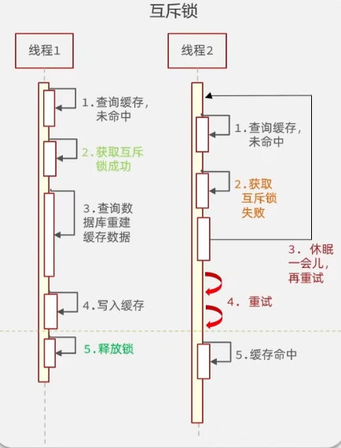

##### （2）逻辑过期

是解决缓存击穿的**异步**方案，不设置 Redis 物理过期时间，而是在缓存数据中附带逻辑过期时间，查询时发现数据过期则立即返回旧值，同时开启独立线程异步更新缓存，性能极高且不会打垮数据库，但会存在短暂的数据不一致。

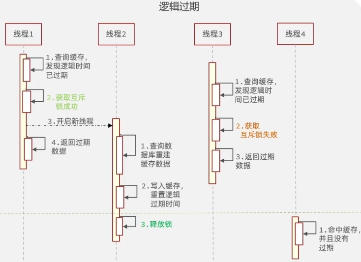

| 解决方案 | 优点                                                        | 缺点                                                       |
| -------- | ----------------------------------------------------------- | ---------------------------------------------------------- |
| 互斥锁   | （1）没有额外的内存消耗<br>（2）保证一致性<br>（3）实现简单 | （1）线程可能需要等待，性能受影响<br>（2）可能有死锁的风险 |
| 逻辑过期 | 线程无需等待，性能较好                                      | （1）不保证一致性<br>（2）有额外内存消耗<br>（3）实现复杂  |


#### 9、利用互斥锁解决缓存击穿问题

需求：修改根据id查询商铺的业务，基于互斥锁方式来解决击穿问题

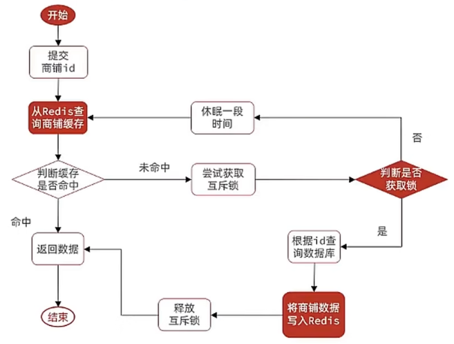


核心在于互斥锁的逻辑实现。

在`com/hmdp/service/impl/ShopServiceImpl.java`中，我打算把互斥锁的逻辑实现单门封装成一个方法，然后在`queryById()`方法中调用。[待会缓存穿透的代码也打算单独封装，然后用来调用]

创建方法`public Shop queryWithMutex(Long id)`

1、先从从Redis查询商铺缓存:

```java
String key = CACHE_SHOP_KEY + id;
        //1.从Redis查询商铺缓存
        String shopJson = stringRedisTemplate.opsForValue().get(key);
```

2、判断其是否存在，判断命中的是否为空值：

```java
//2.判断是否存在
        if (StrUtil.isNotBlank(shopJson)) {
            //3.存在，直接返回
            return JSONUtil.toBean(shopJson, Shop.class);
        }
		if (shopJson != null){//走到这里时，shopJson 只可能是 "" 或 null
            return null;
        }
```

如果是null，则判断为False，继续向下执行，如果为空字符串，则要变成null。总之都要变成null，才能启动缓存重建。

3、缓存重建，实现互斥锁：

```java
//4.实现缓存重建
        //4.1 实现互斥锁
        String lockKey = "lock:shop:" + id;//定义锁的key
        Shop shop = null;
        try {
            boolean isLock = tryLock(lockKey);
            //4.2 判断是否获取成功
            if (!isLock){
                //4.3 失败，则休眠并重试
                Thread.sleep(50);
                return queryWithMutex(id);
                //这里做了个递归，每次重试都从头走一遍逻辑（查缓存 → 抢锁），如果中途缓存已经重建好了，就提前命中缓存返回，不用非得自己抢到锁
            }
            //4.4 成功，根据id查询数据库
            shop = getById(id);
            //模拟重建的延时,用来测试互斥锁有没有产生作用
            Thread.sleep(200);
            //5.数据库里不存在，返回错误
            if (shop == null){
                //将空值写入Redis
                stringRedisTemplate.opsForValue().set(key, "", CACHE_NULL_TTL, TimeUnit.MINUTES);
                return null;
            }
            //6.存在，写入Redis
            stringRedisTemplate.opsForValue().set(key, JSONUtil.toJsonStr(shop),CACHE_SHOP_TTL , TimeUnit.MINUTES);
        } catch (InterruptedException e) {
            throw new RuntimeException(e);
        } finally {
            //7.释放互斥锁
            unlock(lockKey);//不论线程有没有出现异常，只要持有锁到最后都要放锁
        }

        //8.返回
        return shop;
```

这里首先是对锁进行一个key的定义，用来**在Redis中表明是谁的锁**。  调用`isLock()`，再判断当前线程有没有抢到锁，没有就休眠，然后进行下一轮**递归重试**，直到有结果，抢到了就进行缓存重建。

重建缓存就要去数据库里面查这个数据到底在不在。如果在，就直接写入就行，如果不存在，就存一个空对象到缓存里，再返回null，这样即使没有这个数据，也能防止大量请求直接打在数据库上。

最后就是在整个实现逻辑上进行异常处理，因为要保证**整个锁的实现正常与否，到最后都要保证锁能正常释放。**


清空控制台日志，清空Redis缓存，打开**JMeter**，进行并发测试：

先配置线程组，把线程数和执行时间设置好

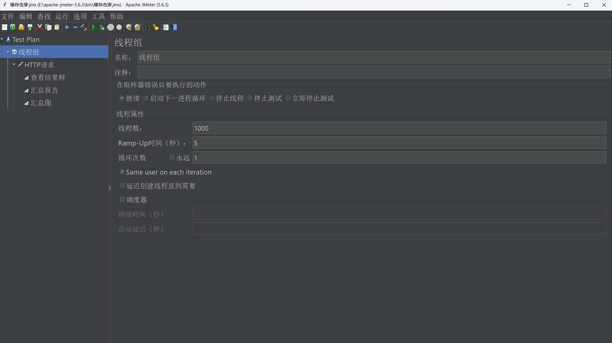

再配置请求地址，

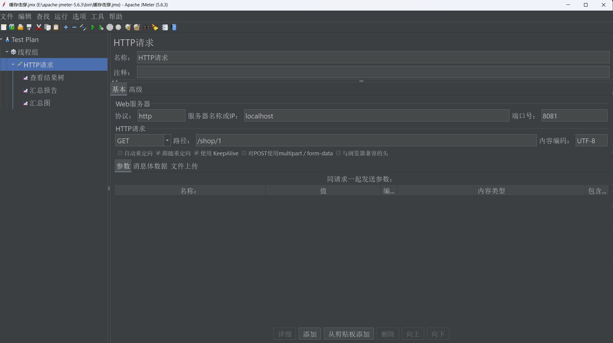

运行，进入IDEA控制台发现只有一条请求被打在了数据库上，其他全打在的Redis重建的缓存上面。这样这个缓存击穿就做好了。


类似的思路，我们把前几节写的缓存穿透的逻辑实现也单门封装：

```java
public Shop queryWithPassThrough(Long id){//防止缓存穿透的Redis查询
        String key = CACHE_SHOP_KEY + id;
        //1.从Redis查询商铺缓存
        String shopJson = stringRedisTemplate.opsForValue().get(key);

        //2.判断是否存在
        if (StrUtil.isNotBlank(shopJson)) {
            //3.存在，直接返回
            return JSONUtil.toBean(shopJson, Shop.class);
        }
        //判断命中是否为空值
        if (shopJson != null){//走到这里时，shopJson 只可能是 "" 或 null
            return null;
        }
        //4.不存在，根据id查询数据库
        Shop shop = getById(id);
        //5.数据库里不存在
        if (shop == null){
            //将空值写入Redis
            stringRedisTemplate.opsForValue().set(key, "", CACHE_NULL_TTL, TimeUnit.MINUTES);
            return null;
        }
        //6.存在，写入Redis
        stringRedisTemplate.opsForValue().set(key, JSONUtil.toJsonStr(shop),CACHE_SHOP_TTL , TimeUnit.MINUTES);
        //7.返回
        return shop;
    }
```

用`queryById(Long id)`调用：

```java
@Override
    public Result queryById(Long id) {
        //缓存穿透
        //Shop shop = queryWithPassThrough(id);

        //互斥锁解决缓存击穿
        Shop shop = queryWithMutex(id);
        if (shop == null){
            return Result.fail("店铺不存在！");
        }
        return Result.ok(shop);
    }
```


##### 常见问题：

- boolean类型的函数直接返回Boolean类型的数据会有什么结果？

​		返回 `Boolean` 对象时：

​		如果是 `Boolean.TRUE` / `FALSE`，会自动拆箱为 `boolean`，正常返回。

​		如果是 null，拆箱时会触发 NullPointerException，直接报错。

​		简单说：非空就正常，为 null就炸。

- 为什么锁也要key

​		锁的本质：一个**"共享标记"**
​		锁本质上就是一个所有线程都能看到的标记。谁能把这个标记"抢到手"，谁就拥有锁。

​		单机多线程（Java 的 synchronized / ReentrantLock）：标记存在 **JVM** 内存里，所有线程共享		同一个 **JVM**，所以能看见同一个标记。
​		分布式系统（多台服务器）：每个服务器有自己的 JVM，内存不共享。如果锁只存在某一台机器		的 JVM 里，其他机器根本看不到 → 锁失效。
​		Redis 就是那个**"所有机器都能看见的公共内存"**，把锁存在 Redis 里，所有服务都能访问到同一		把锁。


#### 10、利用逻辑过期解决缓存击穿问题

需求：修改根据id查询商铺的业务，基于逻辑过期方式来解决缓存击穿问题。

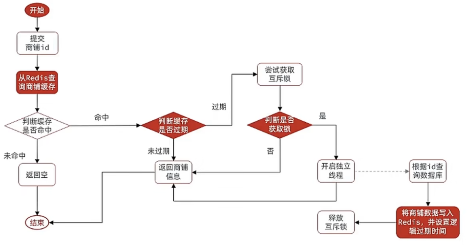

逻辑过期的核心是判断Redis里的key的逻辑时间是否过期，所以每个被逻辑过期判断模块的对象都要有**逻辑时间**属性。

但直接在业务实体 Shop 里添加逻辑时间属性显然不合适，因为 逻辑过期时间 不属于 Shop 这个业务概念，也就是说**店铺本身的业务属性里面没有页不应该有逻辑过期时间这个属性。**逻辑时间属于缓存细节。而且我们要保证逻辑时间的复用性要强，这个属性很有可能还会再别的业务实体中使用。

所以最好的方法是，将其**单门包装成一个类**。在`com/hmdp/utils/`创建类RedisData：

```java
package com.hmdp.utils;
import lombok.Data;
import java.time.LocalDateTime;

@Data
public class RedisData {
    private LocalDateTime expireTime;//逻辑过期时间
    private Object data;
}
```

这里RedisData包含属性逻辑过期时间`expireTime`，还有实际的数据`data`,`data`的实际类型由实际的业务实体而决定，所以直接定义为`Object`类型，什么都能接收。

这样我们到时候直接操作RedisData实体就可以了。


接下来就是实现逻辑过期的具体细节：

1、首先创建`public Shop queryWithLogicalExpire(Long id)`方法，

2、提交商铺id并在Redis里面查询是否存在，

```java
		String key = CACHE_SHOP_KEY + id;
        //1.从Redis查询商铺缓存
        String shopJson = stringRedisTemplate.opsForValue().get(key);

        //2.判断是否存在
        if (StrUtil.isBlank(shopJson)) {
            //3.不存在，直接返回null
            return null;
        }
```

3、如果命中了，则要先把从Redis取出来的json反序列化成对象，

```java
		//4.命中，需要先把json反序列化成对象
        RedisData redisData = JSONUtil.toBean(shopJson, RedisData.class);
        JSONObject data = (JSONObject) redisData.getData();
        Shop shop = JSONUtil.toBean(data, Shop.class);
        LocalDateTime expireTime = redisData.getExpireTime();
        /*因为 data 声明为 Object，JSON 反序列化时解析器不知道具体目标类型，
        就默认把它解析成通用的键值对容器 JSONObject（运行时类型）。
        所以取出来后需要手动强转 + 再转一次才能得到真正的 Shop。
        这正是之前讨论过的"为什么不用泛型"的延续——JSON 反序列化会丢失类型信息，
        无论声明 Object 还是 <T>，取出来都得手动指定类型再转一次。*/
```

4、判断逻辑时间是否过期，未过期直接返回店铺信息，

```java
//5.判断是否过期
        if (expireTime.isAfter(LocalDateTime.now())){
            //5.1.未过期，直接返回店铺信息
            return shop;
        }
```

5、如果过期了，就要进行缓存重建

```java
		//6.缓存重建
        //6.1.获取互斥锁
        String lockKey = LOCK_SHOP_KEY + id;
        boolean isLock = tryLock(lockKey);
        //6.2.判断是否获锁成功
        if (isLock){
            //TODO 6.3.成功，开启独立线程，实现缓存重建
            CACHE_REBUILD_EXECUTOR.submit(()->{
                try {
                    //重建缓存
                    this.saveShop2Redis(id, 20L);
                } catch (Exception e) {
                    throw new RuntimeException(e);
                } finally {
                    //释放锁
                    unlock(lockKey);
                }
            });
        }
        //6.4.返回过期的店铺信息
        return shop;
```

首先是获取互斥锁，如果没抢所成功，就直接返回旧的店铺信息，

抢到锁了，就开启独立线程。这里我们需要提前先创建一个线程池：

```java
private static final ExecutorService CACHE_REBUILD_EXECUTOR = Executors.newFixedThreadPool(10);//线程池线程数量为10个

```

然后进行重建缓存，这里调用`saveShop2Redis(Long id,Long expireSeconds)`重建缓存，

`saveShop2Redis(Long id,Long expireSeconds)`：

```java
public void saveShop2Redis(Long id,Long expireSeconds) throws InterruptedException {
        //1.查询店铺数据
        Shop shop = getById(id);
        Thread.sleep(200);
        //2.分装逻辑过期时间
        RedisData redisData = new RedisData();
        redisData.setData(shop);
        redisData.setExpireTime(LocalDateTime.now().plusSeconds(expireSeconds));//从当前时间加上expireSeconds时间
        //3.写入Redis
        stringRedisTemplate.opsForValue().set(CACHE_SHOP_KEY + id,JSONUtil.toJsonStr(redisData));
    }
```

需要注意的是，这里涉及了抢锁和释放锁，所以一定要用异常处理，保证不论什么情况下，锁都会被完全释放。

重建完成后，返回新的店铺数据。


##### 常见问题：

- **我如果要用逻辑过期，就得添加一个逻辑过期时间，为什么不推荐直接在shop里面添加逻辑过期字段？**

**不推荐直接在 `Shop` 里加 `expireTime`，是因为它是缓存层的技术细节，不属于业务实体。** 把它和业务模型混在一起，会污染实体、干扰数据库映射、泄露给前端，且无法复用。用独立的 `RedisData` 包装类，把"数据"和"缓存元信息"分开，才是干净的设计。

本质上这是软件设计里一个很通用的原则：**区分"业务是什么"和"技术怎么实现"，让它们各司其职**。

------


- **@Resource是干嘛的？**

`@Resource` 是 **JSR-250** 标准里的一个注解，作用是**依赖注入（DI）**——让 Spring 自动帮你把对象塞进字段里，不用自己 `new`。

没有注解时，你得自己创建依赖对象：

```java
public class ShopServiceImpl {
    private StringRedisTemplate stringRedisTemplate = new StringRedisTemplate(); // 自己new，配置麻烦
}
```

用了 `@Resource`：

```java
public class ShopServiceImpl {
    @Resource
    private StringRedisTemplate stringRedisTemplate; // Spring自动注入，不用管怎么来的
}
```

Spring 启动时看到 `@Resource`，会去容器里找 `StringRedisTemplate` 这个 Bean，自动赋值给这个字段。

​	**注入规则（重要）：**

`@Resource` 注入时**默认按名称找，找不到再按类型找**：

1. 先看字段名（比如 `stringRedisTemplate`），去容器里找有没有叫这个名字的 Bean
2. 找不到 → 退而按**类型**（`StringRedisTemplate`）找
3. 还找不到 → 报错

和 `@Autowired` 的区别

这是面试常考点，也最容易混：

| 对比项            | `@Resource`                  | `@Autowired`                 |
| ----------------- | ---------------------------- | ---------------------------- |
| 来源              | JSR-250 标准（JDK 自带规范） | Spring 自带                  |
| 默认匹配方式      | **先按名称**，再按类型       | **先按类型**                 |
| 配合 `@Qualifier` | 自带 `name` 属性，可指定名称 | 需配合 `@Qualifier` 指定名称 |
| 适用范围          | 字段、setter                 | 字段、setter、**构造方法**   |

------


- **逻辑 过期未命中为何直接返回null？**

**逻辑过期方案根本不查数据库，它依赖"缓存永远存在"这个前提。**

先看逻辑过期方案的完整流程：

```
1. 查 Redis
2. 缓存未命中 (key不存在) ──► 直接返回 null   ← 你问的这步
3. 缓存命中 ──► 判断逻辑过期时间
   ├─ 未过期 ──► 返回数据
   └─ 已过期 ──► 尝试抢锁
        ├─ 抢到锁 ──► 开新线程重建缓存 + 释放锁 + 返回旧数据
        └─ 没抢到 ──► 返回旧数据
```

注意：**整个流程里没有任何一步去查数据库**。这就是**逻辑过期方案和互斥锁方案最大的区别。**

✅ 未命中 = 异常情况，应该报警而非查库

在逻辑过期方案的设计里，"缓存未命中"本身就是一种**不正常的状态**，可能的原因：

- 预热没做好（漏了这个 key）
- Redis 故障 / 重启后数据丢了
- 有人误删了缓存

正确做法不是去查库兜底，而是：
- 返回 null（或一个降级提示）
- 触发告警，让人去排查 / 重新预热

用查数据库来"兜底"反而掩盖了问题。

三种方案对比：

| 方案         | 缓存未命中时        | 是否查数据库            | 目标           |
| ------------ | ------------------- | ----------------------- | -------------- |
| 普通缓存     | 查数据库            | ✅ 会                    | 简单可用       |
| 互斥锁       | 抢锁 → 查数据库重建 | ✅ 会（但只让1个线程查） | 防击穿，强一致 |
| **逻辑过期** | **直接返回 null**   | ❌ **完全不查**          | 防击穿，高可用 |

------


- **`JSONObject data = (JSONObject) redisData.getData();`我定义的`data`类型为`Object`，为什么这里是`JSONObject`呢？**

这是 JSON 反序列化时一个很关键的细节，这里详细解释。

**关键原因：反序列化时，Spring/Jackson 不知道 `Object` 到底是什么类型**

`data` 字段声明为 `Object`，对 JSON 解析器来说就是个"黑盒"——它不知道你原本塞进去的是 `Shop`、`Voucher` 还是别的。

存进 Redis 时，JSON 长这样：

```json
{
  "expireTime": "2026-07-12T20:00:00",
  "data": {
    "id": 1,
    "name": "茶颜悦色",
    "typeId": 10,
    ...
  }
}
```

取出来反序列化时：

```java
RedisData redisData = JSONUtil.toBean(json, RedisData.class);
```

所以 `redisData.getData()` 返回的对象，**运行时类型是 `JSONObject`**，只是它的**编译时声明类型是 `Object`**。

编译时类型 vs 运行时类型（核心概念）：

|                        | 类型         | 说明                               |
| ---------------------- | ------------ | ---------------------------------- |
| **声明类型**（编译时） | `Object`     | 字段定义时写的类型，编译器只认这个 |
| **实际类型**（运行时） | `JSONObject` | 对象真正是什么类，运行时才知道     |

```java
Object data = redisData.getData();
//     ↑ 声明类型          ↑ 实际返回的是 JSONObject 实例
```

所以强转是合法的，因为运行时它**真的就是** `JSONObject`：

```java
JSONObject data = (JSONObject) redisData.getData();  // ✅ 没问题
```

怎么拿到真正的 `Shop`？

需要**再手动转一次**，把 `JSONObject` 转成 `Shop`：

```java
JSONObject data = (JSONObject) redisData.getData();
Shop shop = JSONUtil.toBean(data, Shop.class);  // JSONObject → Shop
```

或者一步到位（课程里常见的写法）：

```java
Shop shop = JSONUtil.toBean(
    JSONUtil.toJsonStr(redisData.getData()),  // 把Object重新转回JSON字符串
    Shop.class
);
```

------


- **缓存重建需要单独线程，为什么要提前建立线程池？**

很多人会图省事直接写：

```java
new Thread(() -> 重建缓存).start();  // ❌ 不推荐
```

但课程/工程里推荐**提前定义好一个线程池**：

```java
// 提前建好的线程池（成员变量）
private static final ExecutorService CACHE_REBUILD_EXECUTOR =
    Executors.newFixedThreadPool(10);
```

原因有这几点：

1. 🔴 `new Thread` 每次都创建新线程，开销大

- 线程创建/销毁要**操作系统介入**，涉及内核态切换、分配栈空间（默认 1MB），是个重活
- 高并发下每次重建都 `new Thread`，频繁创建销毁，浪费 CPU 和内存线程池**复用线程**：建好后线程常驻，有任务就丢给空闲线程执行，省去反复创建销毁的开销。

2. 🔴 `new Thread` 无法控制数量，可能拖垮系统

逻辑过期方案的特点是：缓存一过期，**可能瞬间涌入大量请求**都发现过期（虽然只有1个能抢到锁重建，但抢锁失败的那批也来过）。

设想极端情况：如果每次重建都 `new Thread`，一旦出现缓存雪崩（大量 key 同时过期），可能瞬间创建出**成百上千个线程**：

- 每个线程占 1MB 栈 → 内存爆掉 `OutOfMemoryError`
- 大量线程抢 CPU → 上下文切换开销巨大，系统反而更慢
- 还可能把数据库连接池打爆（每个线程都要查库）

线程池**有上限**（比如 `newFixedThreadPool(10)` 最多 10 个线程），超出任务进队列排队，**给系统装了限流阀**，防止失控。

3. 🔴 `new Thread` 不利于管理

线程池提供统一的管理能力：
- **优雅关闭**：应用停止时，线程池能等待任务执行完再退出，避免任务丢失
- **监控**：可以查队列长度、活跃线程数等指标
- **拒绝策略**：任务太多时怎么处理（丢弃、报错、调用者自己执行……）

`new Thread()` 创建的线程是"野线程"，不受控、无法管理、出了问题难排查。

4. ✅ 提前建好 = 启动时初始化，避免运行时延迟

如果线程池是**用到时才建**（懒加载），第一个触发重建的请求要承受"建线程池"的额外耗时。提前在类加载时（`static final`）建好，运行时直接用，**零初始化延迟**。

三、对比总结

|              | `new Thread()`         | 线程池（提前建好）     |
| ------------ | ---------------------- | ---------------------- |
| 线程创建开销 | 每次都创建销毁，开销大 | 复用，开销小           |
| 数量控制     | ❌ 无限创建，可能 OOM   | ✅ 有上限，带限流       |
| 任务管理     | ❌ 无法管理             | ✅ 队列、拒绝策略、监控 |
| 优雅关闭     | ❌ 做不到               | ✅ 可以等待任务完成     |
| 适用场景     | 几乎不推荐             | 工程标准做法           |


#### 11、封装Redis工具类

基于StringRedisTemplate封装一个缓存工具类，满足下列需求：

- 方法一：将任意Java对象序列化为json并存储在string类型的key中，并且可以设置TTL过期时间
- 方法二：将任意Java对象序列化为json并存储在string类型的key中，并且可以设置逻辑过期时间，用于处理缓存击穿问题
- 方法三：根据指定的key查询缓存，并反序列化为指定类型，利用缓存空值的方式就解决缓存穿透问题
- 方法四：根据指定的key查询缓存，并反序列化为指定类型，需要利用逻辑过期解决缓存击穿问题

前面几节里，缓存穿透、互斥锁、逻辑过期这些逻辑全都堆在 `ShopServiceImpl` 里，而且写死了 `Shop` 类型。

问题是：这些逻辑其实和"商铺"没有半毛钱关系，换一个业务（比如优惠券查询）又得把同样的代码抄一遍。所以这一节的目标就是把这些缓存套路**抽成一个通用工具类 `CacheClient`**，用泛型让"存什么类型、用什么id查"都由调用方决定，做到一次封装、处处复用。

在 `com/hmdp/utils/CacheClient.java` 中创建工具类：

```java
@Slf4j
@Component  // 由Spring维护，交给Spring容器，别处直接 @Resource 注入即可
public class CacheClient {

    private final StringRedisTemplate stringRedisTemplate;

    public CacheClient(StringRedisTemplate stringRedisTemplate){
        this.stringRedisTemplate = stringRedisTemplate;
    }
    // ... 四个方法 + tryLock/unlock
}
```

几个关键点：

- **`@Component`**：让 `CacheClient` 成为 Spring Bean，这样 `ShopServiceImpl` 里 `@Resource private CacheClient cacheClient;` 就能直接注入，不用自己 `new`。
- **构造方法注入 `StringRedisTemplate`**：工具类内部要操作 Redis，得拿到 `StringRedisTemplate`。用构造方法注入（而不是 `@Resource` 字段注入）是因为 `StringRedisTemplate` 是 final 字段，能在对象创建时就赋值，更稳妥，也方便单测。因为是 Spring Bean，Spring 会自动帮我们把 `StringRedisTemplate` 传进构造方法。

---

##### （1）方法一：set —— 带TTL的普通缓存

```java
public void set(String key, Object value, Long time, TimeUnit unit){
    // TTL过期
    stringRedisTemplate.opsForValue().set(key, JSONUtil.toJsonStr(value), time, unit);
}
```

最基础的方法：把任意 Java 对象序列化成 JSON，存进 String 类型的 key，并设置 TTL 过期时间。`value` 声明为 `Object`，所以传 `Shop`、`Voucher`、`User` 都行，内部统一用 `JSONUtil.toJsonStr` 序列化。

---

##### （2）方法二：setWithLogicalExpire —— 带逻辑过期的缓存

```java
public void setWithLogicalExpire(String key, Object value, Long time, TimeUnit unit){
    // 逻辑过期
    RedisData redisData = new RedisData();
    redisData.setData(value);  // 把值塞进redisData，这样就有逻辑过期时间属性
    redisData.setExpireTime(LocalDateTime.now().plusSeconds(unit.toSeconds(time)));
    // 写入Redis
    stringRedisTemplate.opsForValue().set(key, JSONUtil.toJsonStr(redisData));
}
```

逻辑过期方案的关键在于：**Redis 里这个 key 永远不设物理 TTL**，而是把"逻辑过期时间"塞进 `RedisData` 一起存进去。查询时由业务代码自己判断 `expireTime` 是否过期。

注意这里和 `ShopServiceImpl` 里 `saveShop2Redis` 的区别——之前是先 `getById` 查库再封装，这里**只负责封装和写入**，数据由调用方传进来（`value` 参数），查询数据库的职责交给了方法四里的 `dbFallback`。这样工具类就更纯粹，不绑定具体的数据库查询逻辑。

`unit.toSeconds(time)` 把"时间 + 单位"统一换算成秒，再 `plusSeconds` 加到当前时间上，得到逻辑过期时间点。

---

##### （3）方法三：queryWithPassThrough —— 泛型 + 缓存空值防穿透

```java
public <R, ID> R queryWithPassThrough(
        String keyPrefix, ID id, Class<R> type, Function<ID, R> dbFallback, Long time, TimeUnit unit
){
    String key = keyPrefix + id;
    // 1.从Redis查询缓存
    String json = stringRedisTemplate.opsForValue().get(key);

    // 2.判断是否存在
    if (StrUtil.isNotBlank(json)) {
        // 3.存在，直接返回
        return JSONUtil.toBean(json, type);
    }
    // 命中是否为空值
    if (json != null) {  // 走到这里时，json 只可能是 "" 或 null
        return null;
    }
    // 4.不存在，根据id查询数据库
    R r = dbFallback.apply(id);
    // 5.数据库里不存在
    if (r == null){
        // 将空值写入Redis
        stringRedisTemplate.opsForValue().set(key, "", CACHE_NULL_TTL, TimeUnit.MINUTES);
        return null;
    }
    // 6.存在，写入Redis
    this.set(key, r, time, unit);
    // 7.返回
    return r;
}
```

逻辑和第6节写的 `queryWithPassThrough` 完全一样（命中返回、命中空值返回null、未命中查库、查不到缓存空值、查到写缓存），区别只在于**用泛型把 `Shop` 换成了 `R`、`Long` 换成了 `ID`**，让它不再绑定商铺。

几个参数的含义：

| 参数 | 含义 | 例子 |
| --- | --- | --- |
| `keyPrefix` | key 的前缀，和 id 拼成完整 key | `"cache:shop:"` |
| `id` | 查询的业务id，类型由 `ID` 决定 | `1L` |
| `type` | 反序列化的目标类型，告诉 `JSONUtil.toBean` 转成什么 | `Shop.class` |
| `dbFallback` | 缓存未命中时"怎么查数据库"的回调函数 | `this::getById` |
| `time` / `unit` | 缓存 TTL | `30L` / `MINUTES` |

- **`<R, ID>` 泛型**：`R` 是返回值类型（如 `Shop`），`ID` 是 id 类型（如 `Long`）。声明在返回值前，整个方法就都能用这两个类型变量了。
- **`Function<ID, R> dbFallback`**：`Function` 是一个函数式接口，接收 `ID`、返回 `R`。它把"查数据库"这一步**外包给调用方**——工具类不知道你要查哪张表，调用方传一个 `this::getById` 进来，工具类在缓存未命中时调 `dbFallback.apply(id)` 去查库。这就是为什么工具类能通用：查询逻辑由调用方决定，工具类只负责"缓存套路"。
- **`type` 为什么必须传**：因为 JSON 反序列化会丢失类型信息（前面第10节讲过 `data` 声明为 `Object` 取出来变成 `JSONObject` 的问题），`JSONUtil.toBean(json, type)` 必须明确告诉它转成 `Shop` 还是别的，所以目标类型得由调用方传进来。
- **复用 `this.set`**：写缓存那一步直接调方法一，避免重复代码。

---

##### （4）方法四：queryWithLogicalExpire —— 泛型 + 逻辑过期防击穿

```java
private static final ExecutorService CACHE_REBUILD_EXECUTOR = Executors.newFixedThreadPool(10);
// 固定10个线程的线程池，专门用来异步重建缓存

public <R, ID> R queryWithLogicalExpire(
        String keyPrefix, ID id, Class<R> type, Function<ID, R> dbFallback, Long time, TimeUnit unit
){
    String key = keyPrefix + id;
    // 1.从Redis查询缓存
    String json = stringRedisTemplate.opsForValue().get(key);

    // 2.判断是否存在
    if (StrUtil.isBlank(json)) {
        // 3.不存在，直接返回null（逻辑过期方案不查库，依赖"缓存永远存在"的前提）
        return null;
    }
    // 4.命中，先把json反序列化成对象
    RedisData redisData = JSONUtil.toBean(json, RedisData.class);
    JSONObject data = (JSONObject) redisData.getData();
    R r = JSONUtil.toBean(data, type);
    LocalDateTime expireTime = redisData.getExpireTime();
    // data 声明为 Object，反序列化时被解析成 JSONObject，所以要强转 + 再转一次才能拿到真正的 R

    // 5.判断是否过期
    if (expireTime.isAfter(LocalDateTime.now())){
        // 5.1.未过期，直接返回
        return r;
    }

    // 5.2.已过期，需要缓存重建
    // 6.1.获取互斥锁
    String lockKey = LOCK_SHOP_KEY + id;
    boolean isLock = tryLock(lockKey);
    // 6.2.判断是否获锁成功
    if (isLock){
        // 6.3.成功，开启独立线程，实现缓存重建
        CACHE_REBUILD_EXECUTOR.submit(() -> {
            try {
                // 查询数据库
                R r1 = dbFallback.apply(id);
                // 写入Redis并且加入逻辑过期时间
                this.setWithLogicalExpire(key, r1, time, unit);
            } catch (Exception e) {
                throw new RuntimeException(e);
            } finally {
                // 释放锁
                unlock(lockKey);
            }
        });
    }
    // 6.4.返回旧数据（不管有没有抢到锁，都先返回过期的旧数据，不让用户等）
    return r;
}
```

逻辑和第10节写的 `queryWithLogicalExpire` 完全一致（未命中返回null、命中判断逻辑过期、未过期返回、过期抢锁异步重建、抢到锁开线程重建并释放锁、返回旧数据），区别同样是**泛型化**：`Shop` → `R`，`saveShop2Redis(id, 20L)` 换成了 `this.setWithLogicalExpire(key, r1, time, unit)`——重建时不再自己查库+封装，而是调 `dbFallback.apply(id)` 拿到新数据，再交给方法二写入。

注意 `LOCK_SHOP_KEY`（`"lock:shop:"`）这里直接用作锁 key 前缀了，虽然是工具类，但锁的前缀还是写死了 `lock:shop:`。严格来说工具类应该把锁前缀也作为参数传进来，但目前业务场景够用，没做那么彻底的解耦。

---

##### （5）tryLock / unlock —— 互斥锁的底层封装

```java
private boolean tryLock(String key){  // 上互斥锁，key是锁的key
    Boolean aBoolean = stringRedisTemplate.opsForValue().setIfAbsent(key, "1", 10, TimeUnit.SECONDS);  // 相当于SETNX
    return BooleanUtil.isTrue(aBoolean);  // 不直接返回，因为Boolean对象可能为null
}

private void unlock(String key){  // 释放互斥锁
    stringRedisTemplate.delete(key);
}
```

和之前 `ShopServiceImpl` 里的一模一样，只是搬进了工具类。`setIfAbsent` 就是 Redis 的 `SETNX`（key不存在才设置），加上10秒过期作为兜底，防止拿到锁的线程挂了导致锁永远不释放（死锁）。`BooleanUtil.isTrue(aBoolean)` 把可能为 null 的 `Boolean` 安全拆箱成 `boolean`。

这两个方法设为 `private`，因为它们是工具类内部用的，不对外暴露。

---

##### （6）ShopServiceImpl 改用工具类

工具类封装好后，`ShopServiceImpl` 里那些 `queryWithPassThrough`、`queryWithLogicalExpire`、`tryLock`、`unlock`、`saveShop2Redis` 全都不用自己写了，直接调 `cacheClient` 的方法即可（旧代码注释保留作对照）：

```java
@Resource
private CacheClient cacheClient;

@Override
public Result queryById(Long id) {
    // 解决缓存穿透
    // Shop shop = cacheClient.queryWithPassThrough(CACHE_SHOP_KEY, id, Shop.class, this::getById, CACHE_SHOP_TTL, TimeUnit.MINUTES);

    // 逻辑过期解决缓存击穿
    Shop shop = cacheClient.queryWithLogicalExpire(CACHE_SHOP_KEY, id, Shop.class, this::getById, CACHE_SHOP_TTL, TimeUnit.MINUTES);

    if (shop == null){
        return Result.fail("店铺不存在！");
    }
    return Result.ok(shop);
}
```

调用时一眼就能看出泛型参数是怎么落地的：`R = Shop`、`ID = Long`、`type = Shop.class`、`dbFallback = this::getById`（把 Service 自己的 `getById` 当作查库回调传进去）。

> ⚠️ **注意**：逻辑过期方案依赖"缓存已预热、永远存在"这个前提，所以 `queryById` 切到 `queryWithLogicalExpire` 之前，**必须先把商铺数据用 `setWithLogicalExpire` 提前写进 Redis**，否则缓存未命中会直接返回 null（详见第10节常见问题"逻辑过期未命中为何直接返回null"）。预热在下面的测试里做。

---

##### （7）测试：预热商铺缓存

逻辑过期方案要先用带逻辑过期时间的方式把数据灌进 Redis。在 `HmDianPingApplicationTests` 里加测试方法：

```java
@Resource
private ShopServiceImpl shopService;
@Resource
private CacheClient cacheClient;

@Test
void TestSaveShop() throws InterruptedException {
    Shop shop = shopService.getById(1L);
    cacheClient.setWithLogicalExpire(CACHE_SHOP_KEY + 1L, shop, 10L, TimeUnit.SECONDS);
}
```

先把1号商铺从数据库查出来，再用 `cacheClient.setWithLogicalExpire` 写进 Redis，逻辑过期时间设为10秒。这样跑完测试后 Redis 里就有这条带逻辑过期时间的缓存了，`queryWithLogicalExpire` 就能正常命中。

> 💡 这里10秒只是测试方便观察过期和重建，生产环境逻辑过期时间会设得长得多（比如几小时）。

---

##### （8）小结：工具类封装的意义

把缓存套路抽成 `CacheClient` 之后：

1. **复用**：任何业务的查询缓存都能套用，新增一个优惠券查询只要 `cacheClient.queryWithPassThrough("cache:voucher:", id, Voucher.class, this::getById, ...)` 一行，不用再抄一遍穿透逻辑。
2. **职责分离**：`ShopServiceImpl` 只关心"商铺业务"（查库用 `getById`、key前缀用 `CACHE_SHOP_KEY`），缓存套路（穿透、击穿、序列化、锁）全归 `CacheClient`，业务代码一下子清爽了。
3. **泛型解耦**：`<R, ID>` + `Function<ID, R> dbFallback` 把"缓存套路"和"查什么数据"彻底分开——工具类不知道也不关心你查的是商铺还是别的，调用方通过传 `type` 和 `dbFallback` 把这两件事补齐。

| 方法 | 作用 | 对应的缓存问题 |
| --- | --- | --- |
| `set` | 存对象 + TTL | 普通缓存 + 超时剔除 |
| `setWithLogicalExpire` | 存对象 + 逻辑过期时间 | 逻辑过期方案的预热 |
| `queryWithPassThrough` | 查缓存 + 缓存空值 | 缓存穿透 |
| `queryWithLogicalExpire` | 查缓存 + 异步重建 | 缓存击穿（逻辑过期） |

至此，商铺查询缓存这块就把"穿透、雪崩、击穿"三种问题的解决方案全部封装成了可复用工具。


**常见问题：**

- **在CacheClient类中，封装queryWithPassThrough方法为什么要用泛型？**

因为 `CacheClient` 是一个通用工具类，要给所有业务复用，不能写死成 Shop。

重点讲两个参数
1. `Class<R> type` —— 为什么要把 Class 传进来？
因为泛型擦除。Java 泛型只存在于编译期，运行时 R 的类型信息会被擦除，`JSONUtil.toBean(json, R.class)` 这种写法是编译不过的（R.class 非法）。

​		所以必须由调用方显式把 Class 对象传进来：`	JSONUtil.toBean(json, type);   // type = Shop.class`，运行时能拿到。

​	这是 Java 泛型 + JSON 反序列化的标准套路。

2. `Function<ID, R> dbFallback` —— 为什么要传一个函数？
CacheClient 是工具类，它不知道你要查哪个表（Shop？Voucher？）。但"缓存未命中查数据库"这一步又是必需的。


- **我作为工具类开发者，我怎么知道dbFallback有apply方法？**

**因为 `Function` 是 JDK 自带的标准接口，它的契约就是规定有 `apply` 方法**。

它的**契约**就是：「接收一个参数 T，返回一个结果 R，核心方法是 `apply`」。

JDK 里有一整套这样的标准接口，都遵循"一个抽象方法代表功能"的契约，记住几个常用的就够：一句话：**接口是契约，`apply` 是 `Function` 契约里规定的方法，查文档或 IDE 就能看到；你按契约调用，实现交给调用方。** 🔌


- **`public <R, ID> R queryWithPassThrough`类是<R, ID>，参数`Function<ID, R>`，顺序不一样有什么说法吗？Function的<ID, R>有都是什么意思？**

**有！而且必须不一样。**

1. `<R, ID>` 是「声明」类型参数（你随便定顺序）

方法上的 `<R, ID>` 是在**声明**："我这个方法有两个类型参数，分别叫 R 和 ID"。


2. `Function<ID, R>` 是「使用」类型参数（顺序被 JDK 锁死）

`Function<ID, R>` 是在**使用**你声明的类型参数，去填充 JDK 的 `Function<T, R>` 接口。

而 `Function<T, R>` 是 **JDK 定义好的**，它的两个参数有**固定含义和顺序**：

```java
// JDK 源码定义
public interface Function<T, R> {   // ← T在前，R在后，JDK规定的
    R apply(T t);                    // T是输入，R是返回
}
```

- **第一个参数 `T`** = 输入类型（apply 的参数类型）
- **第二个参数 `R`** = 返回类型（apply 的返回类型）

**问题二：`Function<ID, R>` 的 `<ID, R>` 各是什么意思？**

对照 JDK 的定义 `Function<T, R>`（T=输入, R=返回）：

| 位置  | 你的类型 | 对应JDK的   | 含义                                               |
| ----- | -------- | ----------- | -------------------------------------------------- |
| 第1个 | `ID`     | `T`（输入） | `apply` 方法的**参数类型**——查库时传入的主键类型   |
| 第2个 | `R`      | `R`（返回） | `apply` 方法的**返回类型**——查库返回的业务对象类型 |

意思是：**传入一个 ID，返回一个 R**。


- **`this::getById`这种写法是什么写法，和lambda表达式的区别？**

`this::getById` 这种写法叫**方法引用（Method Reference）**，它是 lambda 表达式的一种**简写形式**。我来详细讲。

意思是：**「指向某个已经存在的方法，把它当作函数式接口的实现来用」**。

`this::getById` 就是：「把当前对象 `this` 的 `getById` 方法，拿来当作 `Function` 的实现」。

当一个 lambda 表达式**仅仅是调用一个已存在的方法**、什么额外的事都不做时，就可以用方法引用简写。

两者**完全等价**：

```java
// lambda 写法
id2 -> shopService.getById(id2)

// 方法引用写法（前提：lambda 体只是单纯调用一个方法）
shopService::getById
```

注意看：lambda 写法里 `id2 -> shopService.getById(id2)`，参数 `id2` 只是原封不动地传给了 `getById`，没干别的。这种"纯转发"的场景就能用方法引用简写，省掉重复的参数。

`this::getById` 同理，等价于：

```java
id2 -> this.getById(id2)
```


- **那`this::getById`参数怎么穿进去的呢？**

核心认知：方法引用只是"指向方法"，不执行

`this::getById` 这一行代码，**仅仅是创建了一个函数对象**，并没有执行 `getById`，也没有传参。


### 三、优惠券秒杀

#### 1、全局唯一ID

**全局ID生成器**，是一种在的分布式系统下用来生成**全局唯一ID**的工具，一般要满足以下特性：

- 唯一性
- 高性能
- 高可用
- 递增性
- 安全性

为了增加ID的安全性，我么可以不直接受用Redis自增的数值，而是拼接一些其他的信息：

ID的组成部分：

- 符号位：1bit，永远为0
- 时间戳：31bit，以秒为单位，可以使用69年
- 序列号：32bit，秒内的计数器，支持每秒产生2的32次方个不同ID

```markdown
|<------------------- 64 位 long ------------------->|

      高32位（时间戳）              低32位（序号）
  |<------- 32 bit ------->|<------- 32 bit ------->|
  
  含义：第几秒生成的          含义：这一秒内的第几个

```


#### 2、Redis实现全局唯一ID

假设我的服务部署在 3 台服务器上，每个订单都需要一个全局不重复的订单号。

MySQL 自增 ID：3 台机器用各自数据库，A 机器生成 id=1，B 机器也生成 id=1 → 会冲突！

Java 本地 long：每台机器自己计数，各自从 1 开始 → 冲突！

所以需要所有机器共享的"发号器"，保证不管多少台机器并发请求，**拿到的号都不重复**。

Redis 就当这个发号器——**所有机器共用同一个 Redis，Redis 的 INCR 命令是原子操作，天然不会被并发打乱。**

全局唯一ID生成策略：

- UUID
- Redis自增
- snowflake算法
- 数据库自增

本节我们用**Redis自增策略。**

首先我们在utils里创建`RedisIDWoker`工具类。

创建`public long nextId(String keyPrefix)`方法。

**第 1 步：生成「相对时间戳」**：

```java
LocalDateTime now = LocalDateTime.now();                    // 当前时间
long nowSecond = now.toEpochSecond(ZoneOffset.UTC);         // 转成Unix秒（从1970-01-01算起）
long timestamp = nowSecond - BEGIN_TIMESTAMP;               // 减去基准时间

```

这里我们要获取一个自己的基准时间，如果不减，nowSecond 现在是 17 亿多，这个数字占的位数会越来越大。减去基准后，timestamp 就变成一个小得多的数字（从 0 开始计数），省下的位数留给序号用，让 ID 能支持的年份更久。

获取基准时间：

```java
// 修复后
public static void main(String[] args) {
    long second = LocalDateTime.of(2020, 1, 1, 0, 0, 0)//以2020-1-1,0:0:0为基准
                              .toEpochSecond(ZoneOffset.UTC);
    System.out.println("second = " + second);  // 输出结果为1577836800
}
```

获取自己的基准时间后，将它定义为常量，方便随时修改

```java
private static final long BEGIN_TIMESTAMP = 1577836800L;
```


**第 2 步：生成序号：**

```java
String date = now.format(DateTimeFormatter.ofPattern("yyyy:MM:dd"));   // 当天日期
Long count = stringRedisTemplate.opsForValue().increment("icr:" + keyPrefix + ":" + date);

```

| 代码 | 含义 |
| ---- | ---- |
| `now.format(...)` | 得到今天的日期字符串，比如 `"2026:07:21"` |
| `"icr:" + keyPrefix + ":" + date` | 拼成 Redis key，比如 `"icr:order:2026:07:21"` |
| `opsForValue().increment(...)` | 对这个 key 执行 Redis INCR 命令，原子自增 1 |

key 里带了日期 → 不同天的 key 不同 → 序号每天自动归零重置 → 不会无限增长溢出

- 第 1 次调 `increment("icr:order:2026:07:21")` → Redis 里没有这个 key，自动初始化为 0 再 +1 → 返回 1
- 第 2 次调 → 返回 2
- 第 10000 次调 → 返回 10000

不管多少台服务器、多少线程同时调，Redis 是单线程处理命令的，每个 INCR 原子执行，绝对不会给重复的号


**第 3 步：拼接：**

```java
return timestamp << COUNT_BITS | count;
//     ↑ 左移32位，放高位   ↑ 按位或，放低位

```

高32位 = 当前是第几秒（从2020年起算）
低32位 = 这一秒内 Redis 给的第几个号

两者拼成一个 64 位 long → **全局唯一 ID**


最后，我们要测试一下生成的ID，测ID 生成器在高并发下好不好使。

在测试类编写测试。

在编写测试方法之前，首先先创建一个线程池，里面放500个线程

```java
    private ExecutorService es = Executors.newFixedThreadPool(500);
```

首先编写测试方法

```java
 @Test
    void testIdWorker(){/***/}
```

准备工作

```java
CountDownLatch latch = new CountDownLatch(300);
```

`CountDownLatch` 是一个**倒计时门闩**。创建时设一个数字 300，每完成一个线程就减 1，减到 0 后主线程才能继续往下走。这里用它确保**300 个线程全部跑完，主线程才计算耗时**。

```java
Runnable task = () -> {
    for (int i = 0; i < 100; i++) {
        long id = redisIdWorker.nextId("order");
        System.out.println("id = " + id);
    }
    latch.countDown();   // ← 本线程跑完了，计数 -1
};
```

定义一个**任务**（`Runnable` 是一个函数式接口，用 lambda 写的）：

- 每个任务循环 100 次
- 每次调用 `redisIdWorker.nextId("order")` 生成一个全局唯一 ID
- 打印出来
- 100 次循环结束后，调用 `latch.countDown()` 告诉门闩："我跑完了，计数减 1"

---

执行阶段

```java
long begin = System.currentTimeMillis();   // 记录开始时间（毫秒时间戳）
```

```java
for (int i = 0; i < 300; i++) {
    es.execute(task);    // 把 300 个任务提交给线程池
}
```

线程池 `es` 有 500 个线程（第 29 行），所以 300 个任务能**同时执行**，模拟并发。

> 300 个任务 × 每个任务生成 100 个 ID = **总共生成 30,000 个 ID**

---

```java
latch.await();   // 主线程在这里"卡住"，等所有 300 个任务都跑完
```

主线程等待，直到 `latch` 的计数从 300 减到 0。

```java
long end = System.currentTimeMillis();   // 所有任务跑完，记录结束时间
System.out.println("time = " + (end - begin));   // 打印总耗时（毫秒）
```


**常见问题：**

- **时间戳为什么放高位？**

时间戳一直在增长→ 高 32 位一直在增大 → 整个 ID 天然单调递增。

这对 MySQL InnoDB 聚簇索引很重要——顺序插入，不触发页分裂，写入性能好。

------


- **`return timestamp << COUNT_BITS | count;`为什么要用位运算，具体是怎么实现的？**

**目的：把两个 32 位的数，塞进一个 64 位的 `long` 里，互不干扰。**

不用位运算，就没法做到。你不可能用 `+`、`-`、`*`、`/` 把两个数"粘"成一个数，因为加减乘除会搅在一起。

**具体怎么实现的？**

拿一个极简例子来看，假设时间戳 `timestamp = 5`、序号 `count = 3`：

**第 1 步：`timestamp << 32`（把时间戳"推"到高 32 位）**

`timestamp = 5`，但在内存里它是 32 位的：

```
左移前的 timestamp（5）：
  00000000 00000000 00000000 00000101   ← 这 32 位，最右边是二进制 101 = 5
  ↑ 高32位全是0                           ↑ 5 在最右边

左移 32 位之后：
  00000000 00000000 00000000 00000101  00000000 00000000 00000000 00000000
  ↑ 高32位 = 5                            ↑ 低32位 = 全0（空位，等填）
```

**左移 32 位 = 把 32 位的 `timestamp` 塞进了 long 的高 32 位，低 32 位全部变成 0。** 空出的 32 个 0 就是给 count 预留的坑位。

**第 2 步：`| count`（把序号"填"进低 32 位）**

`count = 3`，二进制是 `011`。在 64 位 long 里，它占低位：

```
count（3）扩展成 64 位：
  00000000 00000000 00000000 00000000  00000000 00000000 00000000 00000011
  ↑ 高32位全是0                            ↑ 最右边 = 011 = 3
```

按位或 `|` 的规则：对应位**有一个是 1 结果就是 1**：

```
移位后的 timestamp:  00000000 00000000 00000000 00000101  00000000 00000000 00000000 00000000
count:               00000000 00000000 00000000 00000000  00000000 00000000 00000000 00000011
                     ─────────────────────────────────────────────────────────────────────
按位或 | 的结果:      00000000 00000000 00000000 00000101  00000000 00000000 00000000 00000011
                     ↑ 高32位 = 5（来自timestamp）          ↑ 低32位 = 3（来自count）
```

**两个 32 位数，拼成了一个 64 位的 long。

------


- **在线程测试中，为什么要`await`？**

好问题！关键要区分**两个不同的"线程"**：

- **主线程（main 线程）**：执行 `testIdWorker()` 的线程，只有它一个
- **子线程（工作线程）**：线程池里干活的那 300 个，它们跑完就结束了，但**主线程不知道**

`latch` 的计数从 300 减到 0，这只是**计数器自己的变化**，并**不会自动去通知主线程**"喂，你可以走了"。

**不用 `await` 会发生什么？**

去掉 `latch.await()`，代码会这样执行：

```java
long begin = System.currentTimeMillis();  // 1. 记录开始时间

for (int i = 0; i < 300; i++) {
    es.execute(task);                     // 2. 提交300个任务（只是"下单"，还没跑完）
}

long end = System.currentTimeMillis();    // 3. 立即记录结束时间 ← 子线程根本还没跑完！
System.out.println("time = " + (end - begin));  // 4. 打印耗时：1毫秒？✗ 假的
```

子线程还在后台干活，主线程**已经飞过去了**，打印出的耗时是**提交任务的时间**（大概 1~2 毫秒），而不是所有 ID 生成完的耗时。

通俗类比：

你去餐厅后厨下了 300 个菜：

- **不用 `await`**：你下完单马上看表说"菜齐了，耗时 3 秒"——但菜一个都没炒出来呢，你测的是"下单耗时"，不是"炒菜耗时"
- **用 `await`**：你下完单**在前台等着**，直到后厨喊"300 道菜全部炒完"，你再按表——这才是真正的"炒菜总共耗时"


#### 3、添加优惠券

每个店铺都可以发布优惠券，分为平价券和特价券。平价券可以任意购买，而特价券需要秒杀抢购。

表关系如下：

- `tb_voucher`：优惠券的基本信息，优惠金额、使用规则等

```sql
-- auto-generated definition
create table tb_voucher
(
    id           bigint unsigned auto_increment comment '主键'
        primary key,
    shop_id      bigint unsigned                               null comment '商铺id',
    title        varchar(255)                                  not null comment '代金券标题',
    sub_title    varchar(255)                                  null comment '副标题',
    rules        varchar(1024)                                 null comment '使用规则',
    pay_value    bigint(10) unsigned                           not null comment '支付金额，单位是分。例如200代表2元',
    actual_value bigint(10)                                    not null comment '抵扣金额，单位是分。例如200代表2元',
    type         tinyint(1) unsigned default 0                 not null comment '0,普通券；1,秒杀券',
    status       tinyint(1) unsigned default 1                 not null comment '1,上架; 2,下架; 3,过期',
    create_time  timestamp           default CURRENT_TIMESTAMP not null comment '创建时间',
    update_time  timestamp           default CURRENT_TIMESTAMP not null on update CURRENT_TIMESTAMP comment '更新时间'
)
    charset = utf8mb4
    row_format = COMPACT;


```


- `tb_seckill_voucher`：优惠券额库存、开始抢购时间，结束抢购段时间。特价优惠券才需要填写这些信息

```SQL
-- auto-generated definition
create table tb_seckill_voucher
(
    voucher_id  bigint unsigned                     not null comment '关联的优惠券的id'
        primary key,
    stock       int(8)                              not null comment '库存',
    create_time timestamp default CURRENT_TIMESTAMP not null comment '创建时间',
    begin_time  timestamp default CURRENT_TIMESTAMP not null comment '生效时间',
    end_time    timestamp default CURRENT_TIMESTAMP not null comment '失效时间',
    update_time timestamp default CURRENT_TIMESTAMP not null on update CURRENT_TIMESTAMP comment '更新时间'
)
    comment '秒杀优惠券表，与优惠券是一对一关系' charset = utf8mb4
                                                row_format = COMPACT;


```


这里我们观察请求类`VoucherController.java`和接口类`VoucherServiceImpl.java`，发现基本的请求操作都已完成，新增优惠券写入数据库的逻辑都已实现。

这里我们借用Postman来对其接口发送一个请求，发送的这个请求为秒杀券，因为去网页上看102茶餐厅已经有一张普通券了。

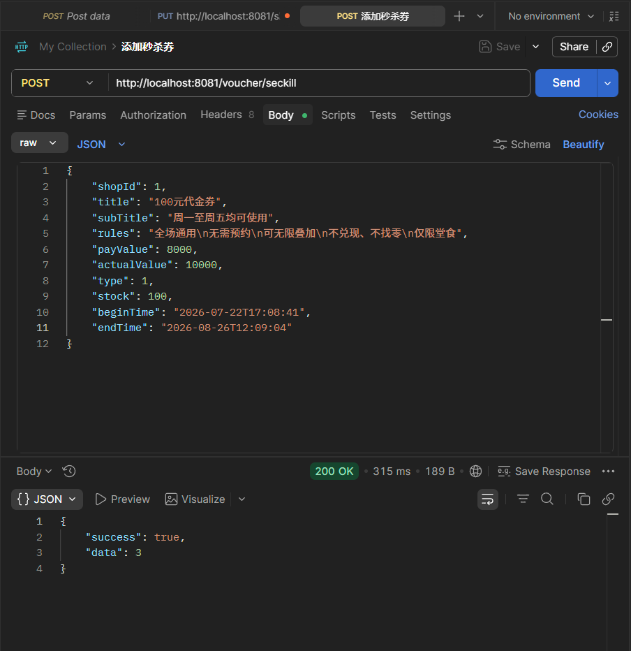

请求成功，首先去看数据库中的表`tb_voucher`，可以发现新增一条券的数据，由于我们添加的是秒杀券，所以还要去表`tb_seckill_voucher`里看看，发现也成功新增了一个数据，而且关联表`tb_voucher`的id还一样，说明成功了。


**常见问题：**

- `vouchercontroller`和`voucherservicelmpl`是啥关系？

标准的三层架构关系，一条线串起来：

调用链

```
浏览器请求  →  Controller    →    Service 接口    →    Service 实现类    →    Mapper    →    数据库
              (接收请求)        (定义规则)            (干活的)              (操作数据库)

VoucherController      →    IVoucherService    →    VoucherServiceImpl
  ↑                              ↑                       ↑
@RestController            interface                 @Service
/api/voucher/...           只定义方法签名             implements IVoucherService
                                                     extends ServiceImpl<>
                                                     真正写逻辑的地方
```

代码对应关系

**① Controller 持有接口引用：**

```java
@RestController
public class VoucherController {
    @Resource
    private IVoucherService voucherService;   // ← 注入的是接口，不是实现类
}
```

**② 实现类 `implements` 接口：**

```java
@Service
public class VoucherServiceImpl extends ServiceImpl<...> implements IVoucherService {
    //   ↑ Spring 发现这是 IVoucherService 的"真身"                            ↑ 实现这个接口
}
```

**③ Spring 自动装配：Controller 声明的 `IVoucherService` 接口 → 自动注入 `VoucherServiceImpl` 实例**

**为什么 Controller 不直接用实现类？**

```java
// ❌ 不推荐的写法
@Resource
private VoucherServiceImpl voucherService;   // 写死实现类

// ✅ 推荐的写法
@Resource
private IVoucherService voucherService;       // 面向接口编程
```

好处：**未来换一套实现（比如换成 `VoucherServiceNewImpl`），只要它也 `implements IVoucherService`，Controller 一行代码不用改。** Controller 只认接口契约，不关心谁实现。

------

- **我如果自己要用postman测试一个接口，我怎么去知道我要写的json格式呢？**

这要看 `@RequestBody` 后面那个实体类的字段。以你的 `VoucherController` 为例：

Controller 里：

```java
@PostMapping
public Result addVoucher(@RequestBody Voucher voucher) {
//                        ↑ 看这里！实体类是 Voucher，JSON 就按 Voucher 的字段写
```

打开 `Voucher` 实体类，每个字段就是 JSON 的一个 key：

Voucher 的字段 → JSON 映射

| Java 字段     | 类型            | JSON 怎么写             | 要不要传         |
| ------------- | --------------- | ----------------------- | ---------------- |
| `id`          | `Long`          | `1`                     | ❌ 自增主键，不传 |
| `shopId`      | `Long`          | `1`                     | ✅ 必传           |
| `title`       | `String`        | `"100元代金券"`         | ✅                |
| `subTitle`    | `String`        | `"全场通用"`            | 可选             |
| `rules`       | `String`        | `"满200可用"`           | 可选             |
| `payValue`    | `Long`          | `8000`（单位：分）      | ✅                |
| `actualValue` | `Long`          | `10000`（单位：分）     | ✅                |
| `type`        | `Integer`       | `0`普通券 / `1`秒杀券   | ✅                |
| `status`      | `Integer`       | `0` / `1`               | 可选             |
| `stock`       | `Integer`       | `100`                   | 秒杀券必传       |
| `beginTime`   | `LocalDateTime` | `"2026-07-22T10:00:00"` | 秒杀券必传       |
| `endTime`     | `LocalDateTime` | `"2026-07-22T22:00:00"` | 秒杀券必传       |
| `createTime`  | `LocalDateTime` | 不传                    | ❌ 自动生成       |
| `updateTime`  | `LocalDateTime` | 不传                    | ❌ 自动生成       |

普通券的 Postman 请求示例

**POST** `http://localhost:8080/voucher`

```json
{
    "shopId": 1,
    "title": "100元代金券",
    "subTitle": "全场通用",
    "rules": "满200元可用",
    "payValue": 8000,
    "actualValue": 10000,
    "type": 0
}
```

秒杀券的 Postman 请求示例

**POST** `http://localhost:8080/voucher/seckill`

```json
{
    "shopId": 1,
    "title": "1元代100元秒杀券",
    "subTitle": "限量100张",
    "rules": "无需满减",
    "payValue": 1,
    "actualValue": 10000,
    "type": 1,
    "stock": 100,
    "beginTime": "2026-07-22T10:00:00",
    "endTime": "2026-07-22T22:00:00"
}
```

通用法则（任何接口都适用）

```
1. 找到 Controller 方法的 @RequestBody 参数 → 看它是什么类
2. Ctrl+点击 进这个实体类 → 看有哪些字段（成员变量）
3. 排除掉自增主键、自动填充的时间字段 → 剩下的就是你要传的 JSON key
4. String → "双引号字符串"、Long/Integer → 数字、LocalDateTime → "2026-07-22T10:00:00"
```


#### 4、实现秒杀下单

下单时需要判断两点：

- 秒杀是否开始或结束，如果尚未开始货已结束则无法下单
- 库存是否充足，不足则无法下单

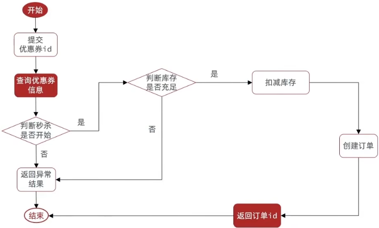

照着这个流程图，开始写代码。秒杀下单的请求入口是 `VoucherOrderController`，所以从 Controller 开始一层层往下改。

**（1）VoucherOrderController —— 接收秒杀请求**

打开 `VoucherOrderController.java`，原本的 `seckillVoucher` 方法是个 TODO 占位：

```java
@PostMapping("seckill/{id}")
public Result seckillVoucher(@PathVariable("id") Long voucherId) {
    return Result.fail("功能未完成");
}
```

注入 `IVoucherService`，改为调用 service 层的方法：

```java
@Resource
private IVoucherService voucherOrderService;

@PostMapping("seckill/{id}")
public Result seckillVoucher(@PathVariable("id") Long voucherId) {
    return voucherOrderService.seckillVoucher(voucherId);
}
```

> 💡 这里注入的是 `IVoucherService` 而不是 `IVoucherOrderService`。因为秒杀下单的核心逻辑涉及优惠券查询、库存扣减、订单创建，和优惠券业务强关联，放在 `VoucherServiceImpl` 里更内聚。而且你注意看，虽然变量名叫 `voucherOrderService`，但类型是 `IVoucherService`——变量名只是起的名字，实际注入的是哪个接口的实现才是关键。

`@PathVariable("id")` 从 URL 路径 `/seckill/{id}` 中提取优惠券id，比如请求 `/voucher-order/seckill/10`，`voucherId` 就是 `10`。

**（2）IVoucherService 接口 —— 声明方法**

在 `IVoucherService.java` 里新增 `seckillVoucher` 方法声明：

```java
Result seckillVoucher(Long voucherId);
```

**（3）VoucherServiceImpl —— 实现秒杀下单逻辑**

在 `VoucherServiceImpl.java` 里实现具体逻辑，对照流程图一步步来：

```java
@Resource
RedisIdWorker redisIdWorker;          // 全局唯一ID生成器
@Resource
IVoucherOrderService voucherOrderService;  // 订单服务

@Transactional
@Override
public Result seckillVoucher(Long voucherId) {
    // 1.查询优惠券
    SeckillVoucher voucher = seckillVoucherService.getById(voucherId);

    // 2.判断秒杀是否开始
    if (voucher.getBeginTime().isAfter(LocalDateTime.now())){
        return Result.fail("秒杀尚未开始");
    }
    // 3.判断秒杀是否已经结束
    if (voucher.getEndTime().isBefore(LocalDateTime.now())){
        return Result.fail("秒杀已经结束");
    }
    // 4.判断库存是否充足
    if (voucher.getStock() < 1){
        return Result.fail("库存不足！");
    }
    // 5.扣减库存
    boolean success = seckillVoucherService.update()
            .setSql("stock = stock - 1")       // SQL: SET stock = stock - 1
            .eq("voucher_id", voucherId)        // WHERE voucher_id = ?
            .update();
    if (!success){
        return Result.fail("库存不足");
    }
    // 6.创建订单
    VoucherOrder voucherOrder = new VoucherOrder();
    // 6.1 订单id —— 用Redis全局唯一ID生成器
    long orderId = redisIdWorker.nextId("order");
    voucherOrder.setId(orderId);
    // 6.2 用户id —— 从ThreadLocal拿当前登录用户
    Long userId = UserHolder.getUser().getId();
    voucherOrder.setUserId(userId);
    // 6.3 代金券id
    voucherOrder.setVoucherId(voucherId);
    // 保存订单到数据库
    voucherOrderService.save(voucherOrder);
    // 7.返回订单id
    return Result.ok(orderId);
}
```

**几个关键点：**

- **`@Transactional`**：整个秒杀流程（扣库存 + 创建订单）放在一个事务里，库存扣了但订单没生成，或者反过来，都不行。要么都成功，要么都回滚。

- **时间判断用 `isAfter` 和 `isBefore`**：`LocalDateTime` 的两个方法非常直观：
  - `beginTime.isAfter(now)` → 开始时间在当前时间"之后" → 秒杀还没开始
  - `endTime.isBefore(now)` → 结束时间在当前时间"之前" → 秒杀已经结束了

- **`setSql("stock = stock - 1")`**：这是 MyBatis-Plus 的一个非常实用的方法，允许在更新语句中写原生 SQL 片段。`stock = stock - 1` 相当于告诉 MySQL：**在当前库存值的基础上减 1**，而不是设置成某个固定值。这样在高并发下，多个线程同时扣库存时，每个线程都是在"当前真实库存"的基础上减 1，不会出现"读到的库存都是 5，大家都 set stock=4"这种覆盖问题。

- **`eq("voucher_id", voucherId)`**：MyBatis-Plus 的条件构造，等价于 `WHERE voucher_id = ?`。`voucher_id` 是 `tb_seckill_voucher` 表的主键，条件唯一，所以更新的就是这一条秒杀券的库存。

- **订单 ID 用 `redisIdWorker.nextId("order")`**：订单号不是 MySQL 自增，而是用上一节写的全局唯一 ID 生成器，保证分布式环境下也不重复。`"order"` 是业务前缀，最终拼成 Redis key `icr:order:2026:07:23`。

- **用户 ID 从 `UserHolder.getUser().getId()` 拿**：`UserHolder` 里的用户信息是拦截器从 Redis 查出来放进 ThreadLocal 的，整个请求链路都能拿到，不用在方法间传来传去。

- **`VoucherOrder` 的 `@TableId(type = IdType.INPUT)`**：注意实体类上主键策略是 `INPUT` 而不是 `AUTO`，意思是**主键由程序自己赋值**，不依赖数据库自增。所以我们用 `redisIdWorker` 生成 id 后手动 set 进去。

- **扣库存的返回值 `success`**：`update()` 返回的是 `boolean`——受影响行数 > 0 返回 `true`，否则 `false`。在超高并发下可能出现这种情况：多个线程同时读到 `stock=1`，都通过了第 4 步的"库存充足"判断，但 `stock = stock - 1` 在执行时发现 stock 已经被别人扣成 0 了（因为 `stock = stock - 1` 是相对扣减，MySQL 行锁保证同一时刻只有一个线程能更新），后面的线程 `update()` 返回 `false`（受影响行数为 0），返回"库存不足"。

------

**常见问题：**

**（1）`setSql("stock = stock - 1")` 和 `set("stock", stock - 1)` 有什么区别？为什么用前者？**

这是一个非常关键的并发安全问题。

**方式一：`set("stock", stock - 1)`（❌ 不安全）**

```java
SeckillVoucher voucher = seckillVoucherService.getById(voucherId);  // 读到 stock = 5
seckillVoucherService.update()
    .set("stock", voucher.getStock() - 1)  // SET stock = 4
    .eq("voucher_id", voucherId)
    .update();
```

生成的 SQL：`UPDATE tb_seckill_voucher SET stock = 4 WHERE voucher_id = ?`

**方式二：`setSql("stock = stock - 1")`（✅ 安全）**

```java
seckillVoucherService.update()
    .setSql("stock = stock - 1")  // SET stock = stock - 1
    .eq("voucher_id", voucherId)
    .update();
```

生成的 SQL：`UPDATE tb_seckill_voucher SET stock = stock - 1 WHERE voucher_id = ?`

**并发场景对比：**

假设当前库存 stock = 5，两个线程同时执行：

```
方式一（❌ 不安全）：                方式二（✅ 安全）：

线程A 读到 stock=5                  线程A 读到 stock=5
线程B 读到 stock=5                  线程B 读到 stock=5
线程A SET stock=4  ✅               线程A SET stock = stock-1  → MySQL行锁，stock									变成4
线程B SET stock=4  ❌ 还是4！       线程B SET stock = stock-1  → MySQL行锁，stock变										成3
```

| 对比项 | `set("stock", stock-1)` | `setSql("stock = stock - 1")` |
| --- | --- | --- |
| SQL | `SET stock = 4`（固定值） | `SET stock = stock - 1`（相对计算） |
| 计算位置 | **Java 内存**里算好再传 | **MySQL** 执行时计算 |
| 并发安全 | ❌ 不安全，读到的是"快照值" | ✅ 安全，MySQL行锁保证原子性 |
| 适用场景 | 非并发、普通更新 | **高并发扣库存、点赞数、计数类** |

核心区别就一句话：**方式一是"在我读到的基础上减"，方式二是"在数据库当前真实值的基础上减"**。高并发下，"我读到的值"可能已经不是"数据库当前真实值"了，所以方式一不安全。

------

**（2）为什么还要判断一次 `!success`？第 4 步不是已经判断过 `stock < 1` 了吗？**

第 4 步的 `stock < 1` 判断是**在 Java 内存里**做的，基于 select 出来的快照值。在超高并发场景下：

```
线程A                              线程B
select stock=1                     select stock=1
判断 stock<1？→ 否，通过           判断 stock<1？→ 否，通过
UPDATE stock=stock-1 → stock=0    UPDATE stock=stock-1 → 此时stock=0，
                                  行锁等A释放后执行，stock已经=0，
                                  再减1会变成-1... 
```

等等，其实 `stock = stock - 1` 这个 SQL 即使 stock=0 也会正常执行（得到 -1），`update()` 仍然返回 `true`（受影响行数 > 0）。**所以这里 `!success` 判断主要防的是更极端的情况**，比如行不存在（`eq` 条件没匹配到任何行）时返回 `false`。

------

**（3）`voucherOrderService.save(voucherOrder)` 这里存了哪些字段？**

看 `VoucherOrder` 实体类，我们手动 set 了三个字段：

| 字段 | 值 | 来源 |
| --- | --- | --- |
| `id` | 全局唯一ID | `redisIdWorker.nextId("order")` |
| `userId` | 当前用户ID | `UserHolder.getUser().getId()` |
| `voucherId` | 优惠券ID | 方法参数 `voucherId` |

其他字段（`payType`、`status`、`createTime`、`updateTime` 等）没有手动赋值：
- `createTime`、`updateTime`：数据库表设了 `DEFAULT CURRENT_TIMESTAMP`，MySQL 自动填充
- `payType`、`status`：表有默认值，后续支付流程再更新

------

**（4）整个秒杀下单的请求链路是怎样的？**

```
前端 POST /voucher-order/seckill/10
  → VoucherOrderController.seckillVoucher(10)
      → IVoucherService.seckillVoucher(10)
          → VoucherServiceImpl.seckillVoucher(10)
              ├── 1. seckillVoucherService.getById(10)      → 查 tb_seckill_voucher
              ├── 2~4. 校验时间 + 库存
              ├── 5. seckillVoucherService.update()          → 扣库存（UPDATE tb_seckill_voucher）
              ├── 6. redisIdWorker.nextId("order")           → 生成全局唯一订单号
              └── 7. voucherOrderService.save(voucherOrder)  → 插入 tb_voucher_order
          → 返回 Result.ok(orderId)
  → 前端拿到订单号
```


#### 5、库存超卖问题分析

在高并发多线程场景下，很容易出现**线程并发的安全问题**。

超卖问题是典型的多线程安全问题，针对这一问题的常见解决方案就是加锁：

- **悲观锁**

认为线程安全问题一定会发生，因此在操作数据之前先获取锁，确保线程串行执行。例如Synchronized、Lock都属于悲观锁

- **乐观锁**

认为线程安全问题不一定会发生，因此不加锁，只是在更新数据时去判断有没有其他线程对数据做了修改。 如果没有修改则认为是安全的，自己才更新数据。 如果已经被其它线程修改说明发生了安全问题，此时可以重试或异常

------

**乐观锁**

乐观锁的关键是判断之前查询得到的数据是否被修改过，常见的方式有两种：

- **版本号法**

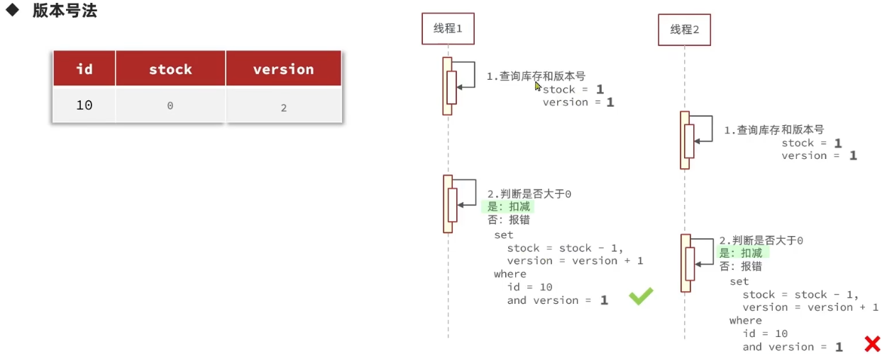

版本号法的核心思想：**给每条数据加一个 `version` 字段，每次修改数据时 `version` 都会 +1，更新时必须带上版本号条件——只有当版本号和自己之前读到的一致时，才允许更新。**

用一个简单例子来理解：

```
数据库里：stock=100, version=1

线程A                      线程B
读 stock=100, ver=1        读 stock=100, ver=1
要扣库存                    要扣库存
UPDATE SET stock=99,
        version=version+1   UPDATE SET stock=99,
WHERE voucher_id=?                 version=version+1
  AND version=1              WHERE voucher_id=?
                                AND version=1
✅ 成功！ver变成2            ❌ 失败！ver已经是2了
                               （说明有人改过，重试）
```

线程A先到，`WHERE version=1` 成立，更新成功，version 变成 2。线程B再来，它的 `WHERE version=1` 已经不成立了（version 被 A 改成了 2），更新失败，B 需要重新读取数据再试。

**版本号法的优缺点：**

| 优点 | 缺点 |
| --- | --- |
| 实现简单，逻辑清晰 | 需要给表额外加一个 `version` 字段 |
| 每次更新都能感知到"有没有别人改过" | 高并发下冲突多，大量重试请求可能失败 |
| 不影响正常读写性能 | 适合写冲突少的场景，不太适合秒杀这种高冲突场景 |

- **CAS法**

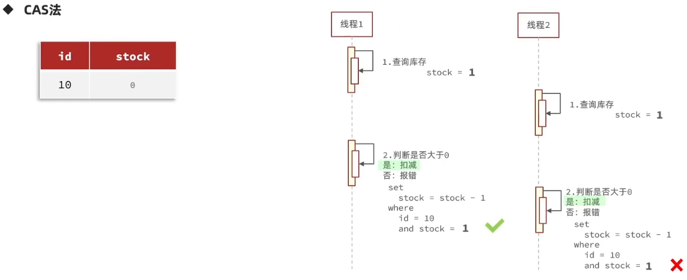

**CAS（Compare And Swap，比较并交换）** 是乐观锁的另一种实现方式，和版本号法的思想一样——"更新前先确认数据有没有被别人改过"，但 CAS 不需要额外的 `version` 字段，而是直接**用数据本身的值作为判断条件**。

在秒杀扣库存的场景里，CAS 的做法是：**更新时把 `stock` 的旧值作为 WHERE 条件**，只有当库存值和自己之前读到的一致时，才扣减。

```
线程A                              线程B
读 stock=100                       读 stock=100
要扣库存                            要扣库存
UPDATE SET stock=stock-1           UPDATE SET stock=stock-1
WHERE voucher_id=?                 WHERE voucher_id=?
  AND stock=100                      AND stock=100
✅ 成功！stock变成99                ❌ 失败！stock已经不是100了
```

线程A先把 stock 从 100 改成了 99，线程B的 `WHERE stock=100` 就不成立了，更新失败。

**CAS 和版本号法对比：**

| 对比项 | 版本号法 | CAS法 |
| --- | --- | --- |
| 额外字段 | 需要 `version` 列 | **不需要**，直接用业务字段 |
| 判断条件 | `WHERE version = ?` | `WHERE stock = ?` |
| 实现成本 | 要加字段、改表结构 | **零成本，改 SQL 即可** |
| 适用场景 | 通用场景 | 字段本身有"变化"语义时（如计数、库存） |

**所以秒杀场景选 CAS，因为 `stock` 字段天然就是一个"会变化的值"，直接用 `WHERE stock = ?` 就能实现乐观锁，不需要额外字段。**

------

**常见问题：**

**（1）CAS 的 `WHERE stock = ?` 和上一节讲的 `WHERE stock > 0` 有啥区别？**

上一节扣库存的 SQL 是：
```sql
UPDATE tb_seckill_voucher SET stock = stock - 1 WHERE voucher_id = ?
```

没有任何 stock 值判断，只要行存在就扣。结果是高并发下 stock 会变成负数。

CAS 的 SQL 要改成：
```sql
UPDATE tb_seckill_voucher SET stock = stock - 1 WHERE voucher_id = ? AND stock = ?
--                                                                          ↑ CAS条件：stock必须是之前读到的值
```

加了 `AND stock = ?` 之后，只有"库存值没被别人改过"的线程才能扣成功。但 CAS 也**不能完全解决超卖**——因为判断条件是 `stock = 之前读到的值`，不是 `stock > 0`。即使 stock 没变，从 stock=1 扣到 stock=0 后，下一批线程读到的都是 stock=0，它们在 `WHERE stock=0` 条件下去扣，依然会把 stock 扣成负数。

所以 CAS 只是**降低了并发冲突**，真正要彻底解决超卖，还得用更严格的判断条件（比如 `WHERE stock > 0`），但这在 MyBatis-Plus 的 `update()` 链式调用里没法直接做到，得写自定义 SQL 或用 Redis 的 Lua 脚本。这就是后面要讲的内容。

**（2）悲观锁和乐观锁该怎么选？**

| | 悲观锁 | 乐观锁 |
| --- | --- | --- |
| 思路 | 先加锁，再操作 | 先操作，失败再重试 |
| 实现 | `synchronized` / `Lock` / 数据库行锁 | 版本号 / CAS |
| 并发性能 | **低**（串行执行，线程排队等锁） | **高**（并发执行，冲突才重试） |
| 适用场景 | 写冲突多、操作重（不想白干） | 写冲突少、操作轻（重试成本低） |
| 秒杀场景 | 可用但性能差 | **更推荐**（虽然冲突多，但扣库存操作很轻） |

简单记：**悲观锁 = 先排队再干活，乐观锁 = 先干活，没干成再重来**。秒杀场景扣库存就是个 UPDATE 语句，非常轻量，重试成本很低，所以乐观锁更合适。


#### 6、乐观锁解决超卖

上一小节详细介绍了CAS法，也就是用库存量代替版本号的方法。

在扣减库存的代码块，添加`.eq("stock", voucher.getStock()`：

```java
//5.扣减库存
boolean success = seckillVoucherService.update()// 第一个update：拿工具（构建器），不执行SQL
        .setSql("stock = stock - 1")// set stock = stock - 1
        .eq("voucher_id", voucherId).eq("stock", voucher.getStock())
        //双重判断 where id = ? and stock = ?  , stock 是实现乐观锁的关键
        .update();// 第二个update：真正执行更新，返回成功与否
```

随后去JMeter里测试，设置线程两百个，秒杀券库存重新设置一百个。预想异常率应该为50%。

测试结果：

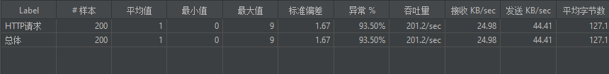

异常率竟然高达93.5%，这是为什么？

看我们添加的筛选条件`.eq("stock", voucher.getStock()`，这意味线程每次都要保证自己取得的库存数量和实际的库存数量要一致，但如果在两个线程同时并行的情况下，这总情况就很可能会发生问题：

```
		线程A						线程B
		  ↓						   |
	获取库存数量为100				   ↓
		  |					获取库存数量为100
		  ↓						   |
	获取的数量=数据库的库存数量		    |
		库存-1=99					  ↓
		   ↓				获取的数量100≠数据库的库存数量99
		   成功						失败
```


为了改善，我们直接把判断条件改为`.gt("stock", 0)//库存大于0即可`，即使拿到的库存信息和实际库存不一致，只要有库存，就可以执行，这样就大大提高了性能。

再重复上述实验，可以得出50的异常。

测试前切记添加请求头

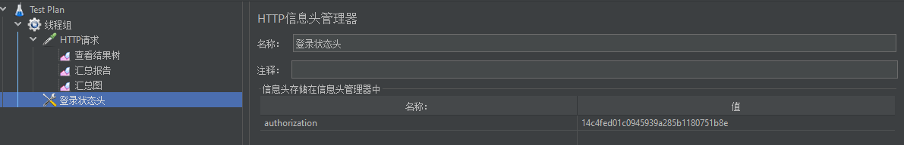


#### 7、实现一人一单功能

需求：修改秒杀业务，要求同一个优惠券用户只能下一单。

那这里就限制一人一单，在购买前查询订单表里是否存在这个用户id买过这个订单，如果买过，就不让买了。

```java
//6.一人一单
Long userId = UserHolder.getUser().getId();
//6.1.查询订单
int count = voucherOrderService.query().eq("user_id", userId).eq("voucher_id", voucherId).count();
//这里是查询订单表，不是优惠券表
if (count > 0){
    return Result.fail("你已经购买过一次了");
}
```

这个时候我们再用JMeter进行测试，仍然只有一个用户，200个线程。执行结束......

发现库存竟然卖了不止一份，这是为何？

因为和前一个问题一样——你的"一人一单"也是先查后插，200 个线程同时查、同时过、同时插：

```markdown
同一个用户 token，200 个并发线程：

时刻 T：线程A → count 查 → 0 → 通过 ✅
时刻 T：线程B → count 查 → 0 → 通过 ✅（A 还没插进去！）
时刻 T：线程C → count 查 → 0 → 通过 ✅
...
时刻 T+1ms：200 个全部通过 → 全部去扣库存 → 全部创建订单 💀

```

改善方法就是加上悲观锁——但怎么加、加在哪里，经历了一个"三版演进"的过程。下面按老师讲课的顺序，把每个版本的问题和为什么要改成下一版，一步步拆开讲清楚。

**版本一：把 `synchronized` 加在方法上**

最直观的想法——既然"一人一单"的查询和插入不是原子的，那把整个方法锁住不就行了？

```java
@Transactional
public synchronized Result creatVoucherOrder(Long voucherId) {
    // 查订单 → 扣库存 → 创建订单
}
```

这样能保证同一时刻只有一个线程在执行这个方法，确实解决了并发问题。但带来了一个新问题：

`synchronized` 加在方法上，默认锁的是 **`this`**（当前实例对象）。由于 Spring 的 Service 默认是**单例**的，全局就一个 `VoucherOrderServiceImpl` 实例，导致**所有用户过来都抢同一把锁**。

```
用户A 买券1  ─┐
用户B 买券2  ─┤─ 全部排队等同一把 this 锁 💀
用户C 买券1  ─┘
```

用户 A 和用户 B 买的是不同的券、完全互不影响，却因为共用一把锁而被串行化，并发性能极差。这就引出了版本二。

**版本二：把锁粒度缩小到"用户级别"**

既然问题是"所有用户抢同一把锁"，那让**不同用户抢不同的锁**就行了。用 `userId` 作为锁对象：

```java
@Transactional
public Result creatVoucherOrder(Long voucherId) {
    Long userId = UserHolder.getUser().getId();
    synchronized (userId.toString().intern()) {
        // 查订单 → 扣库存 → 创建订单
    }
}
```

`synchronized (userId.toString().intern())` 的含义逐层拆解：

- `userId.toString()` — 把 Long 型 userId 转成 String（比如 `1L` → `"1"`）
- `.intern()` — 保证**值相同的字符串是同一个对象**。JVM 把字符串常量池里的 `"1"` 返回给你，不管有多少个线程，只要 userId 都是 `1`，拿到的就是**同一把锁**；userId 不同，拿到的就是不同的锁
- `synchronized (...)` — 对这个字符串对象加锁

> ⚠ **为什么不能直接用 `userId`（Long 对象）？** 因为 Long 的缓存范围是 `-128 ~ 127`，超出这个范围的 userId（比如 `1001L`）每次自动装箱都是**新对象**，锁就形同虚设。用 `.intern()` 保证同一个字符串值对应同一个对象，不会有这个问题。

这样一来：

```
用户A (userId=1) 买券1 → 锁 "1"
用户B (userId=2) 买券2 → 锁 "2"   ← 和 A 互不影响 ✅
用户C (userId=1) 买券1 → 锁 "1"   ← 和 A 抢同一把锁（正常，因为同一用户）
```

锁粒度从"全局"缩小到了"用户级"，不同用户之间不再互相阻塞。

但是版本二还有问题——和事务有关。

**版本三：拆成两个方法 + `AopContext.currentProxy()`**

版本二虽然锁粒度对了，但存在一个致命问题：**`@Transactional` 和 `synchronized` 放在同一个方法上，事务可能没生效**。

这不是 Java 的问题，而是 **Spring 事务的实现机制**导致的。下面展开讲。

---

**Spring 事务是怎么工作的？——代理对象**

Spring 的 `@Transactional` 并不是直接修改你的方法，而是通过 **AOP 代理**来实现的。当你在一个方法上标注 `@Transactional`，Spring 会做这样的事：

```
你写的类:                              Spring 生成的代理类:
VoucherOrderServiceImpl              VoucherOrderServiceImpl$$EnhancerBySpringCGLIB
┌──────────────────────┐             ┌──────────────────────────────┐
│ creatVoucherOrder() {│             │ creatVoucherOrder() {        │
│   // 业务代码        │             │   // 1. 开启事务             │
│ }                    │             │   // 2. 调用真实对象的方法   │
└──────────────────────┘             │   // 3. 提交/回滚事务        │
    ↑ 真实对象(target)               │ }                            │
                                     └──────────────────────────────┘
                                         ↑ 代理对象，注入给 Controller
```

Spring 往 IOC 容器里放的并不是你写的 `VoucherOrderServiceImpl` 实例本身，而是**包了一层"壳"的代理对象**。Controller 拿到的是这个代理对象，调用代理对象的方法时，代理会在方法前后织入事务管理代码（开启事务 → 调真实方法 → 提交/回滚）。

**问题就出在"自己调自己"**：

在版本二中，如果 Controller 调的是 `creatVoucherOrder()`，那么流程是这样的：

```
Controller → 代理对象.creatVoucherOrder()  ← 经过了代理，事务生效 ✅
                → 真实对象.creatVoucherOrder()  ← 里面直接执行 synchronized 代码块
```

这个流程事务是生效的。但如果我们把锁放在外层（`seckillVoucher` 方法里），让 `seckillVoucher` 内部调用 `this.creatVoucherOrder()`：

```java
// seckillVoucher() 里：
synchronized (userId.toString().intern()) {
    return this.creatVoucherOrder(voucherId);  // ← this 是真实对象！
}
```

`this` 拿到的是真实对象，**跳过代理**，`@Transactional` 的事务增强就不会生效——相当于你绕过了门口的保安，直接推门进了房间。

**解决方案：自己拿到代理对象**

```java
// seckillVoucher() 里：
synchronized (userId.toString().intern()) {
    IVoucherOrderService proxy = (IVoucherOrderService) AopContext.currentProxy();
    return proxy.creatVoucherOrder(voucherId);  // ← 通过代理对象调用，事务生效 ✅
}
```

`AopContext.currentProxy()` 是 Spring AOP 提供的方法，它从 **ThreadLocal** 中取出当前线程对应的**代理对象**。因为 Controller 调 `seckillVoucher()` 时走的是代理对象，Spring 在进入代理对象的方法之前就把代理对象塞进了 ThreadLocal，你在被调用的方法内部随时可以用 `currentProxy()` 取出来。

要让这个机制生效，还需要在启动类或配置类上加 `@EnableAspectJAutoProxy(exposeProxy = true)`，`exposeProxy = true` 就是告诉 Spring "把代理对象暴露到 ThreadLocal 里"，默认是 `false`。

> 💡 **口诀**：`this` 是真身（不走代理，事务失效），`proxy` 是假身（走代理，事务生效）。自己调自己要用假身不能用真身。

---

**三版对比总结**

|          | 版本一                         | 版本二                                       | 版本三（最终版）                                         |
| -------- | ------------------------------ | -------------------------------------------- | -------------------------------------------------------- |
| **写法** | `synchronized` 在方法上        | `synchronized(userId)` 块 + `@Transactional` | 拆成两个方法，外层加锁 + 内层事务，通过 proxy 调用       |
| **锁粒度** | 全局一把锁（this）             | 用户级（每个 userId 一把锁）✅               | 用户级（每个 userId 一把锁）✅                           |
| **并发性** | ❌ 所有用户串行                 | ✅ 不同用户不互相阻塞                        | ✅ 不同用户不互相阻塞                                    |
| **事务**   | 可能正常（走代理）             | ❌ this 调用导致事务失效                      | ✅ 通过 proxy 调用，事务生效                             |
| **锁与事务的时序** | 锁释放 → 事务提交（锁在方法结束释放，事务在代理层提交，有间隙） | 同左 | ✅ 锁包裹 proxy 调用，proxy 返回前事务已提交，锁释放时事务一定已完成 |

**为什么最终版（版本三）的时序是正确的？**

```
seckillVoucher()                        creatVoucherOrder() [在代理层]
  │                                        │
  ├─ 查券、判时间、判库存                   │
  ├─ synchronized(userId) { ──────────────► │
  │    获取 proxy                           ├─ 开启事务
  │    proxy.creatVoucherOrder(id) ────────►├─ 查订单
  │                                         ├─ 扣库存
  │                                         ├─ 创建订单
  │                                         ├─ 提交事务 ✅
  │   ◄─────────────────────────────────────┤
  │ } ← 事务提交后，锁才释放                 │
```

核心要点：**锁包裹了 proxy 的整个调用过程**，而 proxy 的方法在返回前就已经提交了事务。所以锁释放时，事务一定已经提交完成——不会出现"锁释放了但事务还没提交，另一个线程进来读到旧数据"的问题。

---

常见问题：

- **真对象和代理对象是什么？**

  真对象（Target Object）就是你写的 `VoucherOrderServiceImpl` 实例本身，包含了核心业务逻辑。代理对象（Proxy Object）是 Spring 用 CGLIB 动态生成的一个**子类对象**，它包装了真对象，在调用真对象的方法前后织入额外的逻辑（事务、日志、权限、缓存等）。

  用类比理解：真对象是演员（负责演戏），代理对象是经纪公司（负责安排通告、谈合同、收钱），外部找演员都是通过经纪公司，经纪公司在演员上场前下场后处理杂事。

  在项目里，被注入到 Controller 里的永远是代理对象，不是真对象。你用 `System.out.println(voucherOrderService.getClass().getName())` 打印，会看到类似 `com.hmdp.service.impl.VoucherOrderServiceImpl$$EnhancerBySpringCGLIB$$xxxxx` 的名字——`$$` 是 CGLIB 的标志，说明这是个代理。

- **为什么非要用 `@Transactional`？**

  秒杀下单涉及两步写操作：**扣库存**（UPDATE `tb_seckill_voucher`）和**创建订单**（INSERT `tb_voucher_order`），这两步必须"同生共死"——要么都成功，要么都失败。

  如果不用事务：
  - 扣库存成功了，但创建订单时断电/抛异常 → 库存被扣了但用户没拿到订单 💀
  - 创建订单成功了，但扣库存时因为乐观锁竞争失败了（没判断返回值）→ 用户有订单但库存没扣 💀

  `@Transactional` 保证这两个操作在一个数据库事务里，任何一步失败都会全部回滚，保证数据一致性。

- **`synchronized (userId.toString().intern())` 是干嘛的？**

  这是 Java 的同步代码块，用于保证**同一个用户的请求串行执行**。

  作用是：拿到当前用户 ID，转成字符串并手工放入字符串常量池（`.intern()`），然后用这个字符串对象作为"互斥锁"——同一个 userId 的所有线程必须排队等锁，不同 userId 的线程用的是不同的锁，互不阻塞。

  为什么要加这个？因为"一人一单"的逻辑是"先查后插"（先查有没有订单，没有才创建），这一步本身不是原子的。200 个并发请求同时查 → 都发现没买过 → 都去创建订单，一人一单就形同虚设。加上同步锁后变成：查订单 + 创建订单这整段代码，同一时刻只有一个线程能执行，其他线程排队等待——第一个线程创建完订单后，后续线程再查就会发现"你已经买过"了。

- **`synchronized` 块写在 `seckillVoucher()` 里，和写在 `creatVoucherOrder()` 方法前面加 `synchronized` 有什么区别？**

  区别有两个，一个关于**锁粒度**，一个关于**锁与事务的时序**。

  **① 锁粒度不同**

  写在 `creatVoucherOrder()` 方法上（`public synchronized Result creatVoucherOrder(...)`）：锁的是 `this` 对象，全局所有用户共用一把锁 → 用户 A 和用户 B 买不同的券也要互相排队。

  写在 `seckillVoucher()` 里的 `synchronized (userId.toString().intern())`：锁的是用户 ID 字符串，不同用户用不同的锁 → 只有同一个用户自己的并发请求才排队，不同用户之间完全并发。

  **② 锁和事务的时序不同**

  如果 `synchronized` 写在 `creatVoucherOrder()` 方法上，方法执行完锁就释放了，但事务要等代理对象的方法返回后才提交——锁释放的瞬间，另一个线程就能进入，而此时上一个线程的事务还没提交完，导致"一人一单"的查询可能读到旧数据。

  现在的写法，`synchronized` 包裹 `proxy.creatVoucherOrder()` 的**整个调用过程**，锁内的事务一定在锁释放前提交——保证下一个拿到锁的线程一定能看到上一个线程提交的最新数据。
